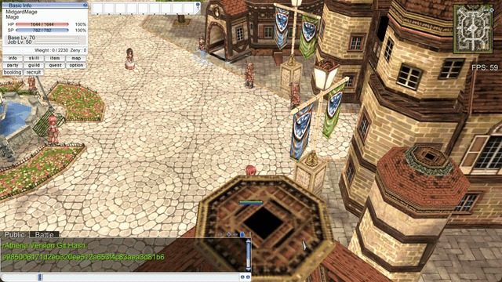
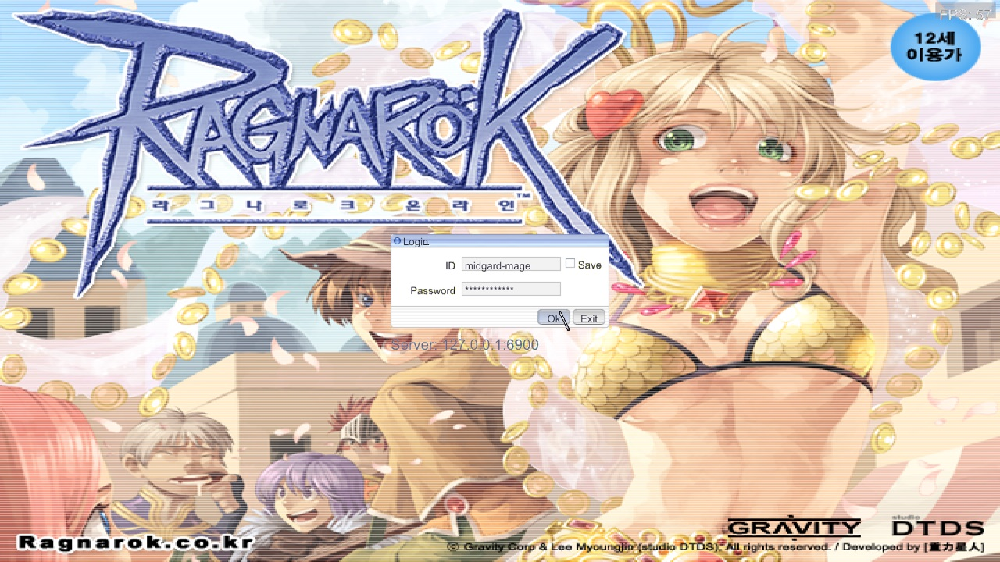
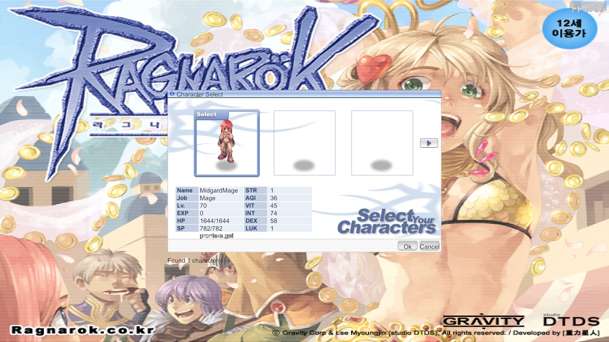
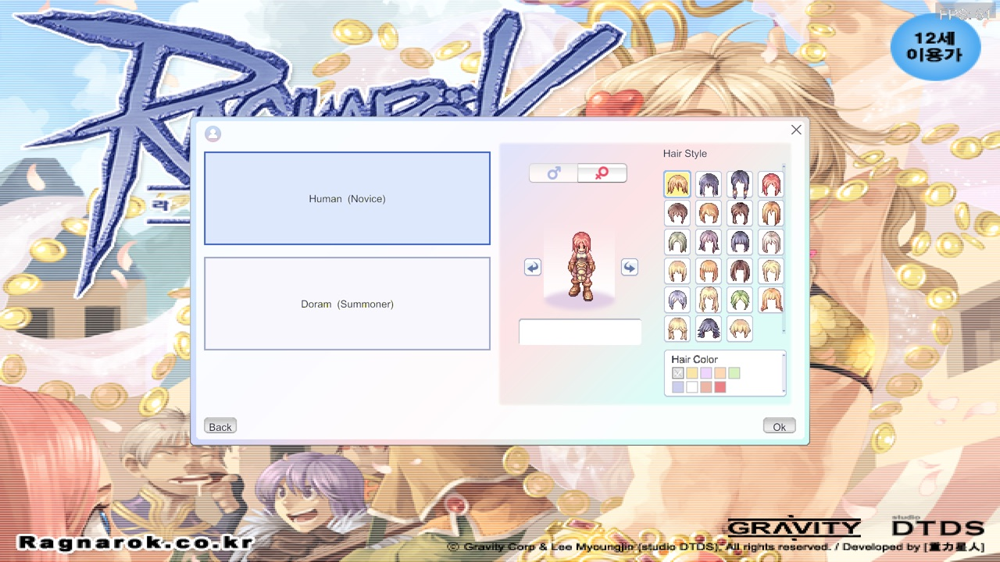
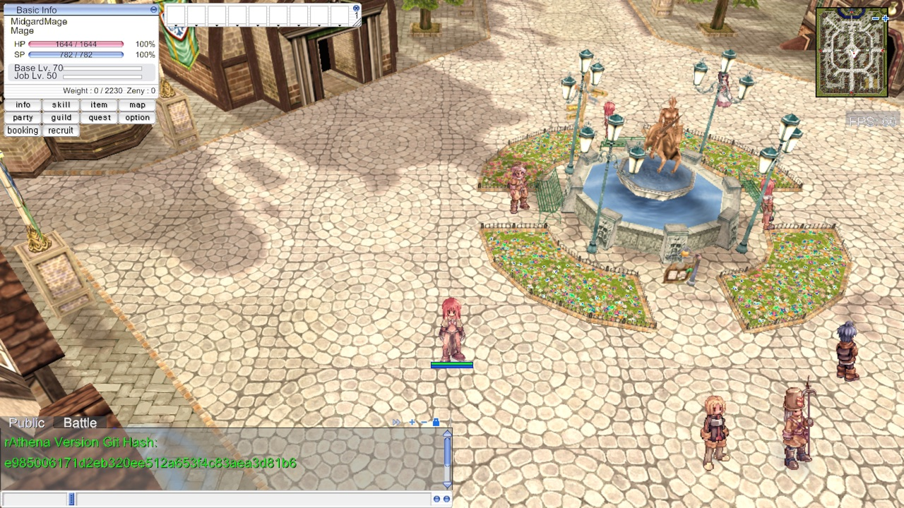
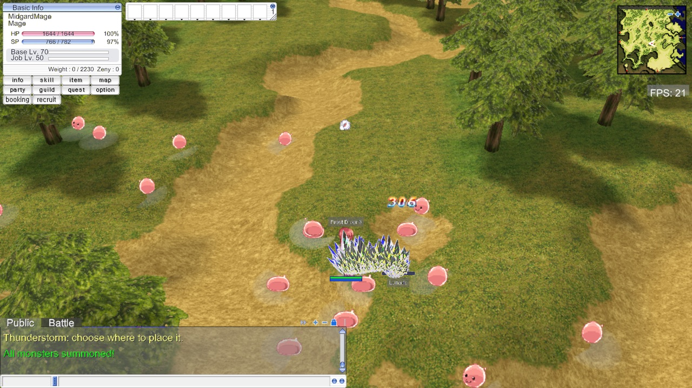
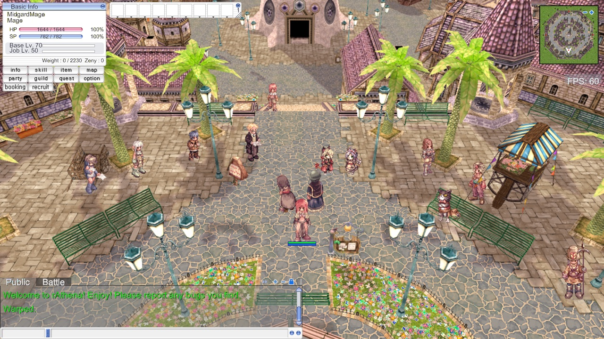
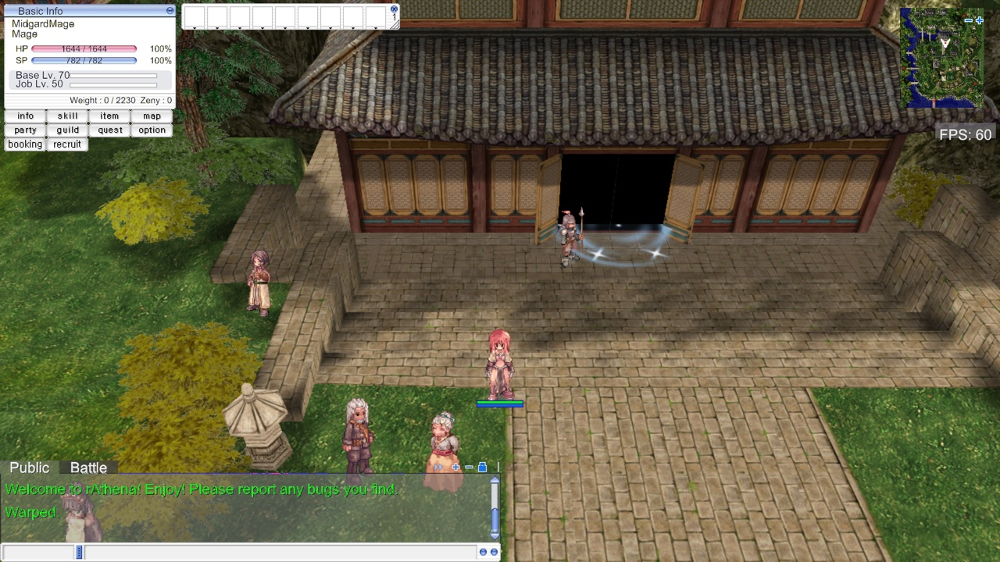

# Midgard RO

**A Ragnarok Online client written from scratch in Go.**
OpenGL 4.1 · SDL2 · the real RO protocol (packet version 20211103) against a self-hosted rAthena.

> An educational project about how far AI-assisted development goes in game
> development. Every feature here was investigated, planned, implemented and
> tested with [Claude Code](https://claude.com/claude-code); the plans,
> decisions and session logs are all in [`docs/`](docs/).

<p align="center">
  
</p>
<p align="center"><sub>A walk through Prontera, then Frost Diver and Thunderstorm on Porings in prt_fild08 — <a href="docs/screenshots/gameplay.mp4">the same clip as mp4</a></sub></p>

## What it does

The client reads the original game's archives (`data.grf`, `rdata.grf` — you
bring your own copy), logs in the way the original client does, and draws what
the server says is there: the map, the units on it, the fights, the skills.
The interface is the original's own bitmaps drawn by our own UI system, not a
recreation of it.

## Screenshots

| | |
|---|---|
|  |  |
| **Login** — the original window, its art and its sounds | **Character select** — nine slots, paging, arrow keys, double-click to play |
|  |  |
| **Character creation** — Human or Doram, hair style and color, the name checked by the server | **Prontera** — the central square, its NPCs and the other players |
|  |  |
| **prt_fild08** — Frost Diver on a Poring | **Geffen** |
|  | |
| **Payon** | |

## What works today

**Getting in**
- Login window with the original art and sounds; modern rAthena auth (`AC_ACCEPT_LOGIN2`, auth tokens)
- Character select: nine slots, paging, arrow keys, double-click to play
- Character creation: Human or Doram, sex from the account, 23 hair styles × 9 colors, name checked by the server
- The original's loading screens; map changes through warp portals; the original's indoor camera rules

**The world**
- Terrain (GND) with lightmaps, 3D models (RSM) with their animations, water, sun lighting, frustum culling
- Sprites for players, monsters, NPCs and ground items: SPR/ACT with palettes, head gear, weapons, sitting, all eight facings, standing on the ground they are actually on
- Per-map background music and ambient sounds; RO's own cursor, changing with what the pointer is over

**Playing**
- Click-to-move, server-authoritative, at the walk speed the server says
- Monsters and NPCs spawn, walk and vanish as the server reports them; NPC dialogs with Next, Close and menus
- Combat: click to attack, approach, damage numbers, HP bars over units
- Ground items: drop them, see them lying there, pick them up; inventory and equipment
- Skills: the skill tree from the client's own tables, casting with target or ground aim, cast bar, effects (STR animations from the archive plus generated particles for the ones the archive does not have), the battle log
- Chat with tabs, `/` client commands and `@` GM commands, colored server messages

**Interface** — an RO-native UI system of our own (`internal/engine/ui2d`), drawn from the archive's bitmaps
- Basic Info, minimap, chat, quick panel with drag and drop, ESC menu with sound configuration
- Status, Skill Tree, Inventory, Equipment and Map / world map windows

**Around it**
- Dockerized rAthena at a pinned commit, seeded test accounts, `make play`
- `grftool` (CLI) and `grfbrowser` (GUI with sprite, model and map viewers)
- Tables generated from the rAthena source and the client's own Lua: packet lengths, skill names, skill tree, skill effects, item and sprite names
- Flags that drive the client with nobody at the keyboard — `--autologin`, `--screenshot-after`, `--say`, `--walk-to`, `--cast`, and more — plus an F3 overlay and trace channels
- About 780 tests, table-driven where it matters: packet layouts, file formats, layout math

## What is next

The big pieces, roughly in the order they are likely to land:

- **Death and respawn**, and the rest of combat's edges (the player dying, returning to the save point)
- **Account registration** — accounts are pre-provisioned today
- **Social**: party, guild, friends, whisper, chat rooms
- **Economy**: shops, vending, trading, storage, mail — all of these reach the generic NPC dialog today and nothing more
- **Quests** — the window and the log
- **Emotions**, `/sit`, chat bubbles over heads
- **More skill effects and skill units** (Fire Wall, Warp Portal, …): the effect table names 170 effects, most still draw nothing
- **Pets, homunculus, mounts, carts**
- **Options**: keybindings and graphics settings; asynchronous map loading
- **Builds**: Linux and Windows, a signed macOS build, and a LICENSE
- **Art of our own** in RO's style — see [docs/research/asset-creation-tools.md](docs/research/asset-creation-tools.md)
- Dropping the last of the ImGui dependency (only its SDL platform backend remains)

## Tech stack

- **Language**: Go 1.22+
- **Graphics**: OpenGL 4.1 core profile
- **Windowing / input / audio**: SDL2 via [go-sdl2](https://github.com/veandco/go-sdl2)
- **Server**: [rAthena](https://github.com/rathena/rathena), run locally in Docker at a pinned commit

## Getting started

End-to-end setup (client + self-hosted rAthena server) is in
**[docs/QUICKSTART.md](docs/QUICKSTART.md)**. The short version:

```bash
make env-install-macos    # Go, SDL2, colima, docker, docker-compose
colima start --memory 8 --cpu 4
make config               # creates config.yaml — edit the GRF paths
make play                 # starts the local rAthena server and launches the client
```

You need a legitimate copy of `data.grf` and `rdata.grf` from a Ragnarok
Online installation. The seeded test accounts are in
[docs/TEST_ACCOUNTS.md](docs/TEST_ACCOUNTS.md). Run `make help` for all targets.

## Project structure

```
midgard-ro/
├── cmd/
│   ├── client/           # The game client
│   ├── grftool/          # CLI: list, search and extract GRF archives
│   └── grfbrowser/       # GUI: browse archives, view sprites, models and maps
├── internal/
│   ├── engine/           # Rendering, terrain, models, water, sprites, effects,
│   │                     # camera, picking, audio, cursor, the ui2d UI system
│   ├── game/             # Game states, entities, skills, items, HUD and windows
│   ├── network/          # rAthena protocol: framing, packets, generated lengths
│   ├── assets/           # GRF-backed asset loading with an EUC-KR path fallback
│   └── config/           # Config file and command-line flags
├── pkg/
│   ├── grf/              # GRF archive reader
│   ├── formats/          # SPR, ACT, PAL, GAT, GND, RSW, RSM, STR parsers
│   ├── encoding/         # EUC-KR
│   └── math/             # Vectors, matrices, quaternions
├── tools/                # Generators: packet lengths, skill and item tables, sprite names
├── docker/rathena/       # The server stack and its seed accounts
├── qa/                   # QA use cases
└── docs/
    ├── features/         # One folder per feature: investigation, references, plan
    ├── adr/              # Architecture decisions
    ├── research/         # Technical research notes
    └── sessions/         # Session logs
```

## How the work is done

One feature = one issue = one branch = one PR. `/feature <topic>` investigates
the code, the archive and the reference clients, gathers screenshots of the
original client, plans the tooling and the steps, and opens the issue; review
happens on GitHub. The layered architecture and the dependency rules are in
[ADR-002](docs/adr/ADR-002-architecture.md); the workflow in
[docs/WORKFLOW.md](docs/WORKFLOW.md) and [docs/CONTRIBUTING.md](docs/CONTRIBUTING.md).

## Documentation

- [Quick start](docs/QUICKSTART.md) · [Test accounts](docs/TEST_ACCOUNTS.md)
- [Feature plans](docs/features/) · [Architecture decisions](docs/adr/) · [Research](docs/research/) · [Session logs](docs/sessions/)
- [Engine packages](docs/ENGINE_FEATURES.md) · [Product requirements](docs/prd/PRD.md) · [MVP scope (RFC #49)](https://github.com/avatar29A/midgard-ro/issues/49)

---

*This is an educational and fan project. Ragnarok Online is a trademark of Gravity Co., Ltd. No game assets are distributed with this repository.*
