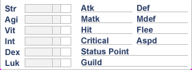
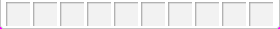
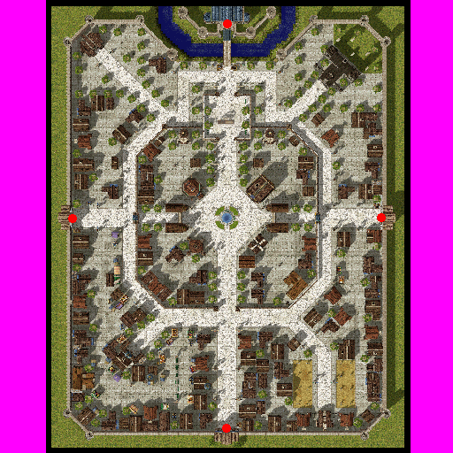
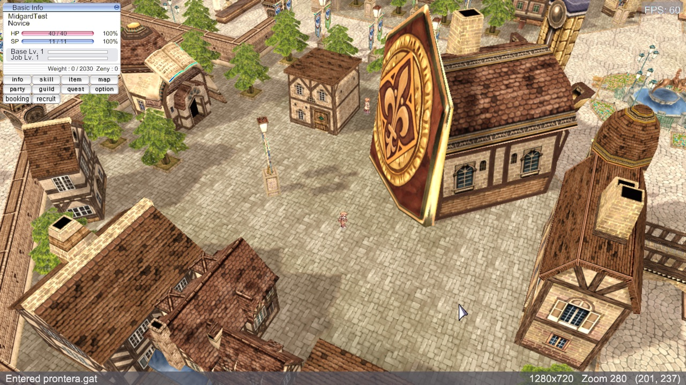

# Feature: Basic HUD — minimap, chat, hotkey bar, ESC menu and the four menu windows

**Branch:** `feature/basic-hud` · **Issue:** #88 · **Parent:** #49 (MVP scope), #53 (Track D — HUD + ESC menu)
**Status:** Planned · **Created:** 2026-08-26

## Goal

Finish the in-game HUD so Prontera is playable rather than just walkable: a
minimap in the corner, chat along the bottom, a hotkey bar, an ESC menu that can
actually quit or go back to character select, and the four menu buttons opening
the windows they promise — **Info (stats), Skills, Items, Map**. Plus the green
target square RO puts under the cursor, so a click has somewhere to land.

Advances the MVP's **UI** item and closes most of #53's Track D.

## A note on size

This is bigger than one feature normally is — four windows, four panels and a
cursor effect, which comes out at eleven steps rather than the four to eight a
feature usually takes. It is planned as one PR because that is what was asked
for, and the pieces do share the same foundations (window chrome, packet
handlers, the `hud` trace channel).

If it proves unwieldy in review, the natural cut is after **Step 5**: steps 1–5
are the always-on HUD (minimap, chat, hotkey bar, click marker) and steps 6–10
are the windows behind the menu buttons. Each half stands alone.

## What #87 already did — and deliberately did not

PR #87 (**merged today**) built the Basic Info panel and, importantly, **the menu
button grid**. Its own "Out of scope" list names almost exactly this feature:

> - The menu buttons **open nothing** — inventory, skills, map, options and guild windows are their own features.
> - Nothing about the minimap, the chat box or entity HP bars…
> - The status window (STR/AGI/VIT/INT/DEX/LUK) — a separate window, despite arriving in the same packets.

So the buttons are drawn and their art is extracted. This feature makes them do
something. **Do not re-do the grid.**

## The finding that shapes the plan

`minimap.go`, `chatbox.go` and `ingame_ui.go` **already exist and look complete** —
`Minimap` samples the GAT, holds markers and handles clicks; `ChatBox` has
scrollback. They are also **unreachable**: they belong to `ImGuiBackend`, and
`NewImGuiBackend` is never called anywhere in the tree. `game.go:189` constructs
`NewUI2DBackend` and nothing else.

That makes them a **reference, not a starting point**. Their logic is worth
lifting — GAT sampling and scrollback are solved problems in there — but every
line that draws is ImGui and has to be rewritten against `ui2d`. Planning this
as "wire up the existing minimap" would be planning against dead code.

**Direction (Boris, 2026-08-26): ImGui is deprecated.** Nothing new uses it, and
the UI framework continues to be built from scratch on `ui2d`. That settles what
was Open question 3 — the dead widget files go in this PR's Step 10.

It does not remove ImGui from the build, and it is worth being exact about why.
ImGui is doing two jobs here, and only one of them is dead:

| Job | Where | State |
|-----|-------|-------|
| **Widgets** — windows, buttons, the old login/charselect/in-game screens | `ingame_ui.go`, `minimap.go`, `chatbox.go`, `charselect_ui.go`, `login_ui.go`, `loading_ui.go`, `connecting_ui.go`, `debug_overlay.go`, `statusbar.go`, `imgui_backend.go` | ⚠️ **unreachable — delete** |
| **Platform** — window, GL context, event pump, mouse, keyboard, HiDPI scale | `game.go:140` `sdlbackend.NewSDLBackend()`; `ui2d_backend.go:102,146-154` `imgui.CurrentIO()`, `MousePos()`, `IsMouseDown()` | 🔴 **load-bearing** |

The second row is the surprise: our **native** backend reaches into ImGui for
input and DPI. So `ui2d` draws everything itself but still gets its mouse from
ImGui, and `game.go:442` reads the Escape key the same way — which Step 5 needs.

Replacing that platform layer with our own SDL window and input is a real piece
of work and **its own feature**, not a step here. This feature deletes the dead
widgets and adds no new ImGui; it does not claim to remove the dependency.

## Reference (original client)

### Assets extracted from `data.grf`

1. **Status window** — `basic_interface/statwin_bg.bmp`, **280×103**. Siblings
   `statwin0/1/2_bg.bmp` are the tab variants.
2. **Hotkey bar** — `basic_interface/shortcut_bg.bmp`, **280×29**. One strip; the
   slots are drawn into it.
3. **Click target** — `data/texture/grid.tga`, **32×32** with alpha. This is the
   green square, and it is a *texture on the ground*, not a cursor state —
   roBrowser draws it the same way (`Renderer/Map/GridSelector.js:103`).
4. **Minimap** — `data/texture/유저인터페이스/map/prontera.bmp`, **512×512**,
   pre-rendered. RO does **not** derive the minimap from the GAT at runtime, which
   is what our dead `Minimap` does. There is also `map/pprontera.bmp`, the
   overlay variant.
5. **Menu buttons** — `btn_status_*`, `btn_skill_*`, `btn_items_*`, `btn_map_*`,
   each with `_on` / `_off` / `_dis`. Already extracted and drawn by #87.

**No in-situ screenshot of the original HUD.** As with #86, a web search turned up
gameplay shots rather than clean UI captures. The bitmaps above are exact, but
placement and spacing are inferred — see Open question 1.

### Current state (ours)

6. **Basic Info panel + menu grid** — from #87, top-left. Buttons draw and hover
   but open nothing.
7. **No minimap, no chat, no hotkey bar.** The corners are empty.
8. **Clicking the ground walks with no feedback** — no target square, no
   indication the click registered until the character starts moving.

## What exists today

| Area | What exists | Status |
|------|-------------|--------|
| `internal/engine/ui2d/context.go` | `BeginWindowEx`, `Button`, `Label`, `Selectable`, `Checkbox`, `ProgressBar`, `DragHandle` | ✅ everything the windows need |
| `internal/game/ui/hud_basic_info.go` | Basic Info panel + menu grid | ✅ #87 — extend, don't duplicate |
| `internal/game/ui/window_skin.go` | `win_msgbox`, `basewin_*` chrome loaded | ✅ reuse |
| `internal/engine/cursor/cursor.go` | RO cursor with `StateTalk`, `StateClick` | ✅ from main |
| `internal/game/ui/minimap.go` | GAT sampling, markers, click handling | ⚠️ **dead** — ImGui only |
| `internal/game/ui/chatbox.go` | scrollback | ⚠️ **dead** — ImGui only |
| `internal/game/ui/ingame_ui.go` | the whole ImGui in-game UI | ⚠️ **dead** |
| `internal/game/ui/imgui_backend.go` | `NewImGuiBackend` never called | ⚠️ **dead** |
| `internal/game/states/player_stats.go` | `PlayerStats` model + live updates, tested | ✅ #87 — extend for the six primary stats |
| `internal/trace` | `status` channel for stat changes | ✅ #87 — reuse |
| `internal/network/packets/` | `ZC_PAR_CHANGE`/`LONGPAR`/`LONGLONGPAR` decoded | 🟡 the rest below missing |
| `internal/game/states/ingame.go` | entity, move and stat handlers | 🟡 extend with chat, skills, items, quit |

**In flight:** nothing. #86 (`feature/npc-dialog`) is planning-only and touches
`states/` and `ui/` — worth landing one before the other, but they do not collide
today.

## Reference implementations

| Source | Where | Approach |
|--------|-------|----------|
| roBrowser | `src/Renderer/Map/GridSelector.js` | The target square is a textured quad on the ground plane from `data/texture/grid.tga`, positioned per cell, not a cursor sprite. |
| roBrowser | `src/UI/Components/{MiniMap,ChatBox,ShortCut,StatusWindow,Inventory,SkillList}` | One component per window, each owning its packet handlers — the split this plan follows. |
| korangar | `korangar/src/interface/windows/` | Same window-per-concern split in an immediate-mode UI, which is closer to our `ui2d`. |

## Assets

| Asset | GRF path | Exists? |
|-------|----------|---------|
| Status window | `…/basic_interface/statwin_bg.bmp` (+`0/1/2`) | ✅ 280×103 |
| Hotkey bar | `…/basic_interface/shortcut_bg.bmp` | ✅ 280×29 |
| Click target | `data/texture/grid.tga` | ✅ 32×32 RGBA |
| Minimap (Prontera) | `…/유저인터페이스/map/prontera.bmp` | ✅ 512×512 |
| Menu buttons | `…/basic_interface/btn_{status,skill,items,map}_{on,off,dis}.bmp` | ✅ all three states |
| Window chrome | `…/basic_interface/basewin_*.bmp`, `titlebar_*.bmp` | ✅ loaded already |

There is **no** `win_stats` / `win_skill` / `win_item` / `win_map` family — the
windows are the generic chrome plus their own background. Checked and recorded so
nobody searches again.

## Protocol

IDs verified against the server's headers at PACKETVER 20211103.

| Packet | ID | Len | Dir | What | Handled? |
|--------|----|-----|-----|------|----------|
| `ZC_PAR_CHANGE` | `0x00B0` | 8 | S→C | one stat changed | ✅ #87 |
| `ZC_LONGPAR_CHANGE` | `0x00B1` | 8 | S→C | one 32-bit stat (EXP, Zeny) | ✅ #87 |
| `ZC_LONGLONGPAR_CHANGE` | `0x0ACB` | 12 | S→C | 64-bit variant | ✅ #87 |
| `ZC_STATUS` | `0x00BD` | 44 | S→C | the whole STR/AGI/VIT/INT/DEX/LUK block | ❌ |
| `ZC_COUPLESTATUS` | `0x0141` | 14 | S→C | stat + its bonus | ❌ |
| `ZC_NOTIFY_CHAT` | `0x008D` | var | S→C | someone else spoke | ❌ |
| `ZC_NOTIFY_PLAYERCHAT` | `0x008E` | var | S→C | our own line, echoed | ❌ |
| `ZC_SKILLINFO_LIST` | `0x0B32` | var | S→C | the skill list — **not `0x010F`** at our version | ❌ |
| `CZ_RESTART` | `0x00B2` | 3 | C→S | `type` at offset 2: 0 respawn, 1 character select | ❌ |
| `CZ_REQ_DISCONNECT` | `0x018A` | 4 | C→S | quit to desktop | ❌ |
| `ZC_ACK_REQ_DISCONNECT` | `0x018B` | 4 | S→C | the server's answer | ❌ |

**The running-total stats are already decoded.** #87 registers `0x00B0`,
`0x00B1` and `0x0ACB` onto a `PlayerStats` model
(`internal/game/states/player_stats.go`, with tests) and traces them on the
`status` channel. What is missing for the Info window is the **six primary
stats** — `ZC_STATUS` and `ZC_COUPLESTATUS`, neither registered — so Step 6 is
mostly a display of a model that already exists, plus two packets.

Two traps, both the same shape as ones already hit:

- **`ZC_SKILLINFO_LIST` is `0x0B32`, not the `0x010F` every wiki lists.** `0x010F`
  is the pre-2018 id and is absent from our length table. Registering it would
  never fire — exactly the bug that made entities invisible before #80.
- **`CZ_RESTART` and `CZ_REQ_DISCONNECT` are absent from `lengths.go`** because it
  is generated from server→client packets only. Build them by hand; do not expect
  `packets.Length()` to know them.

## Step 0 — Prerequisites & tooling

### 0a. Refactoring

- [ ] `internal/game/ui/hud_basic_info.go` — the menu grid draws buttons but has
      no notion of a window being open. Add the toggle state the four windows
      need, so each button reflects open/closed via its `_on`/`_off` art.
- [ ] No ADR. This adds windows to an existing UI layer and handlers to an
      existing state; it crosses no layer boundary.

### 0b. Debug tooling & tests

- [ ] **Trace channel `hud`** — events: `hud.toggle` (window, open), `hud.chat`
      (from, bytes), `hud.skills` (count), `hud.items` (count), `hud.target`
      (cell). Scoped to what the UI does.
      **Stat changes stay on the existing `status` channel** that #87 added —
      a second channel reporting the same events would split the trail.
- [ ] **F3 overlay fields:** which windows are open, chat line count, skill count,
      item count, last target cell. A HUD that shows nothing should be
      diagnosable from one screenshot.
- [ ] **Screenshot scenario:** `./build/midgard --autologin --trace=hud,net --screenshot-after 20s`
      at `prontera 156,191`. `latest.png` must show minimap, chat, hotkey bar and
      the Basic Info panel at once.
- [ ] **Logs:** a missing minimap image must log at **warn** with the path it
      wanted — the black-login-screen lesson. Maps without a pre-rendered image
      must fall back visibly, not silently.
- [ ] **Tests:** `internal/network/packets/hud_test.go` — round-trip each packet
      against hand-written bytes; chat splitting (`name : message`), and
      `CZ_RESTART`'s type byte. `internal/game/ui/*_test.go` — scrollback
      trimming, minimap cell→pixel mapping, window toggle state.
- [ ] **Use cases:** UC-208 (always-on HUD), UC-209 (the four windows), UC-210
      (ESC menu and leaving the game).

## Steps

### Step 1 — Minimap
- **Changes:** `internal/game/ui/hud_minimap.go`, `internal/assets`
- **Done when:** Prontera's pre-rendered minimap sits top-right with the player
  as a dot that moves as you walk; a map without an image logs at warn and leaves
  the corner empty rather than drawing black.
- **Proved by:** screenshot scenario; UC-208. `hud` trace shows the image path resolved.
- **Reference:** grf-prontera ④

### Step 2 — Chat display
- **Changes:** `internal/network/packets/hud.go`, `internal/game/ui/hud_chat.go`, `internal/game/states/ingame.go`
- **Done when:** rAthena's welcome lines appear bottom-left and scroll; the box
  keeps a bounded backlog.
- **Proved by:** UC-208; `--trace=hud` shows `hud.chat` per line. Packet tests for `0x008D`/`0x008E`.

### Step 3 — Click target square
- **Changes:** `internal/engine/scene`, `internal/game/states/ingame.go`
- **Done when:** a green square from `grid.tga` sits on the cell under the cursor
  and animates on click; it tracks the cursor and disappears on arrival.
- **Proved by:** screenshot scenario with the cursor over a cell; UC-208.
- **Reference:** grf-grid ③

### Step 4 — Hotkey bar
- **Changes:** `internal/game/ui/hud_hotkeys.go`
- **Done when:** the bar draws along the bottom with its slots; slots are empty
  but present and the bar sits where the original puts it.
- **Proved by:** screenshot scenario; UC-208.
- **Reference:** grf-shortcut_bg ②

### Step 5 — ESC menu
- **Changes:** `internal/game/ui/hud_escmenu.go`, `internal/network/packets/hud.go`, `internal/game/states/`
- **Done when:** ESC toggles a menu with Return to character select, Quit and
  Cancel; both leave the game cleanly through the right packet.
- **Proved by:** UC-210 — each button lands you where it says, with no hang and
  no orphaned connection.

### Step 6 — Stats window (Info)
- **Changes:** `internal/network/packets/hud.go`, `internal/game/states/player_stats.go`, `internal/game/ui/win_stats.go`
- **Done when:** the Info button opens a window showing STR/AGI/VIT/INT/DEX/LUK
  with their bonuses, updating live as stat packets arrive.
- **Note:** the model and its live updates already exist from #87 — this extends
  `PlayerStats` with the six primary stats from `ZC_STATUS`/`ZC_COUPLESTATUS`
  and draws it. Do not build a second stats model.
- **Proved by:** UC-209, UC-305 (extended); `status` trace fires on change.
  Packet tests for `0x00BD`/`0x0141`.
- **Reference:** grf-statwin_bg ①

### Step 7 — Skills window
- **Changes:** `internal/network/packets/hud.go`, `internal/game/ui/win_skills.go`
- **Done when:** the Skills button lists the character's skills with names and
  levels, from `ZC_SKILLINFO_LIST` (`0x0B32`).
- **Proved by:** UC-209. A Novice shows Basic Skill at its level.

### Step 8 — Items window
- **Changes:** `internal/network/packets/hud.go`, `internal/game/ui/win_items.go`
- **Done when:** the Items button lists inventory contents with counts.
- **Proved by:** UC-209.

### Step 9 — Map window
- **Changes:** `internal/game/ui/win_map.go`
- **Done when:** the Map button opens the full-size map image with the player
  marked — the minimap enlarged, sharing its loader.
- **Proved by:** UC-209.

### Step 10 — Delete the deprecated ImGui widgets, and docs
- **Changes:** remove `internal/game/ui/{imgui_backend,ingame_ui,minimap,chatbox,charselect_ui,login_ui,loading_ui,connecting_ui,debug_overlay,statusbar}.go`
- **Done when:** every ImGui *widget* file is gone, the build is clean, and the
  only remaining ImGui use is the platform layer named above.
- **Proved by:** `go build ./... && go test ./...`; `git grep -l cimgui-go -- internal/game/ui` returns only `ui2d_backend.go`.
- **Note:** done last, once each native replacement is proven — deleting a
  minimap before its replacement works leaves nothing to compare against.
- [ ] `docs/ENGINE_FEATURES.md`
- [ ] Session log
- [ ] Close #53's D1/D2/D3 items; note what remains

## Done when (feature)

- Minimap, chat, hotkey bar and Basic Info panel are all on screen at once and
  readable at 1280×720 and 1920×1080
- A green square follows the cursor and animates when you click to move
- Each of the four menu buttons opens and closes its window, and the button
  shows which state it is in
- The stats window updates live as the server sends stat changes
- ESC opens a menu; Return to character select and Quit both work
- `--trace=hud` shows every server value the HUD is displaying

## Out of scope

- **Chat input.** Display only, as #53's D2 says — sending needs the input box
  and command parsing.
- Assigning skills or items to hotkey slots — the bar draws, the slots stay empty.
- Item icons and skill icons (needs the item sprite table, its own feature).
- Party, guild, storage, equipment windows; entity HP bars.
- Settings inside the ESC menu beyond volume — no keybinding UI.
- **Removing the ImGui dependency.** The dead widgets go (Step 10), but the SDL
  platform backend and the input/DPI calls the native UI makes stay. Replacing
  those is its own feature.

## Open questions

1. **No in-situ HUD screenshot.** Bitmaps are exact; placement and spacing are
   inferred from roBrowser. A real capture would settle the corners.
2. **Minimap for maps with no image?** Prontera has one. If a map ships none, is
   an empty corner right, or should it fall back to sampling the GAT the way the
   dead `Minimap` does?
3. **When should the platform layer be replaced?** Deleting the widgets still
   leaves `ui2d` taking its mouse, keyboard and DPI scale from ImGui. Worth
   raising as the next feature after this one, or later?
4. **Hotkey bar with nothing to put in it** — worth shipping empty in this
   feature, or holding it until skills can be dragged onto it?

## Investigation notes

- `ZC_PAR_CHANGE` (30×), `ZC_COUPLESTATUS` (18×) and `ZC_LONGPAR_CHANGE2` (4×)
  arrive every session and are currently discarded.
- The `dialog_*` 600×24 strips are the chat *input bar* chrome — relevant to chat
  input, which is out of scope here.
- `internal/engine/cursor` independently arrived at the same 25 ms ACT interval
  tick that the entity animation fix did, from the other direction.

## Revision log

- 2026-08-26 — created
- 2026-08-26 — ImGui declared deprecated: deleting the dead widget files became
  Step 10 rather than an open question, and the platform layer it still provides
  was recorded as a separate feature (per direction)
