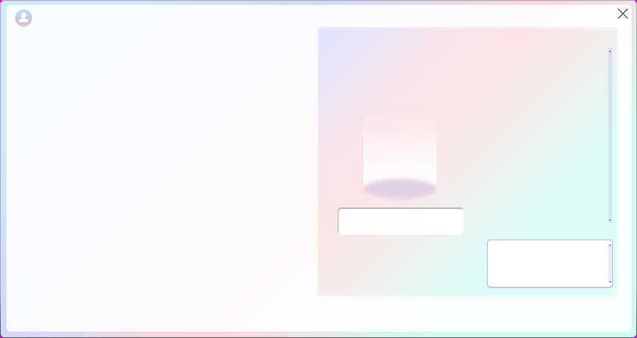
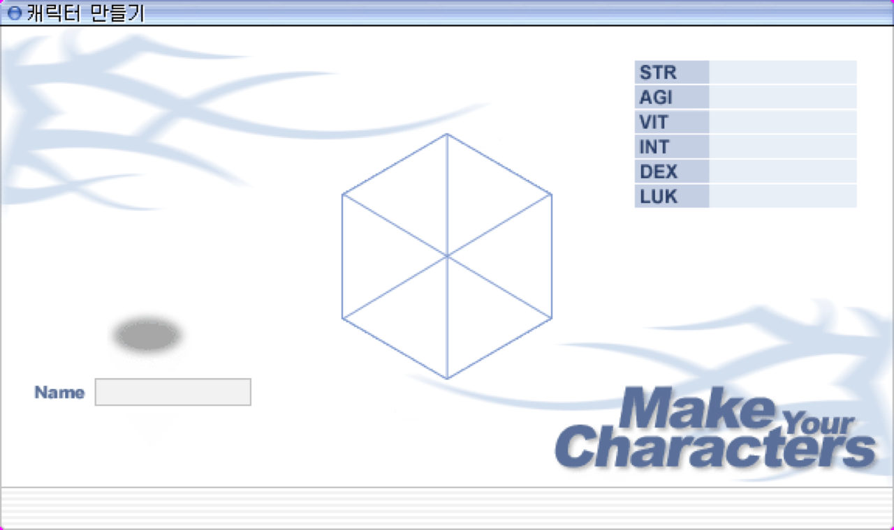
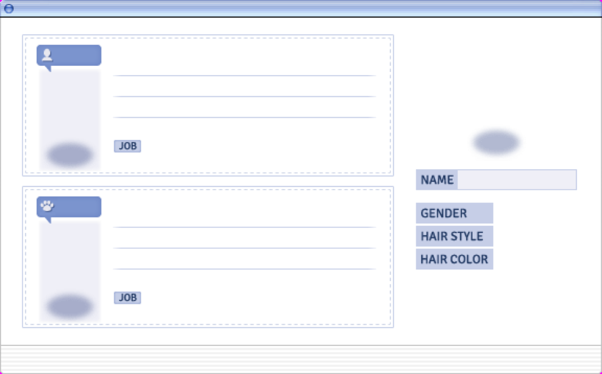
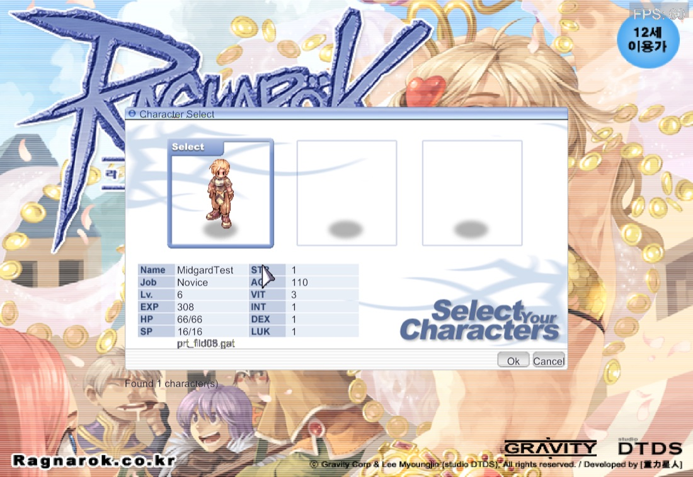

# Feature: Character creation — the "Create Character" screen

**Branch:** `feature/character-creation` · **Issue:** #109 · **Parent:** — (see Scope)
**Status:** Planned · **Created:** 2026-09-01 · **Revised:** 2026-09-01

## Goal

Double-click an empty slot on character select and build a character the way
our server actually supports it: pick Human or Doram, a sex, one of 23 hair
styles and one of 10 hair colours, type a name the server will accept, press
Create, and land back on character select with the character in the slot you
chose.

Today there is no way to create one at all. Every character this project has
tested with was inserted by SQL seed (`docker/rathena/seed/`), which is why
three test accounts exist and why each has exactly one character.

**Scope: complete, matched to our server.** This is deliberately not cut down
to the old MVP shape (Novice only). Whatever `docker/rathena` accepts at
creation, the screen offers. The section below is that list, read off the
server we build.

## What our server actually accepts

Read from our pinned rAthena, not assumed:

| Thing | Value | Source |
|---|---|---|
| Creatable jobs | **Novice *and* Summoner (Doram)** | `char/char.cpp:2814-2818` — our build defines `RENEWAL` (`config/renewal.hpp:24`) and `PACKETVER_RE 20211103`, so `allowed_job_flag = 3`; the check at `:1489` admits both |
| Sex | Male or female, **per character**, sent by the client; anything else refused | `char/char.cpp:1424-1434` |
| Starting stats | **Not sent.** Server writes 1 to each | `char/char_clif.cpp:1278-1285` |
| Starting status points | **48**, spent in game | `char/char.cpp:2800` |
| Name length | 4 – 23 characters | `char_athena.conf:149`; `NAME_LENGTH 24` in `common/mmo.hpp:154` |
| Name characters | Letters, digits and space only (allow-list mode) | `char_athena.conf:160,164` |
| Name uniqueness | Enforced; only knowable by trying | `char/char.cpp:1386` |

So the full set of choices the wire can carry is: **name, slot, hair style,
hair colour, job, sex.** That is exactly six things, and the screen below has
a control for each.

## Reference

### ref-01 — the screen to build

`data/texture/유저인터페이스/make_character_ver2/bg_makebg.bmp`, **794×422**,
from our own `data.grf` — the same size as the retail screenshot Boris sent.
This is the frame; everything else is drawn on top of it.

**Painted into the texture** (nothing to build):

1. **Title bar** with its account glyph, and the close **X** at the right.
2. **The pastel panel** filling the right two-thirds.
3. **The sprite podium** — the soft shadow the character stands on.
4. **The name input well** beneath the podium.
5. **The swatch box** outline at bottom right, for hair colour.
6. **The scrollbar track** down the right edge of the hair-style area.

**Drawn by the client** (what the steps below build): the race cards on the
left half, which is deliberately blank here; the sex toggle; the character
sprite; the hair-style thumbnails in the scrolling area; the colour swatches
inside the box; **Go back** and **Create**, which are *not* painted in; and
every piece of text.

> **Corrected 2026-09-01.** This entry previously named `bg_back2.tga`
> (997×626) and described race cards and a hair grid on it. That was wrong:
> `bg_back2.tga` is the **modern character *select*** — a 15-slot grid with an
> info panel and its own "Character List ◀ 1/1 ▶" paging. It was identified
> from its filename and dimensions without being opened. `bg_makebg.bmp` is
> the creation frame. See Investigation notes.

### ref-02 — the classic screen, and why it is not this one

`login_interface/win_make.bmp`, 576×342 — the hexagon layout, also in our
archive. It was the first proposal for this feature and it is the wrong one:

- Its centre — the hexagon and the stat table — **has no wire representation**
  at our packet version. The six stat bytes exist only in the pre-2012
  `0x0067` variant of `CH_MAKE_CHAR`, whose own rule is that the six must
  total exactly 30 (`char/char.cpp:1437-1446`) — visible in it as six fives.
- It has **no control for job or sex**, the two fields our `0x0A39` added.

ref-01 has a control for every field the packet carries and none for anything
it does not. That is the whole argument.

### ref-03 — the third layout, recorded so nobody rediscovers it

`make_character/bg_create_character.bmp`, 576×358 — a fourth-era skeleton with
NAME / GENDER / HAIR STYLE / HAIR COLOR labels. Same field set as ref-01, much
plainer. Not used.

### current — our character select, captured for the first time

Taken with `--stop-at charselect` (Step 0b), which is what made an unattended
capture of this screen possible at all. It confirms both things the plan
assumed:

1. **Empty slots draw nothing** — slots 2 and 3 are bare but for the shadow
   ellipse painted into the background. No frame, no affordance, nothing to
   click. That is `charselect_native.go:215` skipping them, and it is the seam
   Step 1 opens.
2. **Three slot rects**, against the nine the account allows — Step 1b.

There is no creation screen yet to compare against.

## Assets

Counted with `grftool list`, not `search` — **`search` silently caps at 50
results** (`search data.grf bmp` returns 50 against 46,583 BMPs). Any inventory
taken with `search` is a floor, and reading it as a total is how an asset gets
declared missing when it is present.

| Asset | Count / size | Note |
|---|---|---|
| `make_character_ver2/bg_back2.tga` | 997×626 | The background |
| `bt_male_*`, `bt_female_*` | 4 states each | Sex toggle |
| `bt_leftturn_*`, `bt_rightturn_*` | 3 states each | Preview rotation |
| `bt_make_*`, `bt_close_*`, `bt_hairstyle_*` | — | Create, close, grid cell |
| `img_hairstyle01..23.bmp` | **23** | Male hair thumbnails |
| `img_hairstyle_girl01..23.bmp` | **23** | Female hair thumbnails |
| `img_hairstyle_doramboy/girl*` | 6 + 6 | Doram hair thumbnails |
| `color00..09_{off,on,over,press}` | **10** swatches | Hair colour |
| `img_doram_on.bmp`, `img_doram_comingsoon.bmp` | — | Doram card, both states |
| **Head sprites** `머리통/<sex>/<n>_<sex>.spr` | **104** — 42 styles per sex | Every one of the 23 thumbnails has a sprite behind it |
| **Doram sprites** | 50 | Doram is renderable |
| **Hair palettes** `.pal` | 929; **9 colour ids (0–8) per sex** | Matches 10 swatches where the first is "no palette" |

**The one real gap: the client cannot apply hair colour.** The engine handles
only palettes *embedded in* SPR files (`pkg/formats/spr.go`); there is no
external `.pal` loading anywhere in `internal/` or `pkg/`. The palettes are in
the archive and the swatches are in the archive — the code to put them
together is not. This is new work in the sprite pipeline, not a small
addition, and it is why Step 4 exists.

## What exists today

| Area | What exists | Status |
|---|---|---|
| `internal/game/states/charselect.go` (291 ln) | Char list, selection, map handoff | ✅ extend |
| `internal/game/ui/charselect_native.go` (382 ln) | The 576×342 select screen | ✅ extend |
| `charselect_native.go:215` | **Only slots holding a character respond** — an empty slot has no rect | 🟡 the seam Step 1 needs |
| `charselect_native.go:73` | `charSelSlotX` — **three** rects; accounts have 9 slots | 🟡 Open question 2 |
| `packets.go:28` | `CH_MAKE_CHAR = 0x0067` — declared, unused, **wrong id for our packetver** | ❌ replace |
| `packets.go:128` `CharEnter.Sex` | Account sex already reaches the char server | ✅ pattern to follow |
| `internal/engine/charsprite/` | Composite sprite by job/sex/hair | ✅ reuse; ❌ no palette support |
| Creation packets | None — no `0x0A39`, `0x0B6F` or `0x006E` | ❌ build |
| Holding the client on char select | **Impossible today** (`charselect.go:106` auto-selects) | ❌ Step 0b |

**In flight:** PR **#108** (`feat/basic-ui-mvp`) touches
`internal/engine/charsprite/`, `internal/engine/sprite/composite.go` and
`internal/engine/playerrender/`, and adds the in-game spending of the 48
status points this screen hands off. It does **not** touch char select or
creation. Land it first or expect conflicts in the sprite path.

## Reference implementations

| Source | Where | Approach |
|---|---|---|
| **nostalro-client** | `lib/ui-component/src/account/char_create_window.rs` (719 ln) | Closest match. A `with_stats: bool` taken from the packet version picks both the behaviour and the skin (`:10`, `:31`, `:176-178`) — the same decision this plan makes, made the same way. |
| **roBrowser** | `src/UI/Components/CharCreate/` | Original layout and logic transcribed; `:232` updates stats and polygon together. Layout measurement source. |
| **korangar** | `korangar/src/interface/windows/character_creation.rs` | Behaviour reference; its UI is deliberately not the original look. |

## Protocol

Char-server packets (`src/char/char_clif.cpp`), not map.

| Dir | Packet | Id | Layout | Source |
|---|---|---|---|---|
| → | `CH_MAKE_CHAR` | **`0x0A39`** | 36B: type(2) name[24] slot(1) hair_color(2) hair_style(2) job(4) sex(1) | `common/packets.hpp:122-132` |
| ← | `HC_ACCEPT_MAKECHAR` | **`0x0B6F`** | The new character's entry | `common/packets.hpp:259-264` |
| ← | `HC_REFUSE_MAKECHAR` | `0x006E` | type(2) error(1) | `common/packets.hpp:273-277` |

**`0x0B6F` is version-critical.** Its guard is
`PACKETVER_MAIN_NUM >= 20201007 || PACKETVER_RE_NUM >= 20211103` — we are
*exactly* on the RE boundary. One version earlier the reply is `0x006D` with a
different body. Generate the length with `tools/packetlen/gen.py`; do not
trust this table after a `make server-rebuild`.

**Refusal codes** (`char_clif.cpp:1330-1352`): `0x00` name already taken,
`0xFF` denied (bad name, bad job, bad sex, slot in use, account limit), `0x01`
underaged, `0x03` slot not eligible.

## Step 0 — Prerequisites & tooling

### 0a. Refactoring

1. **Empty slots must be hit-testable** — `charselect_native.go:204-219` skips
   slots without a character, so an empty one has no rect to click.
2. **Fix `CH_MAKE_CHAR` in `packets.go:28`** — wrong id, currently unused.
3. **Char select needs a "slot is empty" affordance** — nothing expresses it today.

No layer boundary is crossed, so **no ADR**.

### 0b. Debug tooling & tests

1. **`--stop-at charselect`** — there is no way to hold the client on the
   character-select screen (`--autologin` drives through, without it you sit
   at login). **Every visual proof below is on that screen or reached from
   it**, so nothing here can be captured unattended until this exists. Highest
   priority item in Step 0.
2. **`--make-char "<name>"`** — drive creation unattended, as `--say` drives chat.
3. **Trace channel `char`** — `char.slot-click`, `char.create-send`,
   `char.create-ok`, `char.create-refused` with the code.
4. **F3 fields** — selected slot, empty or not, last creation result.
5. **Tests** — `0x0A39` round-trip against the generated client table; a decode
   test per refusal code; name-validation table test against the server's real
   rules (4–23, letters/digits/space); palette-application test in Step 4.
6. **UC-219, UC-220, UC-221.**

## Steps

### Step 1 — An empty slot is visible and answers a double-click
- **Changes:** `internal/game/ui/charselect_native.go`, `internal/game/states/charselect.go`
- **Done when:** every slot draws a frame; empty ones read as empty; a double-click logs `char.slot-click` with `empty=true`. Nothing navigates yet.
- **Proved by:** `--stop-at charselect --screenshot-after 6s`; UC-219

### Step 1b — All nine slots are reachable

> **Found while building Step 1:** the account's real slot count arrives on
> `HC_ACCEPT_ENTER2` `0x082D`, which we were not handling at all. `0x006B`,
> which carries the characters, does **not** carry it — its three bytes are
> `total`, `premium_start` and `premium_end`, and we were reading the second
> as an available-slot count. So the client believed the account had **15**
> slots (`MAX_CHARS`) when it has **9**, and would have offered six the server
> refuses. Decoded and corrected in Step 1; `char.slot-counts` now reports
> `producible: 9`, matching `character_slots` in the database.
- **Changes:** `internal/game/ui/charselect_native.go`, `internal/game/states/charselect.go`
- **Done when:** the select screen pages through the account's slots in threes, so a character can be created into any of the nine the account allows. Paging is disabled when the account has three or fewer.
- **Proved by:** a screenshot per page with `--stop-at charselect`; UC-219

### Step 2 — The creation screen opens, drawn from `bg_makebg.bmp`
- **Changes:** new `CharCreateState`, new `internal/game/ui/charcreate_native.go`
- **Done when:** the double-click opens the ref-01 frame with Go back and Create drawn on it. Go back returns having sent nothing.
- **Proved by:** screenshot matching ref-01; UC-219
- **Reference:** ref-01 ①②④⑥⑦⑨

### Step 3 — Sex, race and hair style drive a live preview
- **Changes:** `charcreate_native.go`, reusing `internal/engine/charsprite`
- **Done when:** the ♂/♀ toggle switches the sprite; picking Human or Doram switches the body; the 23-cell grid changes hair style; the turn arrows rotate the preview. All from real sprites.
- **Proved by:** UC-220; one screenshot per sex and per race
- **Reference:** ref-01 ④⑤⑦

### Step 4 — Hair colour, which needs external palettes
- **Changes:** `pkg/formats` (a `.pal` reader), `internal/engine/charsprite`, `internal/engine/sprite/composite.go`
- **Done when:** the 10 swatches recolour the preview's hair, and the same palette is applied to the character in game so the two agree.
- **Proved by:** palette unit test; UC-220; a screenshot of the same character on this screen and in Prontera
- **Reference:** ref-01 ⑧
- **Note:** the largest step. Nothing in the engine reads external `.pal` files today.

### Step 5 — Name entry and the creation round trip
- **Changes:** new `internal/network/packets/charcreate.go`, `charselect.go`
- **Done when:** a valid name and Create sends `0x0A39`; `0x0B6F` returns to char select with the character in the chosen slot; `0x006E` `0x00` says the name is taken and keeps you on the screen; names the server would reject on length or characters are refused locally without a packet.
- **Proved by:** packet round-trip tests; `--make-char`; `--trace=char,net`; UC-221
- **Reference:** ref-01 ⑥⑨

### Step 6 — Docs
- `docs/ENGINE_FEATURES.md` — the creation screen, the palette reader, the packetver constraint
- `docs/research/` — the three `CH_MAKE_CHAR` variants and what our server accepts, so nobody re-derives them
- Session log

## Done when (feature)

- Double-clicking an empty slot opens creation; Go back sends nothing.
- Human and Doram are both creatable and both render.
- The sex toggle changes the sprite, and the created character has that sex.
- All 23 hair styles and all 10 colours apply, and match in game.
- A valid free name creates the character in the chosen slot; it can be entered.
- A taken name is reported and keeps you on the screen.
- A name that is too short, too long, or has disallowed characters is refused
  before a packet is sent.
- The new character has 48 status points to spend.

## Out of scope

- **Character deletion** (`CH_DELETE_CHAR`) — its own flow with a timer.
- **Spending the 48 status points** — the stat window, PR #108.

## Open questions

All three answered by Boris on 2026-09-01 and folded into the steps above.

1. ~~Doram now, or "coming soon"?~~ → **Build it.** Both race cards are live.
2. ~~Three slots or nine?~~ → **Nine, with paging.** The select screen draws
   three rects today; every slot the account has must be reachable, so paging
   is in scope and becomes Step 1b.
3. ~~Should the preview rotate?~~ → **Yes.** The turn arrows work.

## Investigation notes

- `grftool search` caps at 50 results with no indication. Use `list` with a
  glob for any inventory. This is worth fixing in the tool itself.
- The GRF holds **four** creation layouts from four client eras. Searching
  `make_character` finds the newest two and misses the classic screen entirely,
  which lives under `login_interface/`.
- **An asset was named from its filename and never opened**, and the wrong
  one reached the published plan: `bg_back2.tga` is the modern character
  *select* (a 15-slot grid, which is `MAX_CHARS`), not creation. The creation
  frame is `bg_makebg.bmp`, 794×422 — the size of the retail screenshot, which
  is the check that would have caught it immediately. Open the image before
  writing its legend.
- Korean directory names are EUC-KR inside the archive. Decoding a listing as
  UTF-8 with replacement characters produces a path `extract` cannot find —
  pass raw bytes.

## Revision log

- 2026-09-01 — Created against `win_make.bmp` (classic hexagon layout).
- 2026-09-01 — **ref-01 corrected** from `bg_back2.tga` to `bg_makebg.bmp`; the first was the modern character select, not creation.
- 2026-09-01 — Open questions answered: Doram in, nine slots with paging (new Step 1b), preview rotation in.
- 2026-09-01 — **Rebuilt around `make_character_ver2` (ref-01).** Boris: the
  old RFC scope is not current; build the full functionality our server
  supports. Consequences: the screen now has a control for every field
  `0x0A39` carries and none for anything it does not; Doram and the sex toggle
  are in; hair colour is in and brings external `.pal` support with it; the
  Novice-only limit is gone. Open question 1 of the first revision (what to do
  about stat allocation, which the wire cannot carry) is **resolved** — this
  layout has no stat allocation to reconcile.
