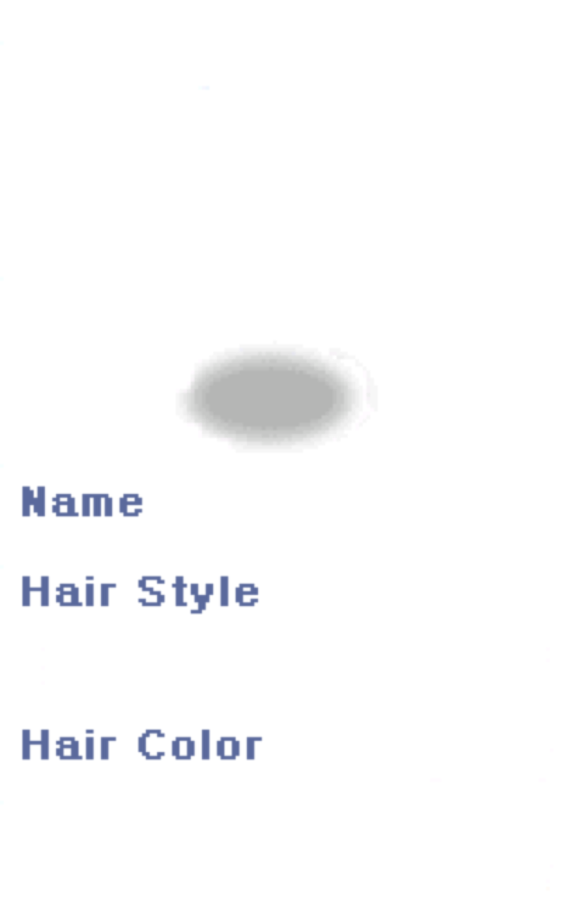

# Feature: Character creation — the "Make Your Characters" screen

**Branch:** `feature/character-creation` · **Issue:** #109 · **Parent:** #49 (MVP scope)
**Status:** Planned · **Created:** 2026-09-01

## Goal

Double-click an empty slot on character select and build a character: pick a
name the server will accept, cycle hair style and colour, see the sprite
update as you do, press OK and land back on character select with the new
character in the slot you chose.

Today there is no way to create one at all. Every character this project has
ever tested with was inserted by SQL seed (`docker/rathena/seed/`), which is
why three test accounts exist and why each has exactly one character.

## The finding that reshapes requirements 2 and 4

**At our packet version the server does not accept starting stats, and it does
accept a sex from the client.** Both of Boris's assumptions land the other way
round from what the reference screenshot implies.

`CH_MAKE_CHAR` has three variants behind `PACKETVER` guards
(`common/packets.hpp:122-157`). At `PACKETVER 20211103` we are in the first
branch, `>= 20151001`:

| PACKETVER | id | Carries |
|---|---|---|
| `>= 20151001` **← ours** | `0x0A39` | name[24], slot, hair_color, hair_style, **job**, **sex** |
| `>= 20120307` | `0x0970` | name[24], slot, hair_color, hair_style |
| older | `0x0067` | name[24], **str, agi, vit, int, dex, luk**, slot, hair_color, hair_style |

The six stat bytes exist **only in the oldest variant**. And the handler does
not merely ignore them at our version — it assigns them
(`char/char_clif.cpp:1272-1285`): under `PACKETVER >= 20151001` it reads `job`
and `sex` from the packet and sets `str` through `luk` to a literal `1` each.

The screen in the reference is the pre-2012 one. Its own rule confirms it:
below `PACKETVER 20120307` the server requires the six stats to total exactly
30 with none below 1 (`char/char.cpp:1437-1446`) — and the reference shows six
stats of 5, which is 30. That screen and that arithmetic belong to `0x0067`.

**What replaces it.** A new character is created with `start_status_points`
(`char/char.cpp:1458-1460`) and spends them **in game**, in the stat window —
which is what PR #108 is building right now. So the capability Boris wants is
not lost; it moves from creation to the status window.

**Sex.** At `>= 20151001` sex comes from the packet, not the account, and the
server accepts only male or female and refuses anything else
(`char/char.cpp:1424-1434`). The account sex requirement 4 asks for is
nonetheless already in our hands: `client.Session()` returns it and
`CharSelectState.sendCharEnter` already puts it in `CH_ENTER`
(`internal/game/states/charselect.go:126`, `internal/network/packets/packets.go:128`).
So we can honour requirement 4 exactly — take the account's sex, show the
matching sprite — and simply send that same value back in `0x0A39` rather than
offering a chooser. roBrowser does the same (`CharCreate.js:95` `setAccountSex`).

## Reference (original client)

### ref-01 — the classic layout, and it is in our archive

`data/texture/유저인터페이스/login_interface/win_make.bmp`, **576×342** — pixel
for pixel the screen Boris referenced, extracted from our own `data.grf`.

1. **Title bar** — Korean "캐릭터 만들기" (Create Character), the same chrome as
   every other window.
2. **Hexagon outline** — painted into the texture. The *filled* polygon is the
   client's to draw.
3. **Stat table**, STR/AGI/VIT/INT/DEX/LUK with empty value cells — labels
   painted in, numbers ours.
4. **"Make Your Characters" wordmark** — painted in. Nothing to draw.
5. **`Name` label and input well** — painted in; the text and caret are ours.
6. **Shadow ellipse** where the sprite stands.

Note **576×342 is exactly the character-select texture's size**
(`internal/game/ui/charselect_native.go:14`). The two screens are siblings and
want the same treatment: one background, everything else drawn on top.

### ref-02 — the layout that matches our packet version

`login_interface/win_make2.bmp`, **150×240**. The compact form the original
switches to once starting stats stopped being sent: name, and the arrows —
no hexagon, no stat table, because there is nothing to allocate.

### ref-03 — the modern set, for completeness

`make_character/bg_create_character.bmp`, 576×358. A third, much later layout:
job cards (Novice / Doram) and labelled NAME / GENDER / HAIR STYLE / HAIR
COLOR fields. It matches `0x0A39`'s payload most literally — job and sex are
exactly the two fields that variant added. Recorded so nobody rediscovers it
and assumes it is the one to build; it is not what Boris asked for.

**Current state:** none. There is no creation screen and no capture of ours to
compare against.

## What exists today

| Area | What exists | Status |
|---|---|---|
| `internal/game/states/charselect.go` (291 ln) | Char list request, selection, map-server handoff, `client.Session()` sex | ✅ extend |
| `internal/game/ui/charselect_native.go` (382 ln) | The 576×342 screen; slot rects, portraits, stat table | ✅ extend |
| `charselect_native.go:215` | **Only slots holding a character respond** — empty slots are skipped outright | 🟡 the seam requirement 1 needs |
| `charselect_native.go:73` | `charSelSlotX` — **three** slot rects, but accounts have 9 slots | 🟡 see Open question 3 |
| `internal/network/packets/packets.go:28` | `CH_MAKE_CHAR = 0x0067` — **already declared, unused, and wrong for our packetver** | ❌ replace with `0x0A39` |
| `packets.go:128` `CharEnter.Sex` | Account sex already reaches the char server | ✅ reuse for requirement 4 |
| `internal/engine/charsprite/` | Composite character sprite by job/sex/hair/palette | ✅ reuse for the preview |
| Creation packets / handlers | Nothing. No `0x0A39`, no `0x0B6F`, no `0x006E` | ❌ build |
| Holding the client on char select | **No way to do it** — auto-select fires the moment the list arrives (`charselect.go:106`) | ❌ Step 0b |

**In flight:** PR **#108** (`feat/basic-ui-mvp`) touches `internal/engine/charsprite/`,
`internal/engine/sprite/composite.go`, `internal/engine/playerrender/` and adds
the in-game stat-point spending this feature hands off to. It does **not**
touch char select or creation — verified by diffing the branch. Land it first
or expect conflicts in the sprite path.

## Reference implementations

| Source | Where | Approach |
|---|---|---|
| **nostalro-client** | `lib/ui-component/src/account/char_create_window.rs` (719 ln) | The closest match by far, and it solves exactly our problem: a `with_stats: bool` chosen from the packet version picks **both** the behaviour and the skin — `win_make.bmp` hexagon layout when stats are sent, `win_make2.bmp` when not (`:10`, `:31`, `:176-178`). Its comment at `:82` describes the radar geometry: each spoke runs from the hexagon centre (0) to its arrow (10), so a stat of 5 sits at the spoke midpoint. If we build the hexagon, that is the geometry to copy. |
| **roBrowser** | `src/UI/Components/CharCreate/` | Original UI logic transcribed. `setAccountSex` (`:95`) holds account sex and puts it in the creation request (`:108`); `:232` updates "the stats and polygon" together. Our measurement source for layout. |
| **korangar** | `korangar/src/interface/windows/character_creation.rs` | Modern re-implementation; behaviour reference only, its UI is deliberately not the original look. |

## Assets

All confirmed present in `data.grf` by `cmd/grftool search`:

| Path (under `data/texture/유저인터페이스/`) | Size | Use |
|---|---|---|
| `login_interface/win_make.bmp` | 576×342 | The classic screen (ref-01) |
| `login_interface/win_make2.bmp` | 150×240 | The compact screen (ref-02) |
| `make_character/bg_create_character.bmp` | 576×358 | Modern layout (ref-03), not used |
| `make_character/chr_arrow_rotate_l_*.bmp`, `_r_*` | — | Hair-cycle arrows, three-state |
| `make_character/btn_create_out.bmp` | — | Create button |

Korean directory names are EUC-KR **inside the archive**: decoding the listing
as UTF-8 with replacement characters produces a path `grftool extract` cannot
find. Pass the raw bytes through. This cost a round trip during investigation
and is worth knowing before the first extract.

## Protocol

All three are **char-server** packets (`src/char/char_clif.cpp`), not map.

| Direction | Packet | Id | Layout | Source |
|---|---|---|---|---|
| → | `CH_MAKE_CHAR` | **`0x0A39`** | 36B: type(2) name[24] slot(1) hair_color(2) hair_style(2) job(4) sex(1) | `common/packets.hpp:122-132` |
| ← | `HC_ACCEPT_MAKECHAR` | **`0x0B6F`** | The new character's entry | `common/packets.hpp:259-264` |
| ← | `HC_REFUSE_MAKECHAR` | `0x006E` | type(2) error(1) | `common/packets.hpp:273-277` |

**`0x0B6F` is version-critical.** The guard is
`PACKETVER_MAIN_NUM >= 20201007 || PACKETVER_RE_NUM >= 20211103` — our
packetver is *exactly* the RE boundary. One version earlier and the reply is
`0x006D` with a different body. Generate the length rather than trusting this
table; `tools/packetlen/gen.py` is the authority.

**Refusal codes** (`char_clif.cpp:1330-1352`, mapped from
`char_make_new_char`'s negative returns):

| Wire | Meaning | Server return |
|---|---|---|
| `0x00` | **Name already taken** — requirement 3 | `-1` |
| `0xFF` | Creation denied (bad name, bad job, bad sex, slot in use, limit) | `-2` |
| `0x01` | Underaged | `-3` |
| `0x03` | Slot not eligible | `-4` |

**Name rules.** `NAME_LENGTH` is 24 (`common/mmo.hpp:154`), so 23 usable
characters. The server rejects empty names, names shorter than
`char_name_min_length`, names containing control characters, and — depending on
`char_name_option` — names outside a configured allow/deny character set
(`char/char.cpp:1340-1386`). We validate what we cheaply can and let the server
be the authority on the rest; **name uniqueness is only knowable server-side**,
so requirement 3 is answered by sending and handling `0x00`, not by pre-checking.

## Step 0 — Prerequisites & tooling

### 0a. Refactoring (only what this feature needs)

1. **Empty slots must be hit-testable.** `charselect_native.go:204-219` skips
   any slot without a character, so an empty one has no rect and cannot be
   clicked. Give every slot a rect; keep "has a character" as a property of
   the slot, not a reason to skip it.
2. **`CH_MAKE_CHAR = 0x0067` in `packets.go:28` is wrong for our packetver**
   and unused. Correcting a declared-but-unused constant is cheap now and a
   confusing bug later.
3. **Char select needs a "no character here" affordance.** The screen has
   nowhere to express an empty slot today; the reference draws the slot frame
   with nothing in it.

Nothing here crosses a layer boundary, so **no ADR**.

### 0b. Debug tooling & tests

1. **`--stop-at charselect`.** There is currently no way to hold the client on
   the character-select screen: `--autologin` drives straight through
   (`charselect.go:106` auto-selects the instant the list arrives) and without
   it the client sits at login. Every visual proof in this feature is on that
   screen or one reached from it, so **no step below can be captured
   unattended until this exists**. This is the single most important item in
   Step 0.
2. **`--make-char "<name>"`** — drive creation unattended, the way `--say`
   drives chat. Fills the name, sends, and leaves the result on screen.
3. **Trace channel `char`** — `char.slot-click`, `char.create-send`,
   `char.create-ok`, `char.create-refused` (with the code). A refusal that
   shows nothing and a packet that never went look identical.
4. **F3 fields** — selected slot, whether it is empty, and the last creation
   result. Same argument as the `Cmd:` field added in #94.
5. **Tests** — packet round-trip for `0x0A39` with known bytes against the
   generated client table (`clientlengths_test.go` pattern); a decode test per
   refusal code; a table test for name validation; a geometry test for the
   radar polygon if we build it.
6. **UC-219, UC-220, UC-221** (game range 200–299; 218 is the highest in use).

## Steps

### Step 1 — An empty slot is visible and answers a double-click
- **Changes:** `internal/game/ui/charselect_native.go`, `internal/game/states/charselect.go`
- **Done when:** all slots draw a frame; an empty one reads as empty; double-clicking it logs `char.slot-click` with the index and `empty=true`. Nothing navigates yet.
- **Proved by:** `--stop-at charselect --screenshot-after 6s`; UC-219
- **Reference:** ref-01

### Step 2 — The creation screen opens, drawn from `win_make.bmp`
- **Changes:** new `CharCreateState`, new `internal/game/ui/charcreate_native.go`
- **Done when:** the double-click opens a screen showing the ref-01 background with the name field, and cancel returns to char select with nothing sent.
- **Proved by:** screenshot matching ref-01; UC-219
- **Reference:** ref-01 ①④⑤

### Step 3 — The sprite preview, in the account's sex
- **Changes:** `charcreate_native.go`, reusing `internal/engine/charsprite`
- **Done when:** a Novice sprite stands on the shadow ellipse in the sex `client.Session()` reports, and the hair arrows cycle style and colour with the sprite following.
- **Done when (visual):** the same account shows the same sex it shows in game.
- **Proved by:** UC-220; `--username midgard-mage` (F) and `midgard-sword` (M) side by side
- **Reference:** ref-01 ⑥

### Step 4 — Name entry and the creation round trip
- **Changes:** new `internal/network/packets/charcreate.go`, `charselect.go`
- **Done when:** typing a name and pressing OK sends `0x0A39`; `0x0B6F` returns to char select with the character in the slot; `0x006E` `0x00` says the name is taken and keeps you on the screen.
- **Proved by:** packet round-trip tests; `--make-char`; `--trace=char,net`; UC-221
- **Reference:** ref-01 ⑤

### Step 5 — The stat table, honestly
- **Changes:** `charcreate_native.go`
- **Done when:** the six stats read 1 and the hexagon is filled to match — the values the server will actually create (see Open question 1 for whether they are editable at all).
- **Proved by:** the numbers on screen equal the numbers in `char` after creation, read via `make server-shell-db`; UC-221
- **Reference:** ref-01 ②③

### Step 6 — Docs
- `docs/ENGINE_FEATURES.md` — the creation screen and the packetver constraint
- Session log
- `docs/research/` note on the three `CH_MAKE_CHAR` variants, so the next person does not re-derive them

## Done when (feature)

- Double-clicking an empty slot opens the creation screen; cancel returns having sent nothing.
- The sprite matches the account's sex without asking.
- Hair style and colour cycle, and the preview follows.
- A free name creates the character; it appears in the chosen slot and can be entered.
- A taken name says so and keeps you on the screen.
- The stats shown are the stats the character is created with.

## Out of scope

- **Character deletion** (`CH_DELETE_CHAR`) — its own flow, with a timer and an email confirmation on modern servers.
- **Job choice.** `0x0A39` carries a job, but the MVP is Novice only (#49), and the Doram alternative needs a sprite set we do not load.
- **More than three visible slots / slot paging** — see Open question 3.
- **Spending status points**, which happens in the stat window (PR #108).

## Open questions

1. **The stat allocation cannot be sent, so what should the screen do?** The
   server hardcodes all six to 1 at our packetver and hands out
   `start_status_points` to spend in game instead. Three honest options:
   **(a)** build ref-01 with the stat arrows inert and the numbers showing the
   1s the server will assign — the referenced look, no lie about what it does;
   **(b)** build ref-02 (`win_make2.bmp`), which is the layout the original
   itself switched to for exactly this reason — honest, but not the screen
   asked for; **(c)** let the arrows allocate and spend the points
   automatically via `CZ_STATUS_CHANGE` right after creation — gives Boris the
   interaction he wants, but it is our invention, not the original's, and it
   can half-fail after the character already exists. **Recommended: (a).**
2. **Should the name be pre-checked?** There is no "is this name free" query;
   uniqueness is only knowable by trying. We can reject locally what is
   locally knowable (empty, too long, control characters) and let `0x00` answer
   the rest. Planned that way.
3. **Three slots or nine?** The UI draws three (`charSelSlotX`) while the
   seeded accounts allow nine (`character_slots = 9`). The original pages
   through slots in threes. Creating into slot 3+ is unreachable until that
   exists. Planned as **three, no paging**, with creation restricted to a
   visible empty slot — say if paging should be in scope.
4. **Should `--stop-at` be general?** Written as `charselect` only here, but
   the same problem will recur for any screen between login and the map.

## Investigation notes

- The GRF holds **three** creation layouts from three client eras. Searching
  `make_character` finds only the newest and suggests the classic screen is
  absent; it is not — it lives in `login_interface/`, and nostalro naming it
  is what found it.
- `PACKETVER_RE_NUM >= 20211103` in the `HC_ACCEPT_MAKECHAR` guard is our exact
  version. Worth re-checking after any `make server-rebuild` onto newer rAthena.

## Revision log

- 2026-09-01 — Created.
