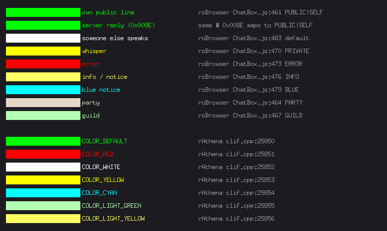
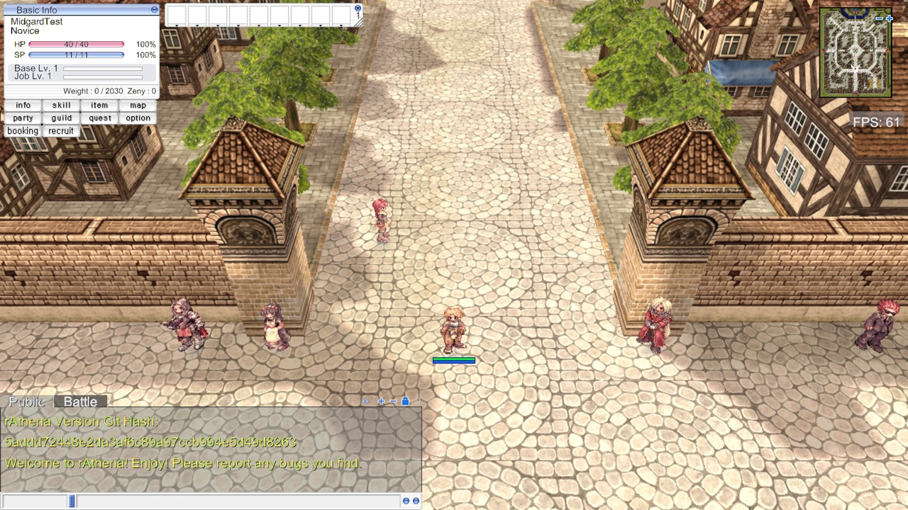

# Feature: Chat commands — `/` client commands and `@` GM commands

**Branch:** `feature/chat-commands` · **Issue:** #94 · **Parent:** #49 (MVP scope), #53 (Track D — HUD)
**Status:** Planned · **Created:** 2026-08-27

## Goal

Make the chat box accept commands as well as sentences. Typing `@go 1` warps the
character to Morocc; typing `/where` prints the map and cell without troubling
the server; typing `/nonsense` says so instead of shouting it at everyone on the
map. The test account becomes a GM so all 318 of the server's commands are
actually reachable, and every line in the box is coloured by where it came
from — which is how the original tells your own words from the server's answer
from a private message.

Advances the MVP's **UI** item, and pays for itself immediately: `@go`,
`@warp`, `@item` and `@monster` are the fastest way to set up a test for every
feature after this one.

## The finding that shapes the plan

**`@` commands need no new packets at all.** They travel as an ordinary chat
line, and the server pulls them out before broadcasting: `clif_process_message`
calls `is_atcommand(fd, sd, out_message, 1)` on the message body and, when it
returns true, drops the line instead of sending it on
(`clif.cpp:10554`). Our `CZ_REQUEST_CHAT` already carries exactly that.

So the entire `@` half of this feature is **one account change plus routing**.
What stops `@commands` from working today is not the client — it is that
`midgard-test` is `group_id = 0`, a group whose whole command list is
`changedress` and `resurrect` (`conf/groups.yml:46-50`).

**`/` commands are the opposite: the server never sees them.** The original
client parses `/` itself and either handles it locally (`/where`, `/bgm`,
`/effect`) or sends a **dedicated packet** which the server converts *back* into
an atcommand — `/mm` becomes `@mapmove` at `clif.cpp:11558`, `/b` becomes
`@kami` at `clif.cpp:11994`, `/lb` becomes `@lkami` at `clif.cpp:13610`.
Nothing on the server parses a leading `/`. Send `/where` as chat today and the
whole map reads "/where".

That asymmetry is the plan: `@`/`#` is routing, `/` is a client-side command
table.

**The full inventory — every `/` and `@` command, with syntax, effect and the
group that grants it — is in [`docs/research/chat-commands.md`](../../research/chat-commands.md).**
Its `@` tables are generated from the server tree by `tools/chatcmds/gen.py`, so
they cannot drift from the server we run.

## Reference (original client)

1. **Chat box**, bottom left, tabs reading **"Regular Chat" / "Battle Log"** —
   ours currently say "Public" / "Battle".
2. **Command output is green.** Every line here came back from an `@` command
   and none of it is yellow. The upper block (`Available aliases: h`,
   `Params: <command>`, `Shows help for specified command.`) is `@help`; the
   lower block (`Experience rates: Base 1.00x / Job 1.00x`, the drop rates) is
   `@rates`.
3. **The input bar** below the scrollback, with the whisper-name field at its
   left — the same bar we already draw.
4. **A broadcast is drawn twice**: once in the box and once as floating text
   over the scene ("The Monster Invasion event is started!"). Only the box is
   in scope here; text over the world is its own feature.

Source: <https://youtu.be/831fb7-1oKc?t=368> (rAthena on a real client).
Sampling the glyph cores gives ≈`rgb(88,171,84)` in both blocks — that is a
bright green blended with the half-transparent dark backdrop and then through
YouTube's encoder, so it confirms **green, not yellow** but is not precise
enough to pin a hex. The exact values come from the two sources below.

5. **Top block** — what the original client paints each kind of line, as
   roBrowser transcribes it (`src/UI/Components/ChatBox/ChatBox.js:459-485`).
   Note **`0x008E` is `PUBLIC|SELF`, so green** (`Main.js:65`) — that is what
   ref-01 shows, and it covers every `@` command's reply, because
   `clif_displaymessage` sends `0x008E` at our PACKETVER (`clif.cpp:6697`).
6. **Bottom block** — rAthena's own `color_table`, the colours it puts on the
   wire in `0x02C1` (`clif.cpp:25849-25856`). `COLOR_LIGHT_YELLOW` is
   `#FFFF63`, byte-for-byte roBrowser's INFO colour: independent confirmation
   that the two sources describe the same client.

**Current state (ours):**

7. **Chat box works** — scrollback, tabs, input bar, whisper field, resize.
   Built by #93, nothing to redo.
8. **The two rAthena welcome lines are yellow.** They arrive on `0x008E` and we
   colour them `chatColorSystem`. The original paints them green (①②⑤). This is
   the single most visible colour change in the feature.
9. **No command handling.** Typing `@commands` sends it as a sentence; typing
   `/where` broadcasts "/where" to the map.

## What exists today

| Area | What exists | Status |
|------|-------------|--------|
| `internal/game/ui/hud_chat.go` | The whole chat box: scrollback, wrap, tabs, drag, resize, input + whisper field (866 lines) | ✅ #93 — extend, don't duplicate |
| `internal/game/states/chatlog.go` | `ChatLog`, 200-line bounded backlog, `ChatLine{Kind,Speaker,Text}` | ✅ extend |
| `internal/network/packets/chat.go` | `0x008D`/`0x008E`/`0x009A`/`0x09DE`/`0x09DF` decode; `EncodeChat`, `EncodeWhisper` | ✅ reuse |
| `internal/game/states/ingame.go:1011-1015` | Handlers registered for chat, whisper, broadcast, whisper-ack | ✅ reuse |
| `internal/game/game.go:877-885` | Takes a typed line and routes it to `SendChat` / `SendWhisper` | 🟡 **the seam this feature needs** |
| `hud_chat.go:180` `chatKindColor` | Colours by `packets.ChatKind` | 🟡 wrong palette, wrong owner (see 0a) |
| `internal/trace` | `hud` channel carries `chat`, `chat-send`, `whisper-send`, `whisper-ack` | ✅ reuse, add `cmd` |
| `internal/config/flags.go` | `--autologin`, `--walk-to`, `--mouse-at`, `--screenshot-after`, `--trace` | 🟡 no way to say anything (see 0b) |
| `packets.DecodeBroadcast` | Returns the raw text | ❌ **bug** — does not strip the `"blue"`/`"ssss"` colour prefixes |
| `0x02C1` `ZC_NPC_CHAT` | Length `-1` in `lengths.go:444`, so framing is fine | ❌ never decoded |
| `docker/rathena/seed/zzz_mvp_novice.sql` | Seeds `midgard-test` with `group_id = 0` | 🟡 → 99 |
| `cmd/grfbrowser` | Nothing to do with chat — no viewer needed | n/a |

**In flight:** nothing touching these files. #88 (basic HUD) is open but its
steps 1–6 merged as #93; its remaining steps 7–11 are the four menu windows,
which do not touch chat.

## Reference implementations

| Source | Where | Approach |
|--------|-------|----------|
| roBrowser | `src/Controls/ProcessCommand.js` (240 lines) | The whole `/` table as one `switch` on the first word. Local preference toggles return immediately; a few send packets (`/sit` → `CZ_REQUEST_ACT`, `/who` → `CZ_REQ_USER_COUNT`, `/memo` → `CZ_REMEMBER_WARPPOINT`); then two fall-throughs — `/str+ 5` style stat raises, and the emotion table — and finally an "unknown command" line. This is the structure we follow. |
| roBrowser | `src/UI/Components/ChatBox/ChatBox.js:437-441` | Dispatch happens **before** the whisper check, so a command is never sent as a private message even when the name field is filled. We need the same rule, and for `@` too. |
| roBrowser | `ChatBox.js:79-90, 458-485` | Ten line kinds as a bitmask, colour chosen from the kind. Ours is an enum; same idea. |
| korangar | `korangar/src/interface/windows/chat.rs` | Has a chat window, **no command handling at all**. Nothing to take. |

roBrowser and rAthena disagree nowhere here; where roBrowser is a transcription
of the client and rAthena is the server, they cover opposite halves and the one
place they overlap (`#FFFF63`) agrees exactly.

## Assets

None. This feature adds no bitmap — the chat box, its background, tabs and
input bar are all loaded already by #93. `msgstringtable.txt`, which is where
the original keeps "Command not found", is **not in our archives**: only
`data/lua files/msgstring_kr.lub` (compiled Lua, Korean). So the wording of our
own messages is ours to choose, and that is recorded here rather than guessed at
implementation time.

## Protocol

Every id below was read out of the server tree we build from, at PACKETVER
20211103.

### Already ours — the whole `@` half rides on these

| Packet | ID | Len | Dir | What | Source |
|--------|----|-----|-----|------|--------|
| `CZ_REQUEST_CHAT` | `0x00F3` | var | C→S | carries `@`/`#` commands unchanged | `chat.go:215` |
| `ZC_NOTIFY_PLAYERCHAT` | `0x008E` | var | S→C | **every atcommand reply** | `clif.cpp:6697` |
| `ZC_BROADCAST` | `0x009A` | var | S→C | `@kami` / `@kamib` | `clif.cpp:6711` |

### To decode

| Packet | ID | Len | Dir | What | Source |
|--------|----|-----|-----|------|--------|
| `ZC_NPC_CHAT` | `0x02C1` | var | S→C | `<id>.L <colour>.L <text>` — `@rates`, `@mobinfo`, `@iteminfo` | `clif.cpp:9780` |
| `ZC_USER_COUNT` | `0x00C2` | 6 | S→C | the answer to `/who` | `packets.hpp:39`, already sized in `lengths.go` |

### To send, for the `/` commands that carry their own packet

| Packet | ID | Len | Dir | Command | Source |
|--------|----|-----|-----|---------|--------|
| `CZ_REQ_USER_COUNT` | `0x00C1` | 2 | C→S | `/w`, `/who` | `clif_packetdb.hpp:67` |
| `CZ_MOVETO_MAP` | `0x0140` | 22 | C→S | `/mm`, `/mapmove` → `@mapmove` | `packets.hpp:1493`, `clif.cpp:11558` |
| `CZ_BROADCAST` | `0x0099` | var | C→S | `/b`, `/nb` → `@kami` | `packets.hpp:1500`, `clif.cpp:11994` |
| `CZ_LOCALBROADCAST` | `0x019C` | var | C→S | `/lb`, `/nlb` → `@lkami` | `packets.hpp:1901`, `clif.cpp:13610` |

Three traps, all verified rather than assumed:

- **`0x02C1` carries BGR, not RGB.** `color_table` is byte-swapped once at
  startup (`clif.cpp:25863`) and `clif_messagecolor` is then called with
  `rgb2bgr = false`, so the wire value is already swapped. Decoding it as RGB
  turns rAthena's light green `0xB5FFB5` into a light pink.
- **`0x009A` encodes its colour as literal text at the front of the message.**
  `"blue"` means blue, `"ssss"` means the WoE style, anything else is yellow
  (`clif.cpp:6722-6735`). We do not strip either today, so `@kamib hi` renders
  as "bluehi".
- **`tools/packetlen/gen.py` cannot answer any of the C→S rows above.** It
  reads only `packet(...)` lines — the server→client table — and every command
  packet is registered with `parseable_packet(...)`. That gap is Step 0b.
  It matters: `/item` is `0x013F`/26 in the base block but is re-registered as
  **`0x09CE`/102** for PACKETVER ≥ 20131223 (`clif_packetdb.hpp:1675`), and
  ours is 20211103.

### What the server will accept, and from whom

| Group | Id | Commands | Reachable by `midgard-test` |
|-------|----|----------|------------------------------|
| Player | 0 | `changedress`, `resurrect` | ✅ today |
| Super Player | 1 | +27 informational/feature commands (`go`, `where`, `mobinfo`, `iteminfo`, `rates`, `autoloot`…) | ❌ |
| Support | 2 | +`jumpto`, `who`, `broadcast`, `localbroadcast`… | ❌ |
| Event Manager | 4 | +`item`, `monster`, `zeny`, `raise`, `pvpon`… | ❌ |
| Law Enforcement | 10 | +`hide`, `kick`, `speed`, `mapmove`, `recall`, `jail`… | ❌ |
| **Admin** | **99** | **all 318**, via the `all_commands` permission | ← this feature |

Group 99 lists no commands of its own; it carries `all_commands: true`
(`conf/groups.yml:236`), and `s_player_group::can_use_command` short-circuits on
that permission (`pc_groups.cpp:326`). The per-command lookup table
`at_groups[]` is built by calling exactly that function
(`atcommand.cpp:12102`), so the permission really does reach the gate at
`atcommand.cpp:12068`. Checked because the whole feature rests on it.

**A non-GM's failed command is broadcast.** When the group may not use a
command, `is_atcommand` returns false and the line continues on as ordinary
chat — so `@mapmove prontera 100 100` typed by a normal player is *shouted at
the map*. That is the original's behaviour too and we keep it for `@`; it is the
reason Step 4 sends real packets for the `/` GM commands instead of rewriting
them into atcommand text, since the packets are silently rejected instead.

## Step 0 — Prerequisites & tooling

### 0a. Refactoring (only what this feature needs)

- [ ] **`ChatKind` is owned by the wrong package.** `states.ChatLine.Kind` is a
      `packets.ChatKind` (`chatlog.go:16`), and the UI colours by it
      (`hud_chat.go:180`). The kinds this feature adds — the echo of what you
      typed, a command error, a client notice — never appear on any wire.
      Putting them in `internal/network/packets` would make the packet layer
      describe UI states. Add `states.ChatKind`, have `ChatLog.Add` map the wire
      kind onto it, and leave `packets.ChatKind` describing only what arrives.
      Small, and everything after it depends on the seam.
- [ ] **`game.go:877-885` decides whisper-vs-public from whether the name field
      is filled.** A command must win over that test, or `@go 1` with a name in
      the box becomes a private message the server never inspects for commands
      (`clif_parse_WisMessage` does not call `is_atcommand` — only
      `clif_process_message` does). Move the decision behind the classifier
      Step 2 introduces.
- [ ] **Two use-case numbers are used twice.** `UC-211` is both
      `hud-menu-windows` and `warp-city-gate-to-field`; `UC-212` is both
      `hud-esc-menu` and `warp-enter-building-indoor`. #88 and #91 were planned
      in parallel worktrees and both took "the next free number" at the same
      time. Renumber the warp pair to **UC-214/UC-215**, fix the four references
      in `docs/features/warp-portals/README.md`, and take **UC-216+** here.
      Also worth a line in `qa/README.md` saying the number must be claimed
      against `origin/main`, not the local branch.
- [ ] No ADR: nothing here crosses a layer or changes a shared interface.

### 0b. Debug tooling & tests

- [ ] **`--say "<line>"` (repeatable).** Once in game, put the line in the chat
      input and submit it, exactly as typing would. Without this **no step
      below can be tested unattended** — every proof in this feature is "type
      something, look at the box". Mirrors `--walk-to`; `--say "@go 1" --say
      "/where"` runs a sequence.
- [ ] **Trace channel `cmd`** in `internal/trace`, emitted as `parse` /
      `local` / `server` / `unknown` and printed as `cmd.parse` and so on —
      `trace.Emit` prefixes the channel itself. `cmd.parse` gives the sigil and
      name, `cmd.local` says it was handled here with no packet, `cmd.server`
      that it was sent on, `cmd.unknown` that it was rejected. A command that
      does nothing is otherwise indistinguishable from one that was never
      recognised.
- [ ] **`--trace` help text is stale** — it lists `move, pick, net, render,
      status, npc, map` and omits `hud`, which has existed since #93
      (`flags.go:17`). Add `hud` and `cmd`.
- [ ] **F3 overlay:** last command parsed and its disposition
      (local / sent / unknown), plus the chat backlog length. Both make a
      screenshot self-explaining.
- [ ] **`make server-gm` / `make server-player`** — flip `login.group_id`
      between 99 and 0 on a *running* database. The seed only executes on first
      DB init, so editing it alone would need `make server-reset` and lose the
      character.
- [ ] **`make server-kick`** — clear `char.online` and restart the map/char/login
      containers. Hit while gathering the screenshot above: killing a client
      leaves `online = 1`, and the next login is refused with **"Too many
      connections. Please wait."** on the login screen. Every unattended run
      after a killed client is affected, so this belongs in the Makefile rather
      than in someone's memory.
- [ ] **`tools/packetlen/gen.py` → also emit the C→S table** from
      `parseable_packet(...)` with the same `#if PACKETVER` resolution it
      already does, into a `mapPacketParseable` map used as a lookup, not for
      framing. This is what makes the four C→S rows above generated rather than
      hand-copied, and it is reusable by every feature after this one.
- [ ] **Logs:** a `/` command we do not implement logs nothing (it is a normal
      user error and gets a chat line); a `@` command sent while the account is
      group 0 logs at info that it will probably be broadcast, because that
      surprise is worth one line.
- [ ] **Tests:** `internal/game/command/parse_test.go` (table-driven: sigils,
      quoting, empty args, a bare `/`, `@` with the whisper field set);
      `packets` round-trips for `0x02C1` including the BGR swap, `0x009A` with
      each of the three prefixes, `0x00C2`, and encoders for `0x00C1`, `0x0140`,
      `0x0099`, `0x019C`.
- [ ] **Use cases:** UC-216 (`@` commands as a GM), UC-217 (`/` client
      commands), UC-218 (colours by line kind).

## Steps

### Step 1 — The test account becomes a GM
- **Changes:** `docker/rathena/seed/zzz_mvp_novice.sql`, `Makefile`,
  `docs/QUICKSTART.md`
- **Done when:** `--say "@commands"` fills the chat box with "Commands
  available:" and the list. Nothing in the client changed to make this work —
  it is the proof that `@` needs no packet.
- **Proved by:** UC-216; screenshot with the list visible; `--trace=hud` shows
  one `hud.chat` per line the server sent.

### Step 2 — The client tells a command from a sentence
- **Changes:** new `internal/game/command`, `internal/game/game.go`,
  `internal/game/ui/hud_chat.go`, `internal/game/states/chatlog.go`
- **Done when:** `/` `@` and `#` are each recognised and routed — `@`/`#` to
  public chat even with the whisper field filled, `/` to the local table — and
  what you typed is echoed into the box. `/nonsense` answers "Unknown command"
  and sends nothing; typing a sentence still talks.
- **Proved by:** `go test ./internal/game/command/`; `--trace=cmd` shows
  `cmd.parse` then one of `cmd.local` / `cmd.server` / `cmd.unknown`; UC-217.
- **Reference:** ref-01 ③

### Step 3 — The `/` commands we can answer ourselves
- **Changes:** `internal/game/command`, `internal/network/packets/chat.go`,
  `internal/engine/audio`
- **Done when:** `/where` prints map and cell from our own state with no
  packet; `/w` and `/who` send `0x00C1` and print the count from `0x00C2`;
  `/bgm` and `/sound` toggle and say which they did; `/h` and `/help` list the
  `/` commands we implement. Each answer is a line in the box.
- **Proved by:** UC-217; `--say "/where" --say "/who"` with `--trace=cmd,net`;
  `packets` test for `0x00C1`/`0x00C2`.

### Step 4 — The `/` GM commands that carry their own packet
- **Changes:** new `internal/network/packets/command.go`, `internal/game/command`
- **Done when:** `/mm prontera 150 150` moves the character; `/b hello` and
  `/lb hello` announce. Sent as `0x0140` / `0x0099` / `0x019C` rather than as
  atcommand text, so a non-GM typing one is silently refused instead of
  shouting the command at the map.
- **Proved by:** UC-217; packet round-trip tests; `--trace=cmd,net` shows
  `cmd.server` with the id; screenshot after `/mm` on a different map.

### Step 5 — Every line is coloured by where it came from
- **Changes:** `internal/game/ui/hud_chat.go`, `internal/game/states/chatlog.go`,
  `internal/network/packets/chat.go`
- **Done when:** the palette of ref-02 is in place — our own words and the
  server's replies green, other people white, whispers yellow (they are purple
  today), errors red, notices light yellow. `0x02C1` is decoded and honours the
  colour it carries, swapped from BGR. `0x009A`'s `"blue"` and `"ssss"`
  prefixes are stripped and turned into the colour they stand for. The echoed
  command and its error line each read as themselves.
- **Done when (visual):** a screenshot after `@rates`, `@help`, `/where` and
  `/nonsense` shows four distinguishable colours.
- **Proved by:** UC-218; the screenshot above; `packets` tests for the BGR swap
  and all three broadcast prefixes.
- **Reference:** ref-01 ②, ref-02 ⑤⑥

### Step 6 — Docs
- [ ] `docs/ENGINE_FEATURES.md` — the new `internal/game/command` package
- [x] `docs/research/chat-commands.md` — **written up front** (every `/` and
      `@` command with syntax, effect and the group that grants it). Its `@`
      tables are generated by `tools/chatcmds/gen.py` from the server tree, so
      re-run it if the pinned rAthena moves
- [ ] `qa/README.md` — claim UC numbers against `origin/main`
- [ ] Session log `docs/sessions/2026-08-27-chat-commands.md`

## Done when (feature)

- `@commands` lists the commands; `@go 1` warps to Morocc; `@item 909 10` works.
- `#` charcommands reach the server (`#zeny MidgardTest 100`).
- `/where`, `/who`, `/h`, `/bgm`, `/sound` answer without a round trip where
  they should, and with one where they must.
- `/mm`, `/b`, `/lb` work as a GM and are silently refused as a player.
- An unknown `/command` says so; an unknown `@command` behaves as the original
  does.
- A command is never sent as a whisper, whatever is in the name field.
- Lines are coloured as ref-02: green for ours and the server's, white for
  others, yellow for whispers, red for errors.
- `make server-gm` / `make server-player` flip the account either way.

## Out of scope

- **Emotions** (`/!`, `/?`, `/ho`, …). The largest group of `/` commands, but
  each is `CZ_REQ_EMOTION` plus an emotion sprite over a character's head —
  that is a rendering feature, not a chat one.
- **`/sit` and `/stand`.** `entity.StateSitting` exists but nothing sends
  `CZ_REQUEST_ACT` and there is no sit animation. Belongs with emotions.
- **Party, guild and chat-room commands** (`/invite`, `/organize`, `/leave`,
  `/guild`, `/chat`, `/q`) — each needs a subsystem we do not have.
- **`/str+ 5` stat raises** — needs the stat window (#88's steps 7–11).
- **Preference toggles for things we do not render**: `/effect`, `/fog`,
  `/lightmap`, `/mineffect`, `/miss`, `/quake`, `/skillfail`.
- **Chat bubbles over the character.** The original also draws `0x008E` above
  the player's head (roBrowser `Main.js:67`); we only put it in the box.
- **Tab completion and command history.**
- **Renaming the tabs** to the original's "Regular Chat" / "Battle Log" (ref-01
  ①) — a one-line change but it belongs with whoever revisits the tab strip.

## Open questions

1. **Should `/` fall back to the server?** When a `/command` is not in our
   table, the original says "unknown". We could instead send it on as an
   atcommand, which would make all 318 reachable through `/` as well as `@` —
   convenient, but it means a non-GM's typo gets broadcast, and it is not what
   the original does. Planned as **"unknown", no fallback**; say if you would
   rather have the convenience.
2. **Should the client refuse `@` commands it knows the account cannot use?**
   It cannot: **the server never tells the client its group level** — no packet
   carries it, checked across `clif.cpp`. The client would have to infer GM-ness
   from whether `@commands` answered. Planned as **no gating**, which is also
   what the original does.
3. **`#` charcommands — worth including?** They are one line of routing once
   `@` works (`#command <charname> <params>`), but they only act on *other*
   characters and there is only one on this server. Planned as **included**,
   since excluding it costs more than including it.
4. Group **99** (Admin, all 318 commands) rather than a narrower group. It is a
   local test server, and a narrower group means finding out mid-test that the
   command you wanted is in a group you did not pick.

## Investigation notes

- **`@commands` output will not line up**, and the font is only half the
  reason. The server pads names into 10-character columns with spaces
  (`atcommand.cpp:10058`), assuming fixed width; ours is Arial Unicode
  (`ui2d/font.go:90`). But the chat wrapper splits with `strings.Fields`
  (`npctext.go:222`), which discards runs of whitespace and rejoins with one
  space — so the padding is gone before the font matters, and a monospace face
  alone would not fix it. Confirmed on screen at step 1. Not worth fixing here;
  noted so it is not reported as a bug, and so the obvious fix is not tried.
- **The `0x01D7` resync is still there.** Every map entry logs `unknown packet
  id, resynchronising {"id": "0x0000", "skipped": 4}`. Known from #92, not this
  feature's to fix, but it will show up in any `--trace=net` run taken while
  proving these steps.
- **Chat delay.** `battle_config.min_chat_delay` would rate-limit a burst of
  `--say` lines. It is unset in our `docker/rathena/conf/battle_conf.txt`, so
  the default 0 applies and a sequence is safe.

## Revision log

- 2026-08-27 — created
