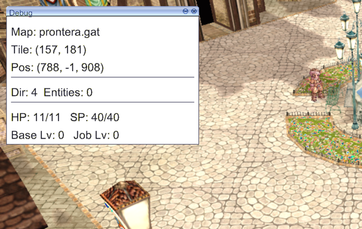
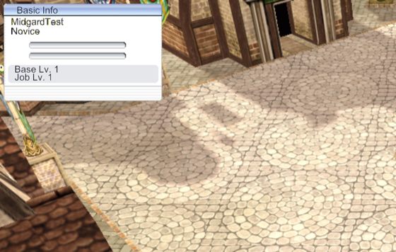
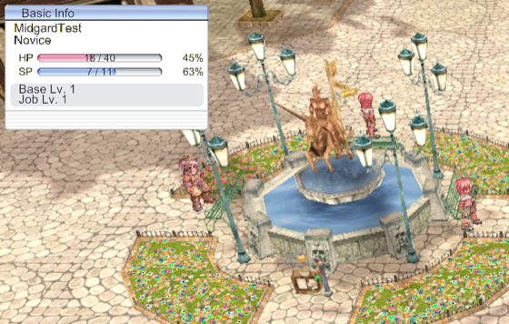

# Feature: Basic Info HUD (name, job, HP/SP, levels)

**Branch:** `feature/hud-basic-info` · **Issue:** #85 · **Parent:** #49 (MVP scope)
**Status:** Planned · **Created:** 2026-08-26

## Goal

Standing in Prontera, the player sees the original client's Basic Info panel in the top-left: their character's name and job, HP and SP as coloured gauges with `current / max` printed on them, and Base/Job level with experience bars. The values track the server — taking damage moves the HP gauge, sitting refills it — rather than being drawn once and going stale. This advances the **UI** item of the six-feature MVP, and is the anchor the rest of the HUD (chat, inventory, skills, quick-spell) positions itself against.

## Reference (original client)


1. **Title bar** — the same 17px gradient bar the window chrome uses, with the system buttons at each end (11×11).
2. **Name / Job rows** — plain text on the white body; nothing is painted for them, so both are drawn.
3. **Gauge troughs** — the two rounded wells at y≈53 and y≈68 are **painted into this bitmap**. Only the coloured fill is drawn on top; we do not draw the trough.
4. **Info block** — the flat grey panel below the gauges is where Base/Job level and the experience bars sit.
5. **Footer strip** — the striped band at the bottom, below which the menu buttons hang.


6. **Menu buttons** — 54×18 each. The archive carries **ten** of them, each in three states (`info1/2/3`, `skill1/2/3`, `item*`, `map*`, `party*`, `guild*`, `quest*`, `option*`, `booking*`, `recruit*`), which matches the screenshot's grid rather than roBrowser's row of five. Four per row × 54 = 216, against a 220-wide panel. This feature draws them but wires none of them.

**Transparency:** the panel's left and right edges are magenta (255,0,255) colour-key, not visible pixels — the loader must key them out or the panel gets pink borders.

**Real client, supplied in review** (kRO, classic skin, windowed — posted on this issue). What it shows, and the names the plan uses:

7. **Panel header** — reads `Basic Info`, with a **single** button at the right (minimize). There is no close button: this panel is always present.
8. **Name / job** — `TankJr` over `Novice`, left-aligned on the white body.
9. **HP / SP rows** — label, then a filled gauge, then the percentage on the right: `HP [====] 54 / 54 100%`. The numbers sit **on** the gauge, the percentage outside it.
10. **Base Lv. / Job Lv.** — each with a thin experience bar to its right.
11. **Weight and Zeny** — `Weight: 50/2150   Zeny: 100,000` on one line under the levels, inside the panel.
12. **Menu buttons** — a **grid of ten** below the panel, four per row: `info skill item map` / `party guild quest option` / `booking rec` + the game's logo. Not the single row of five that roBrowser's older markup describes.

Also visible but **not this feature**: the minimap (top-right), the tabbed chat box (bottom-left, `Regular Chat` / `Battle Log`), and the HP bar under the character.

The client's own bitmaps below remain the measurement source; the screenshot is what confirms which elements exist and how they read.

Behaviour confirmed from documentation rather than a capture ([StrategyWiki](https://strategywiki.org/wiki/Ragnarok_Online/Basic_Info), [iRO Wiki](https://irowiki.org/wiki/Basic_Game_Control)): the window shows name, class, Base/Job level with EXP as a percentage, HP, SP, weight and Zeny, and **Ctrl+V toggles between the large and reduced form**.

**Current state (ours), after Step 0:**



The panel itself is still unbuilt — the in-game UI is this overlay and a bottom status bar (`internal/game/ui/ui2d_backend.go` `RenderInGameUI`). What the readout proves is that the values reach the client, and that they are **wrong**: `HP 11/11` beside `SP 40/40`, `Base Lv 0`, and `class 40` for a Novice. `--trace=status` says the same (`status.initial {"hp":11,"maxHP":11,"sp":40,"maxSP":40,"baseLevel":0,"jobLevel":0,"class":40}`). That is the misread `CharInfo` Step 1 has to fix, now reproducible in one command instead of by eye on the character-select screen.

## Layout (from roBrowser, `src/UI/Components/BasicInfo/BasicInfo.css`)

Coordinates are relative to the panel's top-left.

**The stylesheet was checked against the bitmap itself** (Step 2) by reading the pixels rather than by eye, and it is exact — so the rest of it can be trusted without measuring each one:

| Band in `basewin_bg2.bmp` | Measured | roBrowser says |
|---|---|---|
| Title bar | rows 0–15, black rule at 16 | — |
| White body | rows 17–52 | — |
| HP gauge trough | rows 53–61, **columns 35–169** | (35, 53) 135 × 8 |
| SP gauge trough | rows 68–76, columns 35–169 | (35, 68) 135 × 8 |
| Grey info block | rows 85–109, columns 6–214 | levels at y 86 and 97 |
| Striped footer | rows 114–134 | — |

Nothing else is painted: no `HP`/`SP` labels, no `Base Lv.`, and no window caption. Every piece of text on this panel is drawn by us.

| Element | Position | Size |
|---|---|---|
| Panel (large) | — | 220 × 135 |
| Panel (reduced) | — | 220 × 53 |
| System button, left / right | (4, 3) / (right 2, 3) | 11 × 11 |
| Title | (18, 2) | — |
| Name | (10, 20) | — |
| Job | (10, 33) | — |
| "HP" / "SP" labels | (15, 50) / (15, 65) | — |
| HP gauge / SP gauge | (35, 53) / (35, 68) | 135 × 8 |
| `cur / max` on gauge | centred over the gauge | 127 wide, 10px text |
| HP % / SP % | (right 20, 50) / (right 20, 65) | — |
| Base Lv. / Job Lv. | (15, 86) / (15, 97) | — |
| Base EXP / Job EXP bar | (84, 89) / (84, 101) | 110 × 4 |
| Menu buttons | grid at y = 135, four per row | 54 × 18 each |

## What exists today

| Area | What exists | Status |
|------|-------------|--------|
| `internal/game/ui/ui2d_backend.go:856` | `RenderInGameUI` draws the scene texture, the F3 debug window, an error window and a bottom status bar. No HUD. | ❌ missing |
| `internal/game/ui/backend.go:129` | `InGameUIState` **already declares** `PlayerHP/MaxHP`, `PlayerSP/MaxSP`, `PlayerLevel`, `PlayerJobLevel` | 🟡 declared |
| `internal/game/game.go:657` | builds `InGameUIState` — and **never sets any of those six fields**, so they are always zero | ❌ missing |
| `internal/network/packets/lengths.go:63` | `0x00B0` has a length (8) and nothing else: no struct, no handler, no constant | 🟡 stub |
| `internal/game/states/ingame.go:532` | handlers registered for entity/move/map packets only — no status packets | ❌ missing |
| `internal/game/states/state.go:60` | `Session.Char` carries name, class, HP/SP and stats from character select — the panel's initial values | ✅ done |
| `internal/engine/ui2d` | window chrome, 3-slice drawing, skinned buttons with hover shading, `DrawImageUV`, text with measured metrics — all from #82 | ✅ done |
| `internal/game/ui/window_skin.go` | `LoadNativeWindowFrame` + `TextureCache` — the pattern this panel's loader follows | ✅ done |
| `cmd/grfbrowser` | previews bitmaps already (`preview_image.go`); no new viewer needed for this feature | ✅ done |
| Tests | none for the HUD; `internal/network/packets/lengths_test.go:45` already asserts `0x00B0` is 8 bytes | 🟡 partial |
| Docs | no ADR or plan mentions the HUD | ❌ missing |

**In flight:** only dependabot PRs (#76, #48). Nothing touches these files.

## Reference implementations

| Source | Where | Approach |
|--------|-------|----------|
| roBrowser | `src/UI/Components/BasicInfo/BasicInfo.html`, `.css`, `.js` | Transcribes the original panel: absolute positions inside a 220×135 background, gauges built from `gzered_*`/`gzeblue_*` three-slice art over the trough painted in the background, and a reduced 53px form toggled with Ctrl+V. This is our measurement source. |
| korangar | `korangar/src/interface/` | Its own interface system, deliberately not the original look — useful for how state reaches the UI, not for layout. |
| midgarts | — | No HUD. |

## Assets

All confirmed present with `grftool search` against `data.grf`.

| Asset | GRF path | Size | Exists? |
|-------|----------|------|---------|
| Panel (large) | `…/basic_interface/basewin_bg2.bmp` | 220×135 | ✅ |
| Panel (reduced) | `…/basic_interface/basewin_mini.bmp` | — | ✅ |
| HP gauge | `…/basic_interface/gzered_left/mid/right.bmp` | 4×8, 1×8, 4×8 | ✅ |
| SP gauge | `…/basic_interface/gzeblue_left/mid/right.bmp` | 4×8, 1×8, 4×8 | ✅ |
| Gauge trough | `…/basic_interface/gze_bg_left/mid/right.bmp` | 9px tall | ✅ |
| Menu buttons (ten, three states each) | `…/basic_interface/{info,skill,item,map,party,guild,quest,option,booking,recruit}{1,2,3}.bmp` | 54×18 | ✅ |

The gauges are three-slice horizontally: fixed 4px caps and a 1px middle stretched to the fill width.

## Protocol

The server pushes each value as it changes; there is no "give me my stats" request.

| Packet | ID | Direction | Source |
|--------|----|-----------|--------|
| `ZC_PAR_CHANGE` | `0x00B0` — `<var id>.W <value>.L`, 8 bytes | S→C | `docker/rathena/build/rathena/src/map/clif.cpp:3547` |
| `ZC_LONGPAR_CHANGE` | `0x00B1` — same shape, for values that outgrow a short | S→C | `clif.cpp:3558` |
| `ZC_LONGLONGPAR_CHANGE` | `0x0ACB` — `<var id>.W <value>.Q`, 12 bytes | S→C | `clif.cpp:3621`, struct at `packets_struct.hpp:399` |

**Correction (Step 1).** The plan had only the first two. At `PACKETVER >= 20170830` — ours is 20211103 — `clif_updatestatus` sends all four experience values through `0x0ACB` instead (`clif.cpp:3735`), because the totals no longer fit in 32 bits. A client handling only `0x00B0` and `0x00B1` receives no experience at all, which would have left Step 4's bars empty with nothing obviously wrong. `0x0ACB` was already in the generated length table at 12 bytes, so the framing was never affected — only the reading.

Var ids come from `enum _sp` in `docker/rathena/build/rathena/src/map/map.hpp:497`:

| Field | `var id` | | Field | `var id` |
|---|---|---|---|---|
| `SP_HP` | 5 | | `SP_BASELEVEL` | 11 |
| `SP_MAXHP` | 6 | | `SP_JOBLEVEL` | 55 |
| `SP_SP` | 7 | | `SP_BASEEXP` | 1 |
| `SP_MAXSP` | 8 | | `SP_NEXTBASEEXP` | 22 |
| `SP_ZENY` | 20 | | `SP_WEIGHT` / `SP_MAXWEIGHT` | 24 / 25 |

`clif_updatestatus` (`clif.cpp:3635`) is the dispatcher that decides which of the three packets carries a given parameter.

### The CharInfo layout, resolved

`struct CHARACTER_INFO` (`src/common/packets.hpp:31`) is version-dependent, and the branch that matters is `PACKETVER_RE_NUM >= 20211103`, which the server satisfies: `hp`, `maxhp`, `sp` and `maxsp` are each `int64`. That is what makes the record **175 bytes** — so `CharInfoSize = 175` was right, but for the wrong reason (it was labelled "eAthena"), and the offsets inside it were wrong. Before 20211103 the same fields are `int32/int32/int16/int16` and the record is 155, which is where `CharInfoSizeRathena` came from.

The header of `HC_ACCEPT_ENTER` is `2 + 2 + 1 + 1 + 1 + 20 = 27`, confirming the existing `charDataStart`.

The old offsets were guessed from a capture, and were wrong in the way that survives inspection: `hp` was read at 66, which is where `sp` lives, and `maxhp` at 74, which is `maxsp`. A character with 40 HP and 11 SP therefore read back as **11 HP and 40 SP** — two real numbers in each other's places. `class` was read at 50, the low bytes of `hp`, giving `Job 40`; `level` at 90, which is `weapon`, giving `Lv. 0`. All three symptoms had one cause.

Fixed offsets are pinned as named constants in `packets.go` and asserted field-by-field in `TestCharInfoDecode`.

## Step 0 — Prerequisites & tooling

### 0a. Refactoring (only what this feature needs)

- [x] `internal/game/ui/ui2d_backend.go` is ~950 lines and already holds login, char-select, connecting, loading and in-game rendering. The HUD goes in its own file (`hud_basic_info.go`) beside `charselect_native.go`, rather than growing it further. No interface changes, so **no ADR**.
- [x] `internal/game/game.go:657` — the `InGameUIState` literal is where the six unset fields are filled. `internal/game/player_stats.go` (new) holds `playerStats` and `statsFromChar`: one place where CharInfo's differing widths (HP 32-bit, SP 16) become `int`, and the obvious home for the live store Step 1 adds.

### 0b. Debug tooling & tests

- [x] Trace channel `status` in `internal/trace` — `status.initial` is emitted on entering the map with the CharInfo baseline, so later deltas can be read (a reported HP of 40 means nothing without knowing what it was). Step 1 adds `status.change` (var id, value) and `status.unknown`.
- [x] F3 overlay fields: `HP cur/max`, `SP cur/max`, `Base/Job Lv` — so a single screenshot proves whether the values arrived, independent of whether the panel draws them.
- [x] `--no-bgm` runs without background music, keeping sound effects. The music loops for as long as the client runs, which is exactly what you do not want while reading a log or listening for a sound effect.
- [x] `--debug-overlay` starts the F3 overlay open. Without it the screenshot scenario below could not work at all: the overlay is toggled by a keypress, so nothing unattended could ever capture it.
- [x] Screenshot scenario: `./midgard --config config.yaml --autologin --debug-overlay --trace=status --screenshot-after 25s` → `latest.png` shows the readout; from Step 2 it also shows the panel. **Set `vsync: false` in `config.yaml` for unattended runs** — see below.
- [x] The loading screen held at 100% for an Enter keypress (a debug gate). Removed, at Boris's request: it also meant no unattended run could reach the game, so `--screenshot-after` could only ever capture the loading screen.
- [ ] Logs: an unmapped `var id` warns once; a missing panel bitmap warns and falls back to no HUD, never a swallowed error. *(Step 1 / Step 2 — nothing to log yet.)*
- [x] Tests: `internal/game/player_stats_test.go` — the first test in `internal/game`. Still to come: `internal/network/packets/status_test.go` (round-trip `0x00B0`/`0x00B1` from known bytes, including a var id we do not map, Step 1) and `internal/game/ui/hud_basic_info_test.go` (gauge fill at 0%, 50%, 100% and `max = 0`, Step 3).
- [x] Use cases: UC-205 (panel renders with live values), UC-206 (HP gauge tracks damage), UC-305 (status packets parsed).

**Two things that stopped unattended runs, both now understood.**

*vsync.* With `vsync: true` and the window occluded — which it is when the client is launched from a shell — macOS stops servicing the display link and the buffer swap never returns. The process stays alive at ~2% CPU and renders **zero** frames, so `--screenshot-after` never fires and it looks like a hang with no error. `vsync: false` in the local `config.yaml` fixes it outright. Worth knowing before diagnosing a "frozen" client again; `config.yaml` is gitignored, so this is a per-machine setting, not a code change.

*The Enter gate.* `LoadingState` held at 100% until Enter, so even a rendering client stopped at the loading screen. Now removed.

**Correction found while doing this.** The plan named `internal/game/ui/debug_overlay.go` as the F3 overlay. It is not: that file, `ingame_ui.go` and `imgui_backend.go` are the pre-ui2d imgui code and nothing constructs them. The overlay actually drawn is the `BeginWindow("debug", …)` block in `internal/game/ui/ui2d_backend.go:863`, fed from `InGameUIState`. The fields went there.

## Steps

### Step 1 — Parse status packets, verify the CharInfo layout, keep the player's stats ✅
- **Changes:** `internal/network/packets/status.go` (new), `packets.go` (CharInfo offsets), `internal/game/states/player_stats.go` (new — the live store), `ingame.go` (handler)
- **Done when:** `--trace=status` prints `status.change` with sensible ids and values on login and when taking damage; F3 shows HP/SP/levels matching the server
- **Proved by:** `go test ./internal/network/packets/ ./internal/game/states/`, F3 screenshot, UC-305
- **Reference:** Protocol table above

Both sources now agree, which is the check that matters — `CharInfo` and the server's own pushes independently report the same numbers:

```
status.initial {"source":"charinfo","hp":40,"maxHP":40,"sp":11,"maxSP":11,"baseLevel":1,"jobLevel":1,"class":0}
status.change  {"varID":5,"value":40}   # SP_HP
status.change  {"varID":6,"value":40}   # SP_MAXHP
status.change  {"varID":7,"value":11}   # SP_SP
status.change  {"varID":8,"value":11}   # SP_MAXSP
status.change  {"varID":22,"value":548} # SP_NEXTBASEEXP, over 0x0ACB
status.change  {"varID":25,"value":20300}
```

The untracked ids are reported once each and turn out to be exactly what they should be: 41–53 are the combat stats, 225–233 the fourth-job ones, 12 is the skill point. Nothing we want is going missing.

`PlayerStats` already carries weight, Zeny and the four experience values, so Step 4 needs no further protocol work.

  **Layout investigation (per review).** Character select reports `Job 40`,
  `Lv. 0` and `HP 11/11` next to `SP 40/40` for the test account. 40 is not a
  base job, and those three disagreeing is the signature of a struct read at the
  wrong offsets: `packets.go:151` defines `CharInfo` with `CharInfoSize = 175`
  (eAthena) while noting rAthena/Hercules uses 155, so the same bytes can be
  read two different ways. This step checks the layout against
  `docker/rathena/build/rathena/src/map/packets.hpp` for our PACKETVER and fixes
  the offsets before the HUD trusts them — a panel fed from a misread struct
  shows wrong numbers convincingly. The `0x00B0` values are the cross-check: if
  HP from the packet disagrees with HP from `CharInfo`, the struct is still
  wrong.

### Step 2 — Draw the panel with name, job and levels ✅
- **Changes:** `internal/game/ui/hud_basic_info.go` (new), `internal/game/ui/ui2d_backend.go` (call it from `RenderInGameUI`)
- **Done when:** the panel is in the top-left with the character's name, job and Base/Job level; magenta edges are keyed out
- **Proved by:** screenshot scenario, UC-205
- **Reference:** grf-basewin-bg2 ①②④



The magenta edges key out through `texture.ImageToRGBA(img, true)`, which the texture cache already does for every UI bitmap — no special handling was needed.

Two notes. The window caption is **not** painted into the bitmap, so `Basic Info` is drawn like the rest; it is centered in the 16-row title band rather than sat on its top edge. And the minimize button is deliberately not here — it belongs with Step 5, which gives it something to do. A button that does nothing is worse than no button.

### Step 3 — HP and SP gauges ✅
- **Changes:** `internal/game/ui/hud_basic_info.go`
- **Done when:** both gauges fill in proportion with `current / max` printed on them and the percentage to the right; a gauge with `max = 0` draws empty rather than dividing by zero
- **Proved by:** `go test ./internal/game/ui/` (fill widths), UC-206
- **Reference:** grf-basewin-bg2 ③



**How this was checked.** A full bar proves almost nothing — 100% and a broken proportion look identical — so the character's `hp` and `sp` were set to 17 and 4 directly in the server's database before logging in (`UPDATE \`char\` SET hp=17, sp=4`), and restored afterwards.

That turned into a better test than intended. By the time the screenshot fired, natural regeneration had moved the values, and the trace shows each tick arriving as its own packet:

```
status.change {"varID":5,"value":17}   # on entry
status.change {"varID":7,"value":5}
status.change {"varID":7,"value":6}
status.change {"varID":5,"value":18}
status.change {"varID":7,"value":7}
```

The panel reads `18 / 40` and `7 / 11` — the values after those updates, not the ones it started with. That is UC-206 without needing to take damage.

Two decisions worth recording. The fill is rounded to **whole pixels**, because the art is nearest-filtered and a fractional edge shimmers as the value changes; but anything above zero keeps at least one pixel, so a character on their last hit point does not read as a corpse. And the gauge row is set smaller than the rest of the panel (0.6 against 0.7): the bar is 8px tall and the reading sits on it, so at the body's size the glyphs stood proud of the bar.

### Step 4 — Experience bars, weight and Zeny, and the menu grid
- **Changes:** `internal/game/ui/hud_basic_info.go`
- **Done when:** Base/Job EXP bars fill against the next-level values; `Weight: cur/max` and `Zeny: n` read the server's values; the ten 54×18 buttons draw in a four-per-row grid using their own hover and pressed art
- **Proved by:** screenshot scenario; buttons are drawn but inert (see Out of scope)
- **Reference:** ref screenshot ⑩⑪⑫, grf-basewin-bg2 ④⑤, grf-btn-info1 ⑥

### Step 5 — Reduced form and dragging
- **Changes:** `internal/game/ui/hud_basic_info.go`, input handling for Ctrl+V
- **Done when:** Ctrl+V switches between the 220×135 and 220×53 forms, and the panel can be dragged by its title bar and stays where it is put
- **Proved by:** screenshot scenario in both forms, UC-205
- **Reference:** `basewin_mini.bmp`

### Step 6 — Docs
- [ ] `docs/ENGINE_FEATURES.md` — the HUD entry
- [ ] Session log `docs/sessions/2026-08-26-hud-basic-info.md`

## Done when (feature)

- The Basic Info panel is in the top-left in game, drawn from the original bitmaps.
- Name, job, Base level and Job level are the character's real values.
- HP and SP gauges fill proportionally, show `current / max` and a percentage, and follow the server as they change.
- Base/Job EXP bars fill against the next-level thresholds.
- Ctrl+V switches to the reduced panel and back; the panel drags and stays put.
- Nothing regresses when the archive lacks a bitmap: the HUD is skipped with a warning and the game still runs.

## Out of scope

- The menu buttons **open nothing** — inventory, skills, map, options and guild windows are their own features.
- Nothing about the minimap, the chat box or entity HP bars, all visible in the reference but each its own feature.
- Party/guild HP bars, and HP bars over other entities.
- The status window (STR/AGI/VIT/INT/DEX/LUK) — a separate window, despite arriving in the same packets.

## Open questions

_All three from the first round are answered — see the Revision log. One follow-up:_

1. **The reference image lives on the issue, not in the repo.** It was supplied
   in review rather than fetched (ResearchGate blocks automated download), so
   `docs/features/hud-basic-info/` holds only the client's own bitmaps. Attach
   the PNG to this issue if you want it in the permanent record, and I will
   commit it as `ref-01` with the legend above.

## Revision log

- 2026-08-26 — **Step 3 done.** Both gauges fill proportionally with the
  reading on the bar and the percentage beside it, verified against a
  deliberately damaged character and against live regeneration ticks.
- 2026-08-26 — **Step 2 done.** Panel drawn with caption, name, job and both
  levels. roBrowser's stylesheet verified against the bitmap by reading its
  pixels — exact, so the remaining coordinates are trusted. Added `--no-bgm`.
- 2026-08-26 — **Step 1 done.** Status packets parsed and the player's stats
  kept live. Two corrections to the plan: experience arrives over `0x0ACB`
  (`ZC_LONGLONGPAR_CHANGE`), which the plan did not list, and the `CharInfo`
  offsets were wrong in a way that swapped HP with SP — both now pinned to
  rAthena's struct with a field-by-field test.
- 2026-08-26 — **Step 0 done.** `status` trace channel with a `status.initial`
  baseline; the six stat fields wired through `InGameUIState` into the F3
  overlay, sourced from CharInfo until Step 1 replaces it; `--debug-overlay` so
  the screenshot scenario can run unattended; `internal/game/player_stats.go`
  and its test. Corrected the overlay file the plan named — see Step 0b.
- 2026-08-26 — created
- 2026-08-26 — real-client screenshot supplied in review: the menu buttons are a
  grid of ten (three states each, all present in the archive), not roBrowser's
  row of five; weight and Zeny move into scope since they arrive as status vars
  (`SP_ZENY` 20, `SP_WEIGHT` 24, `SP_MAXWEIGHT` 25) rather than needing
  inventory; the panel has a minimize button and no close button.
- 2026-08-26 — Step 1 now also verifies the `CharInfo` layout against rAthena
  before the HUD trusts its values (per comment 2). Job names stay as they are;
  `Unknown (N)` is acceptable (per comment 3). The reference screenshot is still
  outstanding: the linked ResearchGate image is not fetchable from here
  (per comment 1).
