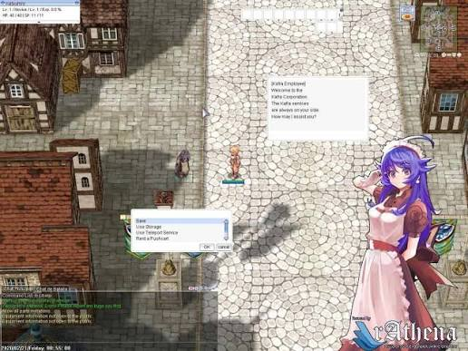
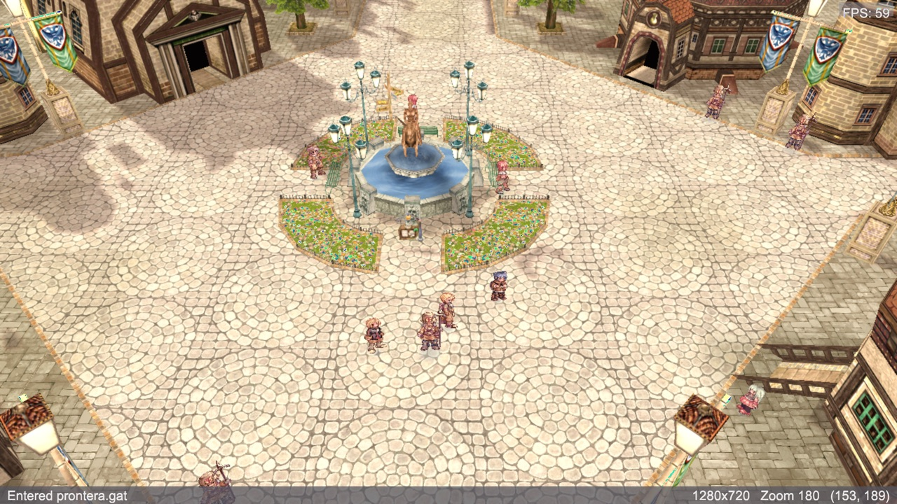

# Feature: NPC dialog and interaction

**Branch:** `feature/npc-dialog` · **Issue:** #86 · **Parent:** #49 (MVP scope), #54 (Track E, task **E3**)
**Status:** Planned · **Created:** 2026-08-26

## Goal

Click a Prontera NPC and talk to it: the Kafra greets you, the Guide offers a list
of places, `Next` advances the script, a menu choice branches it, and `Close`
ends it cleanly. This completes **Track E3** of #54 — E1 (entity system) and E2
(spawn/move/vanish packets) landed in PR #80, and everything that made those
units appear is now waiting on a way to interact with them.

Advances the MVP's **NPCs** item. Quests, shops and storage are all built on this
same conversation flow, so this is the piece they wait on — but none of them are
in this feature.

## The one thing to know first

NPC behaviour is **server-side**. rAthena runs the scripts (`docker/rathena/build/rathena/npc/**/*.txt`);
the client never executes anything. There is no Lua interpreter to write and no
quest logic to port. What the client owes is a **conversation state machine plus
a dialog window**, driven by seven packets. That is the whole feature.

## Reference (original client)

### Buttons — extracted from `data.grf`


1. **Close button** — `basic_interface/btn_close.bmp`, **42×20**, with `_a` (hover)
   and `_b` (pressed) siblings. Ends the conversation.
2. **Next button** — `btn_next.bmp`, **42×20**, but it lives in **`login_interface/`**,
   not `basic_interface/`, and ships **no `_a`/`_b` hover art**. Main already
   handles that case (`1a3bda6 feat(ui): shade skin buttons that ship no hover art`).

Both measure 42×20 in the archive, which is exactly what roBrowser's stylesheet
declares (`NpcBox.css:5` — `width:42px; height:20px`). Two independent sources
agreeing is the confirmation that this is the original size.

### Layout — measured from roBrowser

roBrowser transcribes the original window pixel-for-pixel, so its CSS is a
measurement source (the approach PR #81 used for the login window):

| Element | Size | Source |
|---------|------|--------|
| Dialog window | 276 × 176 | `NpcBox.css:1` |
| Inner border | 264 × 164, 1px `#c1c6c2` | `NpcBox.css:2` |
| Text area | 254 × 130, `#eff4f0`, `pre-wrap`, scrolls vertically | `NpcBox.css:3` |
| Buttons | 42 × 20 | `NpcBox.css:5` |
| Menu window | 276 × 116, list rows 260 wide | `NpcMenu.css:4-33` |

The menu's OK/cancel buttons and its scrollbar are visible in the captures above
but are not in this table — `NpcMenu.css` will need re-reading for their
geometry when Step 5 gets there.

Two behaviours fall out of that CSS and are easy to miss:

3. **`white-space: pre-wrap`** — NPC text carries its own line breaks and they
   are significant. Re-flowing the text as one paragraph would mangle every
   script that formats a list.
4. **`overflow-y: auto`** — the text area scrolls. A long message does not grow
   the window.

### Real client, supplied in review

![ref-01 — [Kris]: the text window and the menu window side by side](./ref-01-text-and-menu.png)

**ref-01 — text and menu together.** `[Kris]` on the first line of the text
window, the message below it, and a separate menu window to its right with
`Yes.` / `Nah, I'm a pro~` / `Cancel.`, the first row filled edge to edge with a
blue highlight, and **OK** / **cancel** at its bottom right. The text window
shows no button of its own while the menu is up.

![ref-02 — [Shopkeeper]: the Next button in place, and colored text in the message](./ref-02-next-button.jpg)

**ref-02 — the Next button in situ.** `next`, lowercase, at the **bottom right
inside the text window**. Also the first sight of **colored text in an NPC
message**: `Clana Nemieri` is blue while the rest of the line is black.



**ref-03 — a whole screen.** Text window upper right, menu window below and left
of it (`Save`, `Use Storage`, `Use Teleport Service`, `Rent a Pushcart`), both
floating over the map beside the chat box and the minimap.

Two more captures were supplied in chat but are not files, so they are not in
the repo: a `[Genius Skyler]` dialog with the menu *overlapping* the text window
rather than beside it, and a warp list — `Last Warp [pay_dun01]`, `~ Towns`,
`~ Fields`, `~ Dungeons` — with a **vertical scrollbar and arrow buttons** down
the right edge. The scrollbar claim in ⑩ rests on that second one.

#### Measured against roBrowser

ref-01 is a lossless capture at native size — its 1px borders are single crisp
pixels, not resampled — so it can be measured rather than eyeballed:

| | Measured in ref-01 | roBrowser |
|---|---|---|
| Text window, outer | 278 × 178 | 276 × 176 |
| Menu window, outer width | 278 | 276 |
| Text area | 260 wide, rows 131–270 | 254 × 130 |
| Border | 1px `#c5c5c5` | `#c1c6c2` |
| Text area fill | `#f7f7f7` | `#eff4f0` |

**roBrowser is confirmed.** Its 276 × 176 is a CSS content box; add the 1px
border it also declares and you get the 278 × 178 measured here, in both
dimensions and for both windows. The two colors differ in the last step or two
of each channel — the measured ones are what the original actually draws, so
prefer them.

What they establish, in the order it matters:

7. **Neither window has a title bar.** Both are plain light panels: a thin grey
   border, softly rounded corners, a slight drop shadow, and nothing else. This
   contradicts the "reuse `win_msgbox.bmp` — no new chrome" line in the table
   below: that bitmap nine-slices with a 24px gradient title bar, which these
   windows do not have. roBrowser agrees — its `NpcBox.css` is a 1px `#c1c6c2`
   border around an `#eff4f0` fill, a plain box. **Step 3 must not open a titled
   window.**
8. **The NPC's name is part of the message,** not a window title —
   `[Genius Skyler]`, `[Kafra Employee]`, written by the script as its first
   line. Nothing parses a name out of anything; the bracket text is just text.
   This follows from ⑦ and is why it can.
9. **The menu is a window with OK and cancel,** not a list that acts on a
   click. A row is *selected* — full-width blue highlight, first row by default
   — and **OK** confirms it. That is two steps, and the plan described one.
10. **A long list scrolls,** with a real scrollbar and arrow buttons (ref-02).
    The menu window does not grow to fit its items.
11. **Text and menu are shown at the same time,** as two separate windows, and
    the text window keeps its content while the menu is up. In both captures
    that show a menu, the text window shows **no Next or Close button** — which
    matches roBrowser revealing those only when the server asks for them.

Not established, so not assumed: whether double-clicking a row also confirms it
(likely — it is the convention, and `ui2d.DoubleClickedIn` now exists — but no
capture shows it), the exact fonts and padding, and where the windows open. The
three captures disagree on position, which is itself the answer to Open
question 2: it is not a fixed spot.

### Current state (ours)



5. **NPCs render and stand on shadows** — 17 tracked, 12 drawn (the 5 undrawable
   are guild flags, job 722, which are `.gr2` 3D models rather than sprites).
6. **Nothing is clickable.** A click anywhere, including squarely on an NPC,
   is a move request.

## What exists today

| Area | What exists | Status |
|------|-------------|--------|
| `internal/game/entity/entity.go` | `Entity` (id, name, job, type, `Body`), `Manager` keyed by AID | ✅ from #80 |
| `internal/game/states/entities.go` | `upsertUnit`, `removeUnit`, `unitSpec`, fade in/out | ✅ from #80 |
| `internal/engine/picking/ray.go:25` | `ScreenToRay` | ✅ used for click-to-move |
| `internal/engine/picking/ray.go:90` | `IntersectAABB` | 🟡 **exists, unused** — this is the seam for entity picking |
| `internal/game/game.go:883` | click → `ScreenToTile` → `RequestMove` | 🟡 needs to try NPCs first |
| `internal/engine/ui2d/context.go:154` | `BeginWindowEx`, draggable, nine-sliced | ✅ |
| `internal/engine/ui2d/context.go:317,339,618` | `Button`, `Label`, `Selectable` | ✅ |
| `internal/game/ui/window_skin.go:48` | `win_msgbox.bmp` frame already loaded | ❌ **not this window** — it has a title bar and the NPC dialog does not (see ⑦) |
| `internal/engine/ui2d/context.go` | `CaptureMouse` / `MouseCaptured` | ✅ from #87 — this is most of Step 0a |
| `internal/engine/ui2d/context.go` | `DoubleClickedIn` | ✅ from #87 — for confirming a menu row |
| `internal/engine/ui2d/widgets_at.go` | `ButtonOptions{Silent}` | ✅ from #87 |
| `internal/network/packets/` | none of the seven dialog packets | ❌ |
| `internal/game/states/ingame.go:531` | `registerPacketHandlers` — entity handlers only | 🟡 extend |
| Tests | entity/packet tests from #80; nothing for dialog | ❌ |

**In flight:** nothing. `git worktree list` shows `midgard-ro-audio` (merged) and
`midgard-ro-entities` (merged as #80). No open PR touches these files.

## Reference implementations

| Source | Where | Approach |
|--------|-------|----------|
| roBrowser | `src/UI/Components/NpcBox/`, `NpcMenu/` | Two separate windows. `NpcBox` shows the text and reveals a `Next` or `Close` button as the server asks for one (`NpcBox.js:148,160`); `NpcMenu` is a list whose selection sends `index + 1`, and cancel sends `255` (`NpcMenu.js:186,195`). The window is not recreated per message — text accumulates in one scrolling box. |
| korangar | `korangar/src/interface/windows/dialog.rs` | Same flow in a modern immediate-mode UI; useful as a structural check, but its look is deliberately not the original. |

They agree on the flow. We follow roBrowser for layout because it is a
transcription of the original; korangar only as a sanity check on packet handling.

## Assets

| Asset | GRF path | Exists? |
|-------|----------|---------|
| Close button | `data/texture/유저인터페이스/basic_interface/btn_close.bmp` (+`_a`,`_b`) | ✅ 42×20, all three states |
| Next button | `data/texture/유저인터페이스/login_interface/btn_next.bmp` | ✅ 42×20, **no hover states, different folder** |
| Window frame | `data/texture/유저인터페이스/win_msgbox.bmp` | ✅ already loaded by `window_skin.go:48` |

The `dialog_*.bmp` family in `basic_interface` (600×24 strips) is the **chat bar**,
not this window — checked and rejected, so nobody re-checks it later.

## Protocol

All IDs and offsets derived from the server's own headers at PACKETVER 20211103
via `tools/packetlen/layout.py`, not from a wiki.

| Packet | ID | Dir | Layout | Source |
|--------|----|-----|--------|--------|
| `CZ_CONTACTNPC` | `0x0090` | C→S | `type(2) AID(4) kind(1)` = 7 | `packets_struct.hpp:5412` |
| `ZC_SAY_DIALOG` | `0x00B4` | S→C | `type(2) len(2) npcId(4) message[]` | `packets_struct.hpp:5486` |
| `ZC_WAIT_DIALOG` | `0x00B5` | S→C | `type(2) npcId(4)` = 6 — show **Next** | `clif_packetdb.hpp` |
| `ZC_CLOSE_DIALOG` | `0x00B6` | S→C | `type(2) npcId(4)` = 6 — show **Close** | `clif_packetdb.hpp` |
| `ZC_MENU_LIST` | `0x00B7` | S→C | `type(2) len(2) npcId(4) menu[]` | `packets_struct.hpp` |
| `CZ_CHOOSE_MENU` | `0x00B8` | C→S | `type(2) npcId(4) select(1)` = 7 | `clif_packetdb.hpp:62` |
| `CZ_REQ_NEXT_SCRIPT` | `0x00B9` | C→S | `type(2) npcId(4)` = 6 | `clif_packetdb.hpp:63` |
| `CZ_CLOSE_DIALOG` | `0x0146` | C→S | `type(2) npcId(4)` = 6 | `clif_packetdb.hpp:136` |

`0x00B8` and `0x00B9` are declared with `parseable_packet(...)`, which is why they
are **absent from `internal/network/packets/lengths.go`** — that table is generated
from server→client packets only. Outgoing packets are built by hand, so this
costs nothing, but do not expect `packets.Length()` to know them.

### Three landmines

1. **An invalid menu index disconnects you.** `clif_parse_NpcSelectMenu`
   (`clif.cpp`) calls `clif_GM_kick` when `select == 0` or `select > npc_menu`.
   Valid values are **1..n**, plus **255 for cancel**. A zero-based index is not
   a display bug — it is a kick.
2. **The menu is one colon-separated string, and empty entries do not count.**
   `clif_scriptmenu` copies the script's text verbatim, NUL-terminated. The
   client splits on `:` and sends the item's 1-based position — but the
   position is in the list with **empty entries removed**. `menu_countoptions`
   (`script.cpp:5051`) counts only non-empty options into `sd->npc_menu`, which
   is the bound `clif_parse_NpcSelectMenu` then checks against. So `a::b`
   offers two choices and `b` is choice **2**, not 3. Keeping the empty entry
   would be a kick, by landmine 1.
3. **NPC text carries color codes.** ref-02 shows `Clana Nemieri` in blue
   inside an otherwise black line. Scripts write `^RRGGBB` inline — `^0000FF`
   to set, `^000000` to return to black. They are not stripped by the server:
   whatever the script wrote arrives verbatim. Rendering the string as-is would
   print `^0000FFClana Nemieri^000000` on screen. At minimum they must be
   parsed out of the text; drawing them in color is a small extra step once the
   parser exists, since the text is already drawn run by run.
4. **The talking NPC may not be an entity we know.** `clif_scriptmenu` calls
   `clif_sendfakenpc` when the npcId is not a real unit near the player. The
   dialog must key off the id in the packet and never assume `Manager.Get(npcId)`
   returns anything.

## Step 0 — Prerequisites & tooling

### 0a. Refactoring

- [x] `internal/game/game.go` — the click handler goes straight from
      `ScreenToTile` to `RequestMove`, with no seam for "did this click hit
      something". Extract the decision so a click can be offered to entities
      first and fall through to movement. Minimal change; no new package.
      **Smaller than planned since #87**: click-to-move is already gated on
      `uiBackend.MouseCaptured()`, so the dialog windows only have to claim
      their own rects — what is left is the entity hit test itself.

      Done as `InGameState.ClickWorld`, which is where the entity manager and
      the connection already are, so Step 2 adds the hit test in front of the
      ground pick without the game loop growing a second copy of the ray cast.
      No stub was left behind for it: the seam is the method, not a dead branch.
      Verified by clicking after the move: `pick.hit … walkable: true` →
      `move.request` → `move.ack-confirms-prediction`, unchanged.
- [x] No ADR. This adds a state machine inside an existing package and a window
      to an existing UI layer — it crosses no layer boundary in `CLAUDE.md`.

### 0b. Debug tooling & tests

- [x] **Trace channel `npc`** in `internal/trace` — events: `npc.click`
      (aid, name, screen xy), `npc.contact` (aid sent), `npc.say` (npcId, bytes,
      text length), `npc.menu` (npcId, item count), `npc.choose` (npcId, index),
      `npc.close`. The `net` channel already shows the raw packets; this one
      shows the conversation as a sequence, which is what makes a stuck dialog
      readable.
- [x] **F3 overlay fields:** one `Dialog:` line — the phase, and once a
      conversation starts the npc id, the name if we know it (`?` if not, which
      is legitimate: the server sends a fake id for scripts with no unit near
      the player) and the menu size. A stuck conversation is diagnosable from a
      single screenshot. `DialogPhase` lives in `states/npcdialog.go`; the
      transitions arrive with Steps 4–6.
- [x] **Screenshot scenario:** `./midgard --config config.yaml --autologin --no-bgm --debug-overlay --trace=npc,net --screenshot-every 4s`.
      `latest.png` must show the dialog window over the map with the NPC's
      greeting in it. **Set `vsync: false` in the local `config.yaml`** — with
      it on and the window occluded, macOS stops the display link and the
      client renders zero frames while staying alive, which looks exactly like
      a hang (learned in #85).
- [ ] **Logs:** a menu index outside 1..n must be refused client-side and logged
      at **warn** with the index and the item count — never sent. Getting kicked
      by our own packet is the failure this prevents. *(Step 6 — there is no
      menu to bound yet.)*
- [ ] **Tests:** `internal/network/packets/npc_test.go` — round-trip each packet
      against bytes written by hand from the layout table, and a menu-splitting
      table (empty, one item, trailing colon, embedded newlines, 255-cancel).
      *(Step 1.)* `internal/game/states/npcdialog_test.go` exists and covers the
      phase type; the transitions it will drive arrive with Steps 4–6.
- [x] **Use cases:** UC-207 (talk and close), UC-208 (menu choice), UC-209
      (cancel and out-of-range refusal).

## Steps

### Step 1 — Decode the dialog packets ✅
- **Changes:** `internal/network/packets/npc.go`, `npc_test.go`
- **Done when:** all eight ids are constants with encoders/decoders; the menu
  string splits into items; index 0 and >n are rejected by the encoder.
- **Proved by:** `go test ./internal/network/packets/` — round-trips against
  hand-written bytes, and a table for menu splitting.

Every id and layout was re-checked against the server's headers rather than
taken from this table, and three things came out of that:

- **`0x0BA8` is a red herring.** `PACKET_CZ_CHOOSE_MENU_ZERO` is declared under
  `PACKETVER_RE_NUM >= 20211103`, which our server satisfies, and it looks like
  the modern replacement for `CZ_CHOOSE_MENU`. It is not:
  `clif_packetdb.hpp` registers `parseable_packet(0x00b8, 7, …, 2, 6)` and never
  mentions `0x0ba8`. The old id is the one the server listens for.
- **Empty menu entries do not count** — see landmine 2, which this step
  rewrote. `SplitMenu` drops them, and that is what makes the 1-based position
  match `sd->npc_menu`.
- **The `kind` byte of `CZ_CONTACTNPC` is ignored.** `clif_parse_NpcClicked`
  switches on the target's own block type, never on this field. The original
  sends zero and so do we.

The message ends in a NUL that the server's length includes
(`clif_scriptmes` sends `strlen(mes) + 1`), and decoding bounds the text by the
packet's own length rather than by the buffer — several packets arrive in one
read, and trusting the buffer would swallow the next one. There is a test for
exactly that.

### Step 2 — Click an NPC and tell the server ✅
- **Changes:** `internal/game/states/npcpick.go` (new), `ingame.go`, `internal/engine/playerrender`
- **Done when:** clicking an NPC sends `CZ_CONTACTNPC` and does **not** walk you
  there; clicking the ground still walks.
- **Proved by:** `--trace=npc,net` shows `npc.click` → `npc.contact` → the
  server answering for that npc id. `ClickWorld` returns before it ever reaches
  `ScreenToTile`, so no move request is built.
- **Reference:** current-npcs ⑥

The hit test is an axis-aligned box per unit rather than the sprite itself: the
billboard turns to face the camera, so its plane has no fixed orientation, and
a square column of the sprite's own width covers wherever it is pointing. It
over-selects at the corners, which is the forgiving direction for something you
are trying to click. The box matches the drawn quad — `playerrender.UnitQuadSize`
reports it — and stands on the unit's feet, because the quad does.

**Two things worth knowing before Step 4 tests anything.**

`--trace=npc` now emits a `candidate` line per eligible unit, with its world
position **and where it projects on screen**. That last field is what turned a
guessing game into a measurement: the first three attempts at clicking an NPC
missed, and the trace showed 7 candidates with the ray hitting none — which
distinguishes "no NPC is tracked" from "the boxes are in the wrong place" from
"your aim is off". It was the third: the nearest NPC stood at world z 1222
while the click landed on the ground at z 1206.

And **most NPCs near the Prontera spawn are not talkers**. `prt05`, `prt07` and
friends are warps — contacting one is valid and silent. `Amatsu Trader#nin`
answers `CZ_CONTACTNPC` with **`0x00C4`** (`ZC_SELECT_DEALTYPE`, the buy/sell
prompt), because it is a shop. Both prove the round trip; neither produces a
`ZC_SAY_DIALOG`. Step 4 needs an NPC whose script actually calls `mes` — the
Kafra is the obvious one.

### Step 3 — The cursor says an NPC is there ✅
- **Changes:** `internal/game/states/npcpick.go`, `internal/game/game.go`, `internal/game/ui/`
- **Done when:** the pointer over an NPC becomes the original's talk cursor and
  goes back to the arrow when it leaves; the pointer over the interface stays
  an arrow.
- **Proved by:** screenshot scenario with the pointer parked on an NPC.
- **Reference:** the cursor sprite's own action 1, `StateTalk`

Added at Boris's request, and it costs almost nothing now that Step 2 can
answer "what is under the pointer". It also puts #83 to work: `SetCursorState`
has existed since that PR and **nothing has ever called it**, so every state
the cursor sprite carries beyond the arrow has been dead.

Two things to get right. The hover test runs every frame, so it must not emit
the per-candidate trace that a click does — that would flood the log at 60
lines a second. And a warp is an NPC to us: `prt05` and friends are
`TypeNPC` entities, so they get the talk cursor too. The original shows its
warp cursor there instead, but nothing in the entity tells us which is which,
so that waits for something that does.

Verified by parking the pointer on an NPC and screenshotting: the speech
bubble appears, and moving off it brings the arrow back.

### Step 4 — Show what the NPC says ✅
- **Changes:** `internal/game/states/npcdialog.go`, `internal/game/ui/npcdialog.go`, `npctext.go`
- **Done when:** the greeting appears in a window over the map, with its own
  line breaks intact, scrolling when longer than the box, and `^RRGGBB` codes
  parsed out rather than printed.
- **Proved by:** screenshot scenario; UC-207; a table test for the color-code
  parser (no codes, one code, unterminated code, a code at the very end).
- **Reference:** ref-01 ⑦⑧, ref-02, measurements above
- **Chrome:** a plain panel — 278 × 178, 1px `#c5c5c5` border, `#f7f7f7` fill —
  **not** `BeginWindow`, which would give it a title bar it does not have.

`ZC_SAY_DIALOG` is handled, the message is kept on the conversation, and the
window draws it: color codes parsed into runs, the script's own line breaks
kept, the rest wrapped on spaces to the 260px field. The window swallows clicks
so talking to an NPC does not also walk you into the scenery behind it.

**Confirmed on screen** by Boris: the window appears with the NPC's text, and
clicking inside it does not walk the character. Not exercised yet: a script
that actually uses `^RRGGBB`, since the Guide's text is plain — the parser has
table tests but no capture of its own.

**NPC text carries navigation markup as well as color codes.** Found in
testing, in the Prontera Guide:

```
<NAVI>[northwest]<INFO>prontera,55,350,0,000,0</INFO></NAVI>
```

The original turns that into a clickable link showing only `[northwest]`; the
server passes it through untouched, so printing what arrives puts raw tags and
map coordinates on screen. `StripNPCMarkup` keeps the label and drops the
payload. Making the label actually clickable needs minimap navigation, which
does not exist — but showing `[northwest]` is right either way, and showing the
coordinates never is. An unclosed tag is left alone rather than swallowing the
rest of the line, so a stray `<` in prose costs nothing.

This is the second kind of inline markup the text carries, after `^RRGGBB`.
There may be more — `<ITEM>` and `<URL>` exist in later clients — but nothing
was invented for tags no script here uses.

Two decisions the tests pinned down. The default text color is **exactly
black**, because scripts return to the default with `^000000` and any softer
near-black would make that a visible color change rather than a return — the
test caught this. And a word wider than the field overflows rather than being
broken mid-word: rare, and a split word reads worse than one that runs on.

**Scrolling is not implemented.** Lines past the bottom of the field are
dropped. The original scrolls, and roBrowser accumulates successive messages in
one box — but a message only grows past the box once `Next` starts appending to
it, which is Step 5. Doing it here would be building for a case that cannot yet
arise.

**How to test this at all:** the NPCs near the default spawn are warps and
shops (see Step 2). Move the character next to a talker first —
`UPDATE \`char\` SET last_map='prontera', last_x=152, last_y=322 …` puts it
beside `Guide#05prontera`, and `--trace=npc` then lists every NPC on screen
with its projected position.

### Step 5 — Next and Close ✅
- **Changes:** `internal/game/states/npcdialog.go`, `internal/game/ui/npcdialog.go`
- **Done when:** `ZC_WAIT_DIALOG` shows a Next button that advances the script;
  `ZC_CLOSE_DIALOG` shows Close, which ends the conversation and returns control.
- **Proved by:** UC-207 end to end against Prontera's Guide; `npc` trace shows
  the full sequence and a clean `npc.close`.
- **Reference:** ref-02 for placement — the button sits at the bottom right
  *inside* the text window.

**The asset table was wrong about both buttons.** roBrowser's `NpcBox.html`
names them with no folder prefix — `btn_next.bmp`, `btn_next_a.bmp`,
`btn_next_b.bmp` and the same for close — which resolves to the **root** of
`유저인터페이스\`, not to `login_interface\` or `basic_interface\`. Those
subfolders contain different buttons that happen to share the names, and it is
the `login_interface` one that has no hover art. The root pair has all six
bitmaps, 42×20 each, so both buttons get real hover and pressed states.

**Both are Korean** (`다음`, "next"), and so is the `login_interface` pair —
there is no English version to pick instead. They go through `skinButton`, the
helper the login window already uses to mask a baked-in caption and draw its
own, which knows where the ink sits in a 42×20 button. Captions are lowercase
`next` and `close`, matching ref-01 and ref-02.

Three behaviours worth stating:

- **Text accumulates.** A second message from the same NPC is appended rather
  than replacing the first, as the original does — a script that says three
  things in a row would otherwise overwrite itself twice before it could be
  read. A different NPC, or a close, starts fresh.
- **That is what makes scrolling matter**, and it is now handled the way a
  conversation wants: when the text outgrows the box the *end* is shown, not
  the beginning. No scrollbar; the last thing said is what you want to read.
- **Being offered Close does not end the conversation.** The script is still
  waiting until the player presses it. `EndDialog` clears the window even if
  the send fails, because leaving a dismissed window on screen is worse than
  the server briefly thinking we are still talking — its own timeout resolves
  that.

**Driven end to end in the client** against `Wanted Notice#edq`
(`prontera 150,326`), whose script is `mes` → `next` → `next` → `close` with
blue names on its second page: the pages append, the colored names render as
colors, and both buttons work.

**The "slow Close" is the server's NPC timeout, not a delay.** Testing showed
a Close button appearing about a minute after the last Next. The net trace
explains it exactly:

```
23:52:10.235  npc.next
23:52:10.251  net.recv 0x00B7 (86 bytes)   <- a menu, 16ms later
23:52:10.252  net.unhandled 0x00B7          <- we ignore menus until step 6
23:52:16..23:53:06  net.recv 0x007F x6      <- nothing but keep-alives
23:53:10.018  net.recv 0x00B6               <- close, 59.8s after the next
```

The server answered in 16 milliseconds. It offered a **menu**, we did not
answer it because menus are Step 6, and rAthena's `SECURE_NPCTIMEOUT` force-
closed the conversation sixty seconds later. Step 6 removes it; there is
nothing to fix in the dialog.

Incidentally the same lines show the length-bounded decode from Step 1 doing
its job: `0x00B6` arrived with `remaining: 67`, another packet in the same
read, and was not allowed to swallow it.

Two faults it turned up, both now fixed:

- **The buttons were invisible but still clickable.** The renderer batches
  images, then solids, then text — and the window's background was drawn with
  `DrawRect`, a solid, so it painted over the button, which is an image. The
  window now fills itself with a tinted 1×1 texture so it sits in the image
  layer, below its own widgets. *Invisible but clickable is the signature of
  this fault: hit tests do not care what is on top.* It is the second time this
  batching order has bitten — the cursor vanished under the experience bars for
  the same reason — and it is worth a proper fix in `ui2d` once this feature is
  done, because **a panel built from solids cannot host an image widget**.
- The captions were Korean, addressed above.

### Step 6 — Menus 🟡 built, not yet driven
- **Changes:** `internal/game/states/npcdialog.go`, `internal/game/ui/npcmenu.go`
- **Done when:** `ZC_MENU_LIST` shows the choices; picking one sends its 1-based
  index and the script branches; cancel sends 255.
- **Proved by:** UC-208, UC-209. Talking to the Guide and choosing a destination
  branches correctly, and cancel closes without a kick.
- **Reference:** ref-01 ⑨⑩, roBrowser `NpcMenu.css`

A second window, shown at the same time as the text one — ref-01 has both on
screen together. Geometry from `NpcMenu.css` with the same +2 for its border
that the text window needed. **Four rows fit and the rest scroll**, which is
not a guess: roBrowser gives the list an 80px box with 20px rows, and the
warp-list capture shows exactly four rows above a scrollbar.

A row is selected — the pale blue band runs the full width, per `.selected` and
ref-01 — and **OK** confirms it. Double-clicking a row does the same thing
faster, using `DoubleClickedIn` from #87.

**Cancel closes the whole conversation, not just the menu.** Testing found the
text window left behind with no button and no way out. The server is never
going to rescue it: `buildin_menu` handles 255 with `st->state = END`
(`script.cpp:5174`) and sends nothing back, because the original client has
already closed its own window by then. The trace shows exactly that — an
`npc.cancel` followed by silence. A script using `prompt` rather than `select`
carries on and sends more text, which arrives with the dialog idle and simply
opens it again.

The wheel scrolls the list and the selection is kept in view. The scrollbar is
a track and a thumb; the original also has arrow buttons at each end, which are
not here.

`btn_ok.bmp` and `btn_cancel.bmp` exist only in `login_interface\` and ship no
hover or pressed art, so the same texture serves all three states and the
widget shades it — the case character select already handles the same way.

Not yet driven in the client.

### Step 7 — Docs
- [ ] `docs/ENGINE_FEATURES.md` if a package was added
- [ ] Session log `docs/sessions/2026-08-DD-npc-dialog.md`
- [ ] Close #54's **E3** checklist items

## Done when (feature)

- Clicking Prontera's Kafra opens her dialog with her greeting
- `Next` advances a multi-page script; `Close` ends it and gives back control
- The Guide's destination menu appears, a choice branches the script, cancel backs out
- Clicking the ground still walks; clicking an NPC never does both
- No disconnect from any menu interaction, including cancel and rapid clicking
- `--trace=npc` reads as a conversation from click to close

## Out of scope

- Shops, storage and the Kafra's warp menu as **custom windows** — they arrive
  through the generic dialog and will look generic until they get their own feature
- Quest log, dialogue history, NPC name tooltips on hover
- Monster clicking and combat (Track F)
- `SECURE_NPCTIMEOUT` — rAthena can time a dialog out server-side; not enabled
  in our config, and not handled here

## Open questions

1. ~~No original screenshot of the dialog in situ.~~ **Answered and
   committed** — `ref-01`…`ref-03`, and roBrowser's measurements confirmed
   against them.
2. ~~Where should the window open?~~ **Answered.** The three captures disagree
   on position, so it is not a fixed spot; the window is draggable (per review)
   and where it is put is **kept for the next conversation**. One that jumped
   back to the middle every time you spoke to someone would be worth moving
   only once.
3. **Text encoding.** rAthena's English scripts are ASCII, so this does not bite
   today, but Korean scripts would arrive as EUC-KR and our font atlas is built
   from the ASCII range. Worth confirming we only care about English scripts.

## Investigation notes

- The `dialog_*.bmp` family (600×24) is the chat input bar, not this window.
- `basic_interface` and `login_interface` are separate folders in the archive and
  the two buttons this feature needs live in different ones.
- `internal/network/packets/lengths.go` covers server→client packets only, because
  the generator reads `packet(...)` declarations and the client→server ones are
  declared with `parseable_packet(...)`.

## Revision log

- 2026-08-26 — dialog window made draggable (per review), which answers open
  question 2: its position is remembered between conversations. It has no
  title bar, so the whole window is the handle; the button is drawn after and
  claims the pointer for itself, so pressing it does not drag.
- 2026-08-27 — **Step 6 built.** `ZC_MENU_LIST` handled and drawn as a second
  window with a selected row, OK, cancel and a scrollbar. This also removes the
  60-second wait recorded above, which was rAthena timing out a menu nobody
  answered.
- 2026-08-26 — **Step 5 verified**, after two fixes from Boris's testing: the
  buttons were drawn under the window background (the images-then-solids
  batching again), and their Korean captions needed the login window's masking
  helper. Both button families in the archive are Korean; there is no English
  one.
- 2026-08-26 — **Step 5 built.** Next and Close handled, drawn and wired. The
  asset table was wrong about both buttons: roBrowser names them unprefixed, so
  they come from the root of the interface folder, where a full six-bitmap set
  exists — the `login_interface` button the plan named is a different one that
  genuinely lacks hover art. Text now accumulates across Next, and an
  overgrown box shows its end rather than its beginning.

- 2026-08-26 — **Step 4 built.** `ZC_SAY_DIALOG` handled and drawn in a plain
  bordered panel with no title bar, color codes parsed into runs, script line
  breaks kept and the rest wrapped. Parser and wrapper have table tests; the
  window itself has not been seen on screen yet. Scrolling deliberately left
  until Step 5, which is what can make a message outgrow the box.

- 2026-08-26 — **Step 3 added and done** (per review): the pointer becomes the
  talk cursor over an NPC. Cheap now that Step 2 can say what is under it, and
  it puts #83 to work — `SetCursorState` had existed since that PR with nothing
  ever calling it, so every cursor state past the arrow was dead. Steps 3–6
  renumbered to 4–7.

- 2026-08-26 — **Step 2 done.** Clicking an NPC contacts it and does not walk
  you there. Added `playerrender.UnitQuadSize` so the hit box matches the drawn
  quad, and a `candidate` trace that projects each eligible unit to screen —
  which is what found that the misses were bad aim rather than bad geometry.
  Also learned that the NPCs nearest the spawn are warps and shops, so Step 4
  must pick a scripted one to test against.

- 2026-08-26 — **Step 1 done.** The eight conversation packets encode and
  decode, verified against the server's headers rather than against this plan's
  own table. `0x0BA8` looked like it had replaced `CZ_CHOOSE_MENU` at our
  packet version and had not; empty menu entries turn out not to count toward
  the selection index, which landmine 2 now spells out.

- 2026-08-26 — **Step 0 done.** `npc` trace channel, the `Dialog:` line on the
  F3 overlay backed by a `DialogPhase` type, and the click decision extracted
  to `InGameState.ClickWorld`. Renumbered the three use cases to UC-207…209:
  this plan and the Basic Info HUD were written the same day and both claimed
  UC-205 and UC-206, and the HUD's have since merged.

- 2026-08-26 — three captures committed as `ref-01`…`ref-03`. Measuring the
  lossless one confirms roBrowser to the pixel (276 × 176 content box + 1px
  border = the 278 × 178 measured). Two findings the earlier round missed: the
  Next button sits bottom right *inside* the text window, and NPC text carries
  `^RRGGBB` color codes that would otherwise print literally.
- 2026-08-26 — rebased onto `main` after #87 merged, which brings
  `CaptureMouse`/`MouseCaptured`, `DoubleClickedIn` and `ButtonOptions` — all of
  which this feature wants. Three real-client captures supplied in review:
  neither window has a title bar (so `win_msgbox.bmp` is the wrong chrome), the
  NPC's name is part of the message text, and the menu is a window with OK,
  cancel and a scrollbar rather than a click-to-choose list.

- 2026-08-26 — created
