# Feature: Warp portals — moving across locations

**Branch:** `feature/warp-portals` · **Issue:** #91 · **Parent:** #49 (MVP scope), #51 (Track B, task **B2**: "`ZC_NPCACK_MAPMOVE` (0x0091) → map change handling")
**Status:** Planned · **Created:** 2026-08-27

## Goal

Walk out of Prontera and into its buildings the way the original client does it.
Every gate and door shows the blue swirling portal; the cursor turns into a door
over one; stepping on it changes the map. Leaving for the next location shows the
loading screen while the field loads and the server re-sends its NPCs and
monsters; walking into a building shows the same loading screen for the moment
the room takes to load — the original's behaviour — and inside, the camera is
the original's indoor camera: no orbiting, and black beyond the walls rather
than water.

Advances the MVP's **walking** item (Track B2 of #51 — the one task left open
there) and turns "Prontera + fields" from a list of maps into a place you can
actually walk across.

**Generic by construction (scope confirmed by Boris, 2026-08-27):** nothing in
this feature is keyed on Prontera. Any map the server names in `0x0091` loads
through the same path; the indoor and camera rules come from the client's own
tables (`indoorrswtable.txt`, `viewpointtable.txt`) for every map; and *Done
when* verifies with maps far from Prontera.

## The one thing to know first

**Warps are server-side NPCs.** Each one is a unit of class **45** with a
trigger box (`warp prt05 2,2,prt_in,168,128` = a 5×5 box around 177,221); the
client never knows where a warp leads. What the client owes is exactly three
things:

1. **Draw class 45 as the portal** — the original client's built-in effect
   `EF_WARPZONE2` ("Warp NPC", rAthena `doc/effect_list.md:332`), not a sprite.
   The client's own `jobname.lub` maps `JT_WARPNPC` to `1_ETC_01`, which is why
   we draw a white blob in every doorway today (see *Current state* ⑫).
2. **Answer `0x0091`** — load the named map, and only then send `0x007D`
   (`CZ_NOTIFY_ACTORINIT`). The server responds to `0x007D` with everything in
   view: NPCs, monsters, players (`clif_parse_LoadEndAck`, `clif.cpp:10848`).
   There is no "request entities" packet — the refresh is automatic.
3. **Keep the camera honest indoors** — `data/indoorrswtable.txt` lists the maps
   (`prt_in.rsw#` is line 144) where the original disables orbital rotation.

There is no "walk into a building" logic to write: `prt_in` is just another map,
and all fifteen Prontera doors lead into it. The protocol makes no distinction
between "building" and "next location"; the only thing that differs indoors is
the camera (Step 6).

## What the measurements say (the load-time research)

Measured on this Mac with the real client, `--autologin`, `--trace=render`, one
run per map (a second Prontera run gave 1022 ms):

| Map | GND | RSW models | `InGameState.Enter` → `map loaded` | Frames rendered meanwhile |
|-----|-----|-----------:|-----------------------------------:|--------------------------:|
| `prt_in` (indoor) | 150×100 | 528 | **587 ms** | 0 |
| `prontera` | 156×196 | 1304 | **1243 ms** | 0 |
| `prt_fild01` (field) | 200×200 | 1244 | **1455 ms** | 0 |

Three things follow:

- **The loading screen does not cover the load.** `LoadingState` lasts **33 ms**
  — it only waits for `ZC_ACCEPT_ENTER2` — and its progress bar is simulated
  (`loading.go:92-97`, `Progress += dt * 0.5`). The map is then parsed and
  uploaded **synchronously inside `InGameState.Enter()`** (`ingame.go:139-146`,
  `loadMap` at `:263-317`), which stalls the render loop for the whole second:
  zero frames, a frozen last image of the previous screen.
- **`0x007D` is sent before anything is loaded** (`loading.go:176-182`). It works
  today only because the spawn burst that answers it is held by the network
  layer until the handlers exist (`client.go:249-268`). Korangar and roBrowser
  both send it after the map is on the GPU; so must we.
- **Where the time goes is not instrumented.** Nothing in `states/`, `scene/` or
  `world/` measures the phases (`Scene.LoadMap` prints three lines to stdout,
  `scene.go:218-220`). Step 0b adds per-phase timing; the numbers above are the
  totals the plan is sized against.

Consequence: every map change gets the original's loading screen with a real
bar — 1–1.5 s for a field, ~0.6 s for a building. Preloading `prt_in` so that
doors would be instant was considered and **dropped by decision (Boris,
2026-08-27)**: the original shows the loading screen for buildings too, just
briefly, and that is what we match.

## Reference (original client)

### Real client — YouTube stills

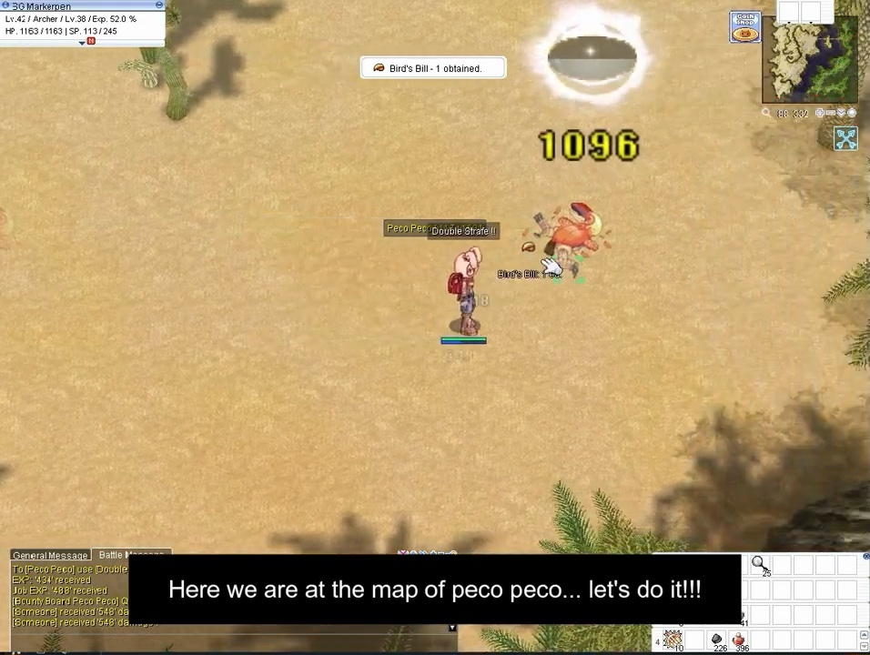

1. **Portal, seen from the default camera** — a soft white-blue **disc on the
   ground** with a **column of light** rising from it, semi-transparent, brighter
   at the base. It is the only thing on the map that glows. Source:
   [iRO Chaos — EP05 #Prontera](https://youtu.be/rXsLFRYZMP4?t=315).
2. **No name label, no HP bar, no shadow** on it — unlike every NPC and monster
   in the same frame.

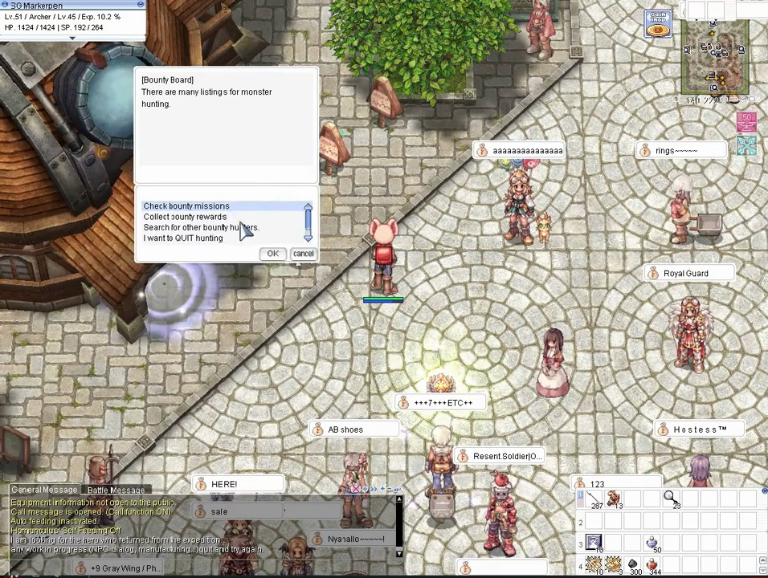

3. **A building door in Prontera** — the portal stands *in front of* the door
   on the street tile, not inside the doorway; the disc is wider than a
   character and the column reaches roughly a character's height. Source:
   [same video @ 10:45](https://youtu.be/rXsLFRYZMP4?t=645).

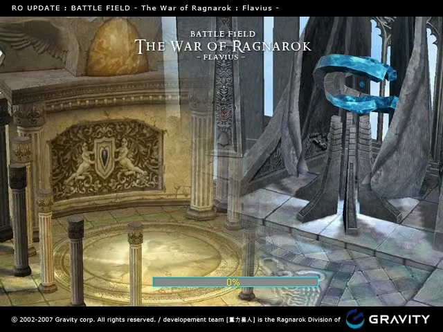

4. **Loading screen** — the image fills the window; the bar sits low-centre
   with a **cyan border**, a grey trough and the **yellow percentage** inside
   it — exactly roBrowser's transcription (⑪ below). Nothing else is drawn:
   no map name, no HUD. Source:
   [Ragnarök Online Gameplay](https://youtu.be/2sQ5j8ZoY8Y?t=81).

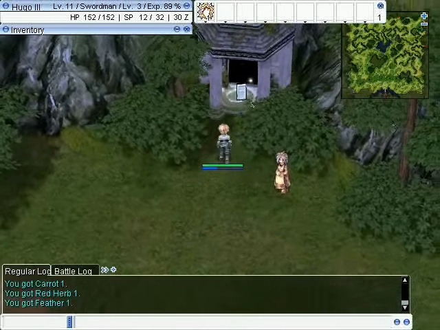

5. **The same portal two seconds before that loading screen** — small because
   the camera is far; the player walks into it and the loading screen above is
   the very next thing on screen. This pair is the whole feature in two frames.
   Source: [same video @ 1:19](https://youtu.be/2sQ5j8ZoY8Y?t=79).

The two videos are the real client; nothing in either frame is a private-server
UI. Frames were taken with `yt-dlp` + `ffmpeg` and kept as JPEG.

### The portal — extracted from `data.grf`

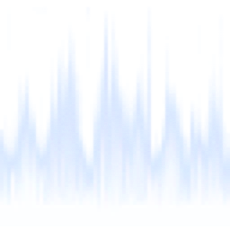


6. **Portal column** — a vertical, slightly conical tube textured with
   `ring_blue.tga`: pale-blue light spikes rising from the base, alpha in the
   texture, transparent above the spikes. roBrowser carries the original's
   primitive for exactly this (`Cylinder.js`): **20 segments**, separate top and
   bottom radii, `u = i/20` around, `v` 1→0 from bottom to top, spun about Y at
   **`tick/4` degrees** (one turn every 1.44 s), fragments with `alpha == 0`
   discarded. The table entry that would use it was never written — "TODO: Warp
   STR file" (`DBManager.js:184`) — so no reference client draws it.
7. **Ground disc** — the same texture family (`magic_blue.tga` is the violet
   sibling used by casting circles). Whether the original draws a disc under the
   column, or the column alone: **the real-client frames (①③) show the disc** — so both are drawn.
8. **No name, no shadow** — roBrowser deliberately never requests a warp's name
   (`EntityControl.js:80-82`, commit "Do not display warp's name"); class 111/139
   have shadow scale `0.0` in its shadow table.

### The door cursor — extracted from `data/sprite/cursors.spr` / `.act`

  

9. **Door cursor** — `cursors.act` **action 7**, 10 frames, interval `2`
   (= 50 ms at the ACT's 25 ms tick), so one loop every half second. Hotspot
   from roBrowser's table: `drawX 10, drawY 32` (`CursorManager.js:135`).
   Korangar names the same slot `Warp = 7` and has `WarpFast = 12` (2 frames,
   sprites 11 and 15) for the fast-warp state. Our `internal/engine/cursor`
   already bakes every action and declares `StateWarp = 7` — it has simply
   never been selected.

### The loading screen — extracted from `data.grf`


10. **Loading image** — the archive has eleven, `loading00.jpg`…`loading10.jpg`
   under `유저인터페이스/` (plus older copies at `texture/loading00..06.jpg` and
   `basepic/`). roBrowser picks **one at random from `loading01..10`** per load
   (`Background.js:87-91, 158-170`). No map name, no tips.
11. **Progress bar** — roBrowser's transcription: **240×15** px, centred, at
   **75 %** of the window height; border `rgb(0,255,255)`, trough
   `rgb(140,140,140)`, fill `rgb(66,99,165)` inset 2 px, percentage text in
   `rgb(255,255,0)`; the bar fades in and out through black over 500 ms
   (`Background.js:196-262`). Progress is an estimate from file counts, not
   bytes — it steps, it does not glide.

### Current state (ours)

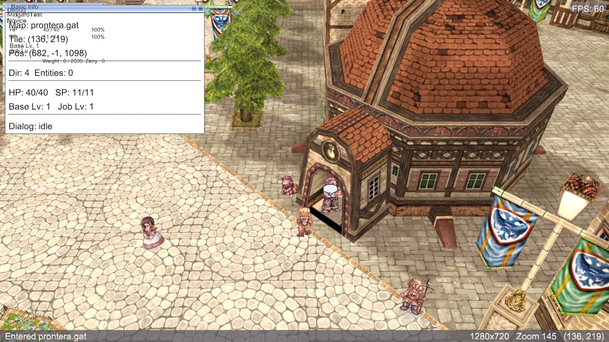

12. **The warp drawn as `1_ETC_01`** — the white oval in the doorway is the
   sprite `jobname.lub` assigns to class 45. It is clickable, sends
   `CZ_CONTACTNPC`, and gets the *talk* cursor (`game.go:1120-1124` says so in
   its own comment).
13. **No portal, no door cursor, nothing distinguishes the door from the wall.**

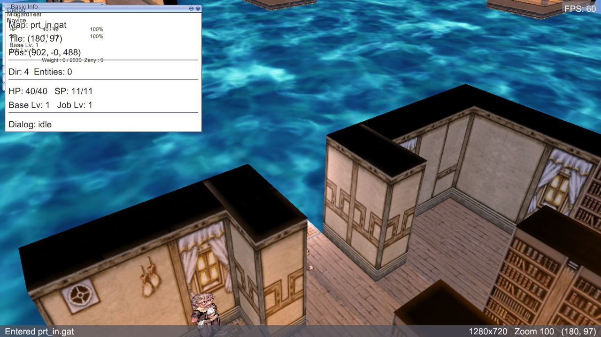

14. **The indoor map from outside.** Rooms are boxes on a plane of animated
   water; the camera can orbit and zoom freely, so you look at the back of the
   walls. This is what "I shouldn't be able to zoom and see aside" refers to.
   (The water is the map's RSW water plane filling the void — the original shows
   black there; see Open question 2.)

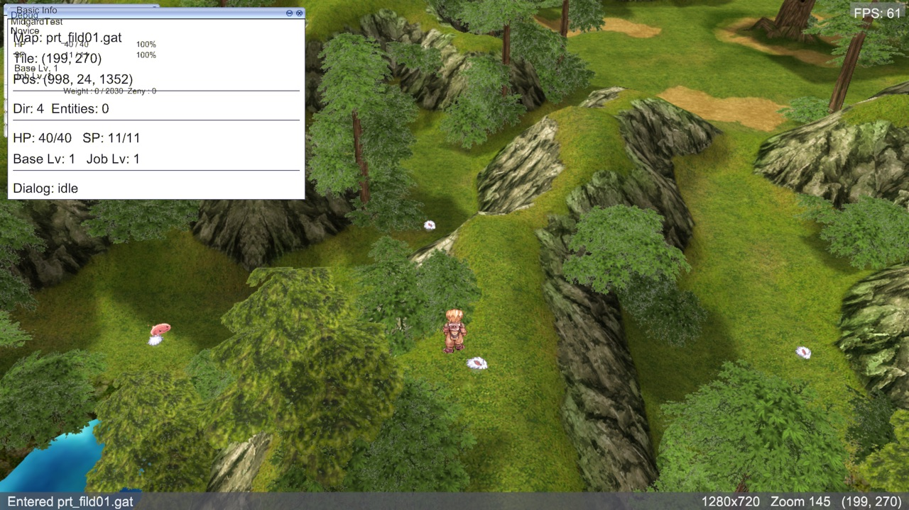

15. **A field, after the freeze.** This is what you see 1.5 s after the last
    frame of the previous screen — no loading screen in between.

## What exists today

| Area | What exists | Status |
|------|-------------|--------|
| `internal/network/packets/packets.go:68` | `ZC_NPCACK_MAPMOVE = 0x0091`, length 22 in `lengths.go:54` | 🟡 id only — **no decoder** |
| `internal/game/states/ingame.go:641,919-923` | handler registered; body is `return nil` | ❌ stub |
| `internal/network/packets/lengths.go:886` | `0x0AC7: 156` (`ZC_NPCACK_SERVERMOVE` at our PACKETVER) | 🟡 framed, unhandled; `0x0092` is not in the table (pre-2017 id) |
| `internal/network/packets/packets.go:52,626` | `CZ_NOTIFY_ACTORINIT = 0x007D`, `LoadingComplete` | ✅ — sent too early (`loading.go:176-182`) |
| `internal/game/states/loading.go` | `LoadingState`: sends `CZ_ENTER2`, waits for accept, fakes progress, 60 s timeout | 🟡 loads nothing |
| `internal/game/states/ingame.go:263-317` | `loadMap`: GAT → GND → RSW → `scene.LoadMap` | ✅ works, wrong place, synchronous |
| `internal/game/ui/ui2d_backend.go:872-888` | `RenderLoadingUI`: login backdrop (`bgi_temp.bmp`) + one 280×16 bar | 🟡 not the loading screen |
| `internal/game/states/state.go:153-180` | `Manager.Change` schedules, `Update` runs `Exit`/`Enter` inline on the render thread | ✅ — the freeze lives here |
| `internal/game/entity/entity.go:11-19,370,378` | `TypeWarp`, `TypePortal` constants; `Manager.Clear`/`ClearAll` | 🟡 **declared, never used** |
| `internal/game/states/entities.go:15-27` | `unitType`: everything not player/mob/item → `TypeNPC` (warps included) | 🟡 extend |
| `internal/engine/charsprite/spritenames.go:10` | `45: "1_ETC_01"` (generated from `jobname.lub`; **139 absent**) | 🟡 override for 45/139 |
| `internal/engine/cursor/cursor.go:37` | `StateWarp = 7`, baked and animated | ✅ **unused** |
| `internal/game/game.go:1118-1141` | `updateCursor`: Default or Talk only | 🟡 extend |
| `internal/game/states/npcpick.go:120-126` | `isClickable`: any `TypeNPC` → `CZ_CONTACTNPC` | 🟡 warps must walk, not talk |
| `internal/engine/camera/camera.go:137-216` | `ThirdPersonCamera`: zoom 100–800, pitch fixed 0.85, yaw unclamped, no per-map rules | 🟡 needs indoor mode |
| `internal/engine/scene/scene.go:330,464` | `RenderWithThirdPersonExtras`, `RenderSprite` billboard; water frame cycling (`water.go:48`) | ✅ seams for the effect |
| `internal/engine/texture/tga.go:13` | `DecodeTGA` (types 2 and 10, 24/32-bit) | ✅ `ring_blue.tga` decodes |
| `internal/game/world/world.go:33-96` | `world.Manager` / `Map.Load` — "map loading not implemented" | ❌ dead stub, nothing constructs it |
| `internal/network/client.go:249-313` | packets held until a handler exists (64/packet, 512 total) | ✅ — see landmine 5 |
| `internal/config/flags.go:19-21` | `--autologin`, `--debug-overlay`, `--no-bgm` | ✅ from #85 |
| Tests | packet lengths (`0x0091` = 22), entity decoders, `{"warp portal", EntityNPC, 45, true}` in `entities_test.go:466` | 🟡 nothing for loading, camera, cursor, state manager |

**In flight** (touches the same files — build on it, don't collide):

| PR / branch | What | Overlap |
|-------------|------|---------|
| #88 `feature/basic-hud` (worktree `midgard-ro-entities`) | minimap, chat, ESC menu, windows | The minimap shows one map's image; **it must be told when the map changes**. Step 3 exposes an `OnMapChanged` hook on `InGameState` for it; nothing else overlaps. |
| `feature/native-cursor` (merged as #83) | RO cursor | Done — this feature only selects a state it already bakes. |
| `feature/npc-dialog` (merged as #89) | dialog windows | Step 3 closes an open dialog on map change (korangar does; the server has already ended it). |

## Reference implementations

| Source | Where | Approach |
|--------|-------|----------|
| **korangar** | `korangar/src/main.rs:1359-1374, 2444-2482`; `loaders/async/mod.rs:76-81, 202-273` | On `ChangeMap`: drop the map, clear particles/effects/lights/ambient, **truncate the entity list to the player**, close dialogs, enqueue an **async** load on a one-thread pool; when it lands: insert map, BGM, `player.set_position` (which cancels movement), snap camera, **then** `MapLoadedPacket` (`0x007D`). **No loading screen at all** — empty frames until the map is in. Entities that arrive before the map is ready are **dropped** (`main.rs:1220`). Warps: `EntityType::Warp` for job 45, drawn as `npc\WARPNPC.spr` — a file that does not exist in kRO data (`entity/mod.rs:412` "TODO: change"). Cursor `Warp = 7` chosen from the GPU picker (`main.rs:2992-3009`). Clicking a warp **walks** to its tile (`main.rs:2077-2098`). Camera: fixed pitch −55°, zoom 150–500, no indoor concept. |
| **roBrowser** | `src/Engine/MapEngine.js:257-319`; `src/Renderer/MapRenderer.js:105-190`; `src/UI/Background.js`; `src/UI/CursorManager.js:34-43,133-138`; `src/Controls/EntityControl.js:69-88,183-188` | `onMapChange`: teardown (sound, renderer, UI, cursor → default); **same map name = local teleport, no reload**; different map → `Background.setLoading` (random `loading01..10.jpg`, progress from file counts), map loaded in a Web Worker, then `onLoad`: re-add the player at the new tile, `Camera.init`, re-append the HUD, **then** `NOTIFY_ACTORINIT`. `0x0092` reconnects and replays the same path. Job 45 → `TYPE_WARP` (`Entity.js:170-175`), **rendered as nothing** (`DBManager.js:184` "TODO: Warp STR file"), picking box 20×20, name never requested. Cursor `WARP: 7`, hotspot `(10,32)`. Click on a warp = `CZ_REQUEST_MOVE` to its tile. Camera: zoom 2–150, pitch 190°–270°, **no indoor handling** (`indoorrswtable.txt` unread). |
| **rAthena** (our server) | `src/map/clif.cpp:2151-2163` (`clif_changemap`), `:10746-11182` (`clif_parse_LoadEndAck`), `src/map/npc.cpp:1896-1953` (`npc_touch_areanpc`), `src/map/pc.cpp:2273, 7078-7083` | See *Protocol*. The authoritative sequence and the two surprises (initial `0x0091`, re-warp on load). |
| **Ragnarok Research Lab** | [Camera Controls](https://ragnarokresearchlab.github.io/rendering/camera-controls/) | `indoorRswTable.txt`: "orbital rotations will be disabled completely for the map"; `viewpointtable.txt` gives per-map presets (`range 230, scope 170, altitude −50…−65` are the normal-map defaults per its own header; `prt_in` has no entry, so it takes the defaults with rotation off). |

Where they disagree: korangar shows nothing during a load, roBrowser shows the
original's loading screen — we follow roBrowser (it is what the original does,
and what Boris asked for). Both reload on every map change; roBrowser skips the
reload for a same-map `0x0091` — we follow roBrowser there too, because the
server sends one on every login (`pc_authok`, `pc.cpp:2273`).

## Assets

| Asset | GRF path | Exists? (`grftool search`) |
|-------|----------|-----------------------------|
| Portal wall texture | `data/texture/effect/ring_blue.tga` (64×64 RGBA) | ✅ |
| Portal disc / violet variant | `data/texture/effect/magic_blue.tga` (64×64 RGBA) | ✅ |
| Cursor sheet | `data/sprite/cursors.spr`, `cursors.act` (14 actions; 7 = door) | ✅ already loaded |
| Loading screens | `data/texture/유저인터페이스/loading00.jpg` … `loading10.jpg` | ✅ 11 files |
| Indoor map list | `data/indoorrswtable.txt` (205 lines, CP949, `name.rsw#` per line; `prt_in.rsw#` at 144) | ✅ |
| Camera presets | `data/viewpointtable.txt` (56 lines, CP949, 10 `#`-separated fields; no `prt_in`) | ✅ |
| Map display names | `data/mapnametable.txt` | ✅ (not needed here) |
| `prt_in` | `data/prt_in.rsw/.gnd/.gat` | ✅ |
| Fields adjacent to Prontera | `prt_fild05/06/08` `.rsw/.gnd/.gat` | ✅ (`prt_fild08` checked) |
| Sounds | `data/wav/effect/ef_portal.wav`, `warp.wav` | ✅ (not used by the NPC warp — Open question 3) |
| ~~`data/sprite/npc/warpnpc.spr`~~ | what korangar loads | ❌ **absent** from both archives |
| `data/sprite/npc/portal.spr` | looked promising; it is a knight standing on a magic circle (an event NPC), not the warp | ✅ exists, ❌ wrong thing |

**Warps to test with** (from `npc/warps/cities/prontera.txt`, the file our Renewal
server loads — `npc/re/scripts_main.conf:34`; format `map,x,y,facing warp name xs,ys,dest,x,y`; **`xs,ys` are half-extents**, `npc.cpp:1922-1925`):

| Warp | Line | From | Box | To | Return |
|------|------|------|-----|----|--------|
| `prt001` south gate | `:24` | `prontera 156,22` | 7×5 | `prt_fild08 170,375` | `prtf004` at `prt_fild08 170,378` → `prontera 156,26` |
| `prt002` west gate | `:30` | `prontera 22,203` | 5×7 | `prt_fild05 367,205` | `prtf002` → `prontera 26,203` |
| `prt003` east gate | `:32` | `prontera 289,203` | 5×7 | `prt_fild06 27,193` | `prtf003` → `prontera 285,203` |
| `prt05` door | `:25` | `prontera 177,221` | 5×5 | `prt_in 168,128` | `prt05-1` at `prt_in 168,124` → `prontera 174,218` |
| `prt04` door (in the capture) | `:23` | `prontera 134,221` | 3×3 | `prt_in 131,71` | `prt04-1` at `prt_in 135,71` → `prontera 136,219` |

Note: in Renewal data Prontera's gates lead to `prt_fild05/06/08` and `prt_cas`;
`prt_fild01` — where the test character had been parked — is **not adjacent**
(reachable only via `prt_fild02`, `prt_gld`, `prt_maze01`). See Open question 4.

## Protocol

PACKETVER **20211103** (`docker-compose.yml:44`); ids and layouts from the server's own headers.

| Packet | ID | Len | Dir | Layout / source |
|--------|----|----:|-----|-----------------|
| `ZC_NPCACK_MAPMOVE` | `0x0091` | 22 | S→C | `mapName[16]` (with `.gat`, NUL-padded), `x u16`, `y u16` — `packets.hpp:696-702`, sent by `clif_changemap` `clif.cpp:2151-2163` |
| `ZC_NPCACK_SERVERMOVE` | `0x0AC7` | 156 | S→C | `mapName[16]`, `x`, `y`, `ip u32`, `port u16` (LE!), `domain[128]` — `packets.hpp:704-715`; **`0x0092` is the pre-20170315 id** |
| `CZ_NOTIFY_ACTORINIT` | `0x007D` | 2 | C→S | header only — `clif_packetdb.hpp:32`; answered by `clif_parse_LoadEndAck` `clif.cpp:10746-11182` |
| `ZC_NOTIFY_VANISH` | `0x0080` | 7 | S→C | `id u32`, `type u8` (0 = out of sight) — sent to **others** when you warp (`AREA_WOS`, `clif.cpp:976`); the warping client gets nothing |
| `ZC_NOTIFY_STANDENTRY11` | `0x09FF` | var | S→C | every NPC — warps included — with `objecttype 0x6`, `job 45` (`clif_bl_type` `clif.cpp:364-377`; `clif_set_unit_idle` `:1099-1130`) |

The sequence for stepping on a gate, from the server's code:

```
client   CZ_REQUEST_MOVE → …walk…                       unit_walktoxy_timer (unit.cpp:680-687)
server   cell has CELL_NPC → npc_touch_area_allnpc       npc.cpp:1958-1994
server   in box → pc_setpos(dest, CLR_OUTSIGHT)          npc.cpp:1939
server   → 0x0080 to everyone else                       unit_remove_map_pc → clif_clearunit_area
server   → 0x0091 (prt_fild08.gat, 170, 375) to us        pc.cpp:7081 → clif_changemap
client   stop moving, drop units (keep player), close dialog
client   load prt_fild08 (loading screen, phases)
client   → 0x007D                                         only when the map is on the GPU
server   → inventory, weight, spawn(self), map property,
           every unit in AREA_SIZE via clif_getareachar   clif.cpp:10780-10848
           …, weather, then npc_touch_area_allnpc again   clif.cpp:11146-11152
```

### Landmines

1. **A `0x0091` arrives on every login, for the map you are already entering.**
   `pc_authok` sends `clif_changemap` "to fix the login-without-aura glitch"
   (`pc.cpp:2273`); it was in the very first burst of every run above, right
   after `ZC_ACCEPT_ENTER2`, and we log it as `net.unhandled`. The handler must
   treat *same map* as "set position, don't reload" — roBrowser's local-teleport
   rule — or every login would load the map twice.
2. **`0x007D` must move to after the load.** Today it goes out inside
   `handleMapAccept`, before a byte of GND is read. Once the loading is real and
   phased, sending it early would put the spawn burst in the held-packet buffer
   for a second — or lose it (landmine 5).
3. **The server can answer `0x007D` with another `0x0091`.** If
   `sd->state.rewarp` is set, `LoadEndAck` sends only `clif_changemap` and
   returns (`clif.cpp:10760-10764`); and after a normal load it runs
   `npc_touch_area_allnpc` on the arrival cell (`clif.cpp:11149-11152`), so
   arriving on a warp cell warps again immediately. The handler has to work
   while `LoadingState` is still the current state, not only in-game. (This is
   also why every return warp sits a few cells off its partner.)
4. **`0x0AC7`, not `0x0092`.** The map-server-change packet at our PACKETVER is
   `0x0AC7` (156 bytes). It is already in the length table, so framing is safe;
   it needs a decoder and a log line, not a reconnect — we run one map server.
5. **The held-packet buffer is small.** `heldPerPacket = 64` (`client.go:261`).
   A busy Prontera arrival is dozens of `0x09FF`; if handlers were ever missing
   at that moment, spawns would be dropped silently. They are not missing today
   (`InGameState` registers them once and we never leave it), and Step 3 keeps
   it that way — the map change must **not** tear down `InGameState`.
6. **`jobname.lub` lies about 45.** The client's own table maps `JT_WARPNPC` to
   `1_ETC_01`; `139` (`JT_HIDDEN_WARP_NPC`) is not in it at all. The generated
   `spritenames.go` must never be consulted for these two: 45 is the effect,
   139 is invisible (roBrowser draws nothing for 111/139, korangar has a TODO).
7. **The character's saved map decides what you test.** `last_map` in the
   `char` table is what `--autologin` lands on; it was `prt_fild01` this morning.
   It is now `prontera 156,191`.

## Step 0 — Prerequisites & tooling

### 0a. Refactoring (only what this feature needs)

- [x] **Move the map load out of `InGameState.Enter()`** (`ingame.go:139-146,
      263-317`) into a loader that `LoadingState` drives **in phases, one or more
      per frame** — GAT, GND, RSW, terrain textures, models in chunks, water —
      so the loading screen renders between phases with a bar that moves.
      `InGameState` receives a ready scene and GAT. Same code path for the first
      map and for every warp. (Phased-on-the-main-thread is what the original
      does; it keeps GL on one thread and needs no goroutine plumbing. Moving
      the parse phases to a goroutine later is a local change to the loader.)
      **Done, with one correction:** the loader is driven by `InGameState`, not `LoadingState`. Landmine 5 wanted the state — its handlers, stats and dialog — to survive a warp, and that only works if the state that owns the map also owns its loading. `LoadingState` is now the handshake only (`CZ_ENTER2` → accept); `InGameState.beginMapLoad`/`finishMapLoad` do the rest, for the first map and every warp alike. `0x007D` goes out from `finishMapLoad`, after the handlers exist and the scene is up.
- [x] **`Scene` gains phase methods** (`PrepareTerrain`, `LoadModels(from, n)`,
      `Finish`) that `LoadMap` calls in sequence — `LoadMap` itself stays, so
      `cmd/grfbrowser/map_viewer.go` is untouched. Additive; no ADR.
      Done: `BeginMap`, `LoadTerrain`, `BeginModels`, `LoadModelRange`, `EndMap`; `LoadMap` wraps them. The model renderer keeps its RSM parse cache between chunks.
- [x] **Delete `world.Manager` / `Map.Load`** (`world/world.go:33-96`): a stub
      nothing constructs, and a second "map loader" name in the tree would be
      confusing next to the real one.
      Done.
- [x] **Entity kind on hover.** `HoverEntity` (`npcpick.go:39-43`) returns an
      entity; `updateCursor` (`game.go:1130-1140`) and `isClickable`
      (`npcpick.go:120-126`) both need its `Type`, not "is an NPC". Small seam,
      done once.
      Done as `cursorFor(entity)` in `game.go`; Step 5 adds the warp case.
- [x] **`entity.Manager.Clear` keeps the player.** It exists (`entity.go:370`)
      and is unused; make it the map-change primitive (korangar's
      truncate-to-one) and test that the player survives it.
      Done; `manager_test.go` proves it.
- [x] `Scene.LoadMap`'s three `fmt.Printf` lines (`scene.go:218-220`) → the
      logger, with the phase timings from 0b. Nothing else in the tree prints.
      Done — the engine cannot import the logger, so the scene reports counts (`LoadedModels`, `TerrainGroups`) and the loader logs them with the phase timings.
- [x] No ADR. Every change is inside `internal/game/states` or additive on
      `internal/engine/scene`/`camera`; no layer boundary in `CLAUDE.md` moves.

### 0b. Debug tooling & tests

- [x] **Trace channel `map`** in `internal/trace` — `map.change` (from, to, x, y,
      `same` bool, origin `login|warp|rewarp`), `map.load.phase` (name, ms,
      count), `map.loaded` (map, total ms, models, textures), `map.ready`
      (`0x007D` sent, ms since `map.change`), `map.indoor` (map, rotation
      locked, zoom range), `map.water` (cells with water / total cells). The `net`
      channel still shows the raw packets; this one reads as the story of one
      warp. Movement stays on `move`, cursor on `pick`/`npc`.
      Done: `map.change`, `map.step` (per frame: phase, ms, progress), `map.loaded`, `map.ready`, `map.server-move`. `map.indoor` and `map.water` arrive with Step 6.
- [ ] **F3 overlay fields:** a `State:` line (`Login/CharSelect/Loading/InGame`),
      `Load: 1243 ms (gat 3 · gnd 210 · rsw 12 · tex 380 · models 620 · water 18)`,
      `Indoor: yes (yaw locked, zoom 230–400)`, `Water: 1240 cells`.
      A frozen load or a wrong camera is diagnosable from one screenshot.
- [x] **`--walk-to x,y` (QA aid)** — and **`--mouse-at x,y`**, added in Step 5 for the cursor capture. in `internal/config/flags.go`, alongside
      `--autologin`: once in-game, issue one click-to-move to that tile through
      the same `RequestMove` path. It is what lets an unattended run step on a
      warp. Zero-code alternative for the packet steps: put the character **on**
      a warp cell in the DB — `LoadEndAck` fires the warp itself
      (`clif.cpp:11149`), so a `0x0091` arrives without anyone walking.
      Done; fires once through `RequestMove` when `MapReady()`.
- [x] **Screenshot scenario:** from `prontera 156,30`,
      `./build/midgard --autologin --no-bgm --debug-overlay --trace=map,net --walk-to 156,22 --screenshot-every 2s`
      → the sequence of `latest.png` must show the street, the loading screen
      with the bar part-way, and `prt_fild08` with mobs. Doors: from
      `prontera 174,218`, `--walk-to 177,221` → the loading screen, then the
      room with the camera locked and black between the rooms. **`vsync: false` in the local `config.yaml`** (learned
      in #85).
      **Correction:** `--screenshot-every` below one second starves the loader — each retina capture is a ~0.5 s PNG encode on the render thread, and a 1.3 s load became 7.4 s under a 300 ms cadence. Use `--screenshot-every 1s`, or `--screenshot-after`.
- [ ] **Logs:** a loading image that fails to load → **warn** with the path and
      the `bgi_temp.bmp` fallback (the black-login-screen lesson); a map whose
      `.gnd` is missing → the loading screen shows the error (`ErrorMsg` exists,
      `loading.go:83-87`) instead of a hang; `indoorrswtable.txt` missing →
      warn once, every map is outdoor; `0x0AC7` received → warn with the address
      (we do not reconnect).
- [x] **Tests:** `internal/network/packets/mapchange_test.go` — `0x0091` decode
      against hand-written bytes (NUL padding, `.gat` stripped, x/y), `0x0AC7`
      decode; `internal/game/states/maploader_test.go` — phase order, progress
      monotonic, error surfaces; `internal/engine/water/water_test.go` — cells only where the
      GND rule says so, none for a map without water; `internal/assets/indoor_test.go` —
      `name.rsw#` parsing, CP949 comments ignored, `viewpointtable` fields;
      `internal/engine/camera/camera_test.go` — indoor clamps (yaw frozen, zoom
      range); `entities_test.go` — job 45 → `TypeWarp`, 139 not drawable, warps
      not clickable-as-NPC; `game`'s cursor choice from entity type; `Clear`
      keeps the player.
      Done for this step: `mapchange_test.go`, `maploader_test.go` (phase order, chunking, progress monotonic, GAT/RSW optional, GND fatal, terrain failure stops), `manager_test.go`. The rest land with their steps.
- [x] **Use cases:** UC-211 (gate → field with loading screen), UC-212 (enter
      and leave a building, indoor camera), UC-213 (portal visual, door cursor,
      click-to-walk).

## Steps

### Step 1 — Decode the map-change packets, and act on the one we already get ✅
- **Changes:** `internal/network/packets/mapchange.go` (+test), `internal/game/states/ingame.go` (`handleMapChange`), `loading.go`
- **Done when:** `0x0091` and `0x0AC7` decode; the login-time `0x0091` for the
  current map repositions the player (no reload) and traces
  `map.change same=true origin=login`; a `0x0091` for another map traces
  `map.change same=false` and — for now — logs at warn that map changes are not
  wired yet, instead of being silently dropped.
- **Proved by:** `go test ./internal/network/packets/`; `--autologin --trace=map,net`
  on login shows `net.recv 0x0091` followed by `map.change … same=true`, and
  `net.unhandled 0x0091` is gone from the log.

Landed with Step 0, since the loader needed the handler. Two things the first
run taught: the held login-time `0x0091` is delivered the instant its handler
registers, so the load has to be *started* before the handlers are — otherwise
the echo reads as a teleport and `0x007D` goes out early — and the same-map
rule is therefore "same map and not yet loaded", not "same map and loading".
A `0x0091` for another map already starts a load (that is most of Step 3);
`0x0AC7` is decoded and logged at warn.

### Step 2 — A loading screen that loads ✅
- **Changes:** `internal/game/states/maploader.go` (new), `loading.go`, `ingame.go`,
  `internal/engine/scene/scene.go` (phase methods), `internal/game/ui/ui2d_backend.go`
  (`RenderLoadingUI`), `internal/game/debug_fields.go`
- **Done when:** on login the loading screen is a random `loading01..10.jpg`
  with the original's 240×15 bar at 75 % height; the bar advances per phase
  while the map actually loads; `0x007D` is sent after `map.loaded`; the F3
  `Load:` line shows the phase breakdown; total load time is not worse than
  today's (±10 %).
- **Proved by:** `--screenshot-every 250ms` during login catches the loading
  screen with the bar part-way (attach one); trace order
  `map.load.phase … → map.loaded → map.ready → net.recv 0x00B0/0x09FF…`;
  `maploader_test.go`.
- **Reference:** ref-02 ④, grf-loading01 ⑩⑪

Done. The picture is one of `loading01..10.jpg` per load, chosen by the
handshake and kept by the load that follows so the player sees one screen;
the bar is roBrowser's transcription to the pixel. A missing picture warns
once with its path and falls back to the title backdrop. Load time: **1307 ms**
for Prontera against 1243 synchronous (+5 %).

What the proof run found: capturing the loading screen was distorting it.
Each `--screenshot-every` frame encoded a 2560×1440 PNG on the render
thread — most of a second each — so a 1.3 s load measured as **7.3 s** with a
300 ms cadence and still 7.3 s at 1 s. The encode now runs on a worker
goroutine at best-speed compression (`internal/game/screenshot.go`), and the
same 1 s run measures 1.9 s. Every unattended number in this document from
here on is taken with that in place.

### Step 3 — Walk through a gate ✅
- **Changes:** `ingame.go` (`handleMapChange` → `Manager.Change(LoadingState{map, x, y, keepConnection})`, `OnMapChanged` hook), `entities.go` (`Clear` keeping the player), `npcdialog.go` (close), `internal/engine/character` (cancel walk), BGM switch via `manager.PlayLocationBGM`
- **Done when:** stepping on `prt001` shows the loading screen and lands the
  player at `prt_fild08 170,375` with the field's units spawning within a
  second; the return warp brings you back; the NPC dialog, if open, is closed;
  a `0x0091` that arrives during loading (landmine 3) restarts the load cleanly.
- **Proved by:** UC-211; the DB trick (character on `prontera 156,22`) gives an
  unattended `0x0091` right after login — trace reads `map.change origin=warp →
  map.load.phase… → map.ready → 0x09FF…`; `--walk-to 156,22` from `156,30`
  does it by walking. `Entities:` on F3 drops to 0 and grows again.

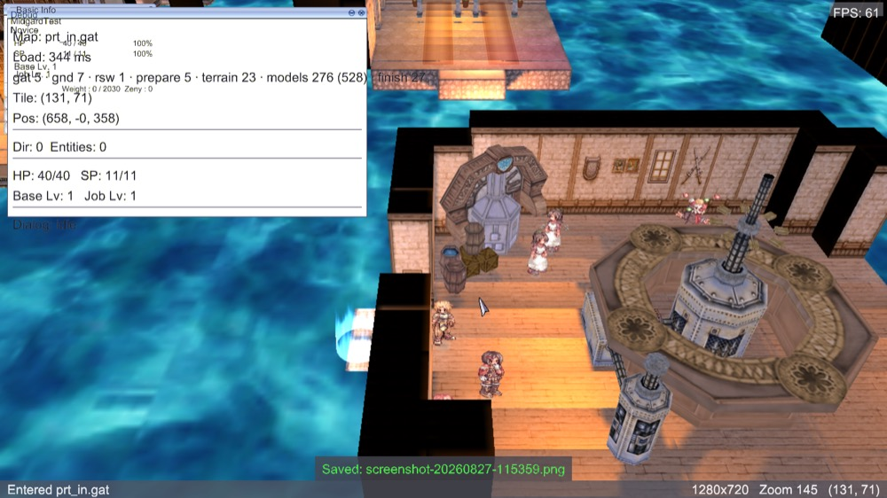

Done — the mechanics landed with Step 0 (the state survives the change; the
loader runs for every map alike) and this is the proof, by walking: from
`prontera 136,219`, `--walk-to 134,221` onto door `prt04`. The trace reads
`walking to … 134,221` → `net.recv 0x0091` → `map.change from prontera.gat to
prt_in.gat 131,71 origin=warp` → `map.loaded prt_in 344 ms (528 models)` →
`map.ready` → the room's NPCs (`Tool Dealer`, `Gemstone Bagger`) in the next
packets. Six tenths of a second from the step to standing inside, loading
screen included. The units, the dialog and the walk are dropped on the
change; the character, stats, camera and handlers are not.

### Step 4 — Warps look like warps ✅
- **Changes:** `entities.go` (`unitType`: 45 → `TypeWarp`, 139 → hidden), `internal/engine/scene/portal.go` (new: the 20-segment cylinder, `ring_blue.tga`, spin at `tick/4`°, alpha blend, no depth write), `ingame.go` (`renderUnits` → portal for `TypeWarp`, drawn through `RenderWithThirdPersonExtras`), `charsprite` (never look 45/139 up)
- **Done when:** every door and gate in Prontera shows the blue column; no
  `1_ETC_01` sprite, no name, no shadow for warps; hidden warps draw nothing but
  are still counted; the column survives camera rotation (it is geometry, not a
  billboard).
- **Proved by:** screenshot at `prontera 136,219` (the capture above, redone);
  `render` trace shows no `render.sheet` for job 45; `entities_test.go`.
- **Reference:** ref-01 ①, ref-04 ③, grf-ring-blue ⑥, current-prontera-door ⑫

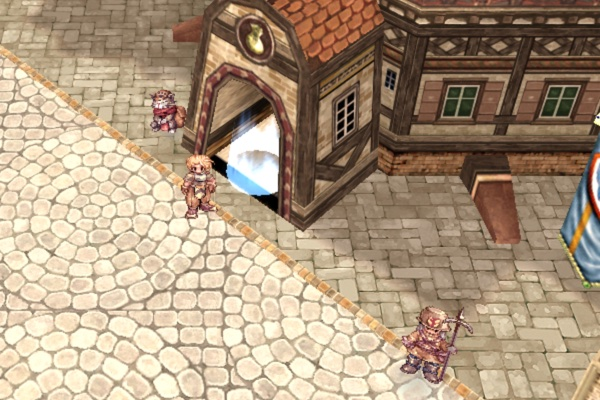

Done. `internal/engine/scene/portal.go` is roBrowser's cylinder — twenty
segments, the top ring half a segment ahead of the bottom so the spikes lean,
`ring_blue.tga` wrapped once around, a quarter degree per millisecond of spin
— plus a soft procedural disc on the ground, which the real-client frames
show and the texture alone would not give. Added light over a sunlit doorway
came out white in the first capture, so the tube is tinted `(0.55, 0.8, 1.0)`
at nine tenths. Class 45 and 139 are `TypeWarp`; only 45 is drawn, never as
a sprite (`render.sheet` lists no job 45), with no name and no shadow. The
renderer belongs to the state, like the player's, so a warp costs no
reload. Proportions are by eye against ref-04 — the thing to adjust in
review, if anything.

### Step 5 — The door cursor, and clicking a portal walks onto it ✅
- **Changes:** `game.go` (`updateCursor`: `TypeWarp` → `cursor.StateWarp`), `npcpick.go` (`isClickable` excludes warps; `ClickWorld` walks to a warp's tile)
- **Done when:** hovering a portal shows the animated door; hovering an NPC still
  shows talk; clicking a portal walks there and warps, sending no `CZ_CONTACTNPC`.
- **Proved by:** UC-213; F12 with the cursor on the portal; `--trace=npc,move`
  shows `move.request` and no `npc.contact` for the click.
- **Reference:** grf-cursor-door ⑨

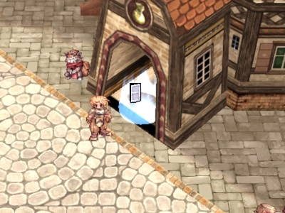

Done. `cursorFor` returns `StateWarp` for a warp; `isClickable` admits visible
warps and refuses hidden ones; `ClickWorld` walks to a warp's cell instead
of contacting it (`map.warp-click` in the trace, no `npc.contact`). The
capture needed a pointer over the portal with nobody at the mouse, so there
is now **`--mouse-at x,y`** beside `--walk-to`: once the map is up it moves
the pointer through the OS (`SDL_WarpMouseGlobal`), so the same motion event
a hand would cause reaches the input layer.

### Step 6 — Indoors, the camera behaves, and the void is black
- **Changes:** `internal/assets/maptables.go` (new: `indoorrswtable.txt`,
  `viewpointtable.txt`, CP949-safe), `internal/engine/camera/camera.go`
  (`Limits{YawLocked, MinDistance, MaxDistance, Pitch}` + `SetLimits`), `ingame.go`
  (apply per map on enter), `debug_fields.go`; **water as per-cell tiles from the
  GND** — `internal/engine/water/water.go` (`BuildPlane`, `:17`) and
  `scene/water_renderer.go` (`createWaterPlane`, `:79`) currently make one
  map-sized quad; the original emits a tile per cell only where the cell's
  ground meets the level test (roBrowser `Ground.js:471-483`: a corner above
  `level − waveHeight`), so cells with no ground get no water
- **Done when:** in `prt_in` right-drag does not rotate the camera, zoom is
  clamped to the table's normal range, entering resets to the map's
  `rotation_IN`/`altitude_IN`; **the space between the rooms is black, not
  water**; outdoor maps are unchanged — Prontera's fountain and the field's
  lake still render and animate; F3 shows `Indoor: yes` and the water cell
  count.
- **Proved by:** UC-212; screenshots in `prt_in` after a right-drag and a full
  zoom-out, and at Prontera's fountain (attach both); `camera_test.go`,
  `indoor_test.go`, `water_test.go`; `map.water` reports 0 cells for `prt_in`.
- **Reference:** current-prt-in ⑭ (the before)

### Step 7 — Docs
- [ ] `docs/ENGINE_FEATURES.md` — the map loader and the portal primitive
- [ ] `docs/features/warp-portals/README.md` — corrections found while building
- [ ] Session log `docs/sessions/2026-08-DD-warp-portals.md`
- [ ] RFC #49 / PRD §4.3.1 — Prontera's adjacent fields are `prt_fild05/06/08`, not `prt_fild01–03` (verified in the shared and the `re/` warp scripts; Open question 4)

All steps land on `feature/warp-portals` in one PR (one or a few commits per step, in order). The PR closes the issue.

## Done when (feature)

- Every gate and door in Prontera shows the blue portal; none shows the `1_ETC_01` blob; hidden warps show nothing
- The cursor is the animated door over a portal, talk over an NPC, default over the ground
- Walking onto the south gate shows the original's loading screen (random image, stepping bar) and arrives in `prt_fild08` with NPCs and monsters; walking back returns to Prontera
- Walking into a door shows the same loading screen, briefly, and lands in `prt_in`; walking out returns the same way
- Inside `prt_in` the camera cannot orbit, and beyond the walls there is black, not water; outside, camera and water are as before
- **Any map works:** with the character placed by DB on `geffen 119,59`, `morocc 156,93` and `prt_castle 102,20` (indoor-listed) in turn, each loads through the same path with the right camera rules; nothing in the feature names a map
- The login-time `0x0091` no longer shows as `net.unhandled`; `--trace=map` reads as a story from `map.change` to `map.ready`
- No freeze longer than one frame anywhere in the flow; no disconnect in a 5-minute walk `prontera → prt_fild08 → prontera → prt_in → prontera`

## Out of scope

- **Map-server changes** (`0x0AC7`): decoded and logged; we run one map server. Reconnect logic is its own feature.
- **Teleport skills and items** (Butterfly Wing, Kafra warp service): they arrive as the same `0x0091` and will simply work, but are not tested here.
- **The Acolyte "Warp Portal" skill unit** (`ZC_SKILL_ENTRY`, unit id 0x81) — a skill-unit effect, not an NPC.
- **Minimap update on map change** — #88 draws the minimap; this feature only provides the `OnMapChanged` hook it needs.
- **Preloading / instant buildings** — decided against (Open question 1); the original shows its loading screen for buildings too.
- **Loading tips, map-name banner, the `mapnametable.txt` names** — the original loading screen shows neither.
- **Async (goroutine) loading** — the loader is phased so it can be moved off-thread later; not needed to meet the numbers above.

## Open questions

1. ~~"Instant" buildings — preload, or the original's loading screen?~~
   **Answered (Boris, 2026-08-27): the original is fine.** The preload/cache
   step is dropped; buildings get the loading screen like any other map.
2. ~~What should indoor restrict, and is the void fix in scope?~~ **Answered:
   keep it like the original, and fix the void here.** Rotation off per
   `indoorrswtable`, the normal zoom range, and water drawn per GND cell so the
   void is black — all in Step 6.
3. ~~Portal proportions and sound.~~ **Withdrawn** — it was a note, not a
   request: Step 4 tunes the portal by eye against ref-01/ref-04; nothing is
   needed from Boris.
4. ~~The MVP field list.~~ **Closed** — verified in the server's own scripts
   (shared `npc/warps/cities/prontera.txt:24,30,32`; the `re/` file adds only
   the Illusion door and the castle gate): Prontera's gates open onto
   `prt_fild05/06/08` in both eras; `prt_fild01` is not adjacent. Step 7
   corrects the RFC #49 / PRD wording.
5. ~~`--walk-to` as a permanent QA flag?~~ **Answered: yes.**

None open.

## Investigation notes

- **`0x01D7` is mis-framed on every map entry — pre-existing.** Right after
  `0x007D` the server sends `ZC_SPRITE_CHANGE2`, which our length table has
  at 11 bytes; at this PACKETVER it is 15, so the client logs `unknown packet
  id, resynchronising {id: 0x0000, skipped: 4}` and recovers. It is in every
  run back to `main` and costs nothing visible, but it is a wrong entry in
  `lengths.go` (`tools/packetlen`) worth its own fix.


- The initial map name reaches the client only in `HC_NOTIFY_ZONESVR2`
  (`packets.go:405-437`); `ZC_ACCEPT_ENTER2` carries position and tick, no name.
  A warp's map name therefore comes only from `0x0091`.
- `ZC_NOTIFY_TIME` (`0x007F`) is **not** part of the LoadEndAck reply — it only
  answers `CZ_REQUEST_TIME`. Nothing here should wait for it.
- roBrowser's `MapRenderer.setMap` refuses a new map while one is loading
  ("TODO: stop the map loading") — landmine 3 is exactly the case it punts on.
- korangar's cursor picks direction slot 7 for the door action and 0 for the
  default with a "TODO: figure out how this is supposed to work"; our
  `cursor.go` already bakes per-state frames, so we do not inherit that hack.
- The `1_ETC_01` blob is not a bug in the sprite table — it is faithful to
  `jobname.lub`. The bug is consulting the table for class 45 at all.
- Both fields in `viewpointtable.txt` headers are Korean comments; the numbers
  (`range 230 / scope 170 / altitude −50…−65`) are the normal-map defaults it
  states itself.

## Revision log

- 2026-08-27 — **Steps 3 and 5 done.** Walking into a Prontera door reaches
  `prt_in` in 0.6 s, loading screen included; the door cursor shows over a
  portal and clicking one walks into it. `--mouse-at` joins `--walk-to`.
- 2026-08-27 — **Step 4 done.** The portal effect, rebuilt from roBrowser's
  cylinder and the archive's `ring_blue.tga`; warps typed as `TypeWarp`,
  hidden ones (139) not drawn.
- 2026-08-27 — **Step 2 done.** The original's loading screen; screenshot
  encoding moved off the render thread after it turned a 1.3 s load into a
  7.3 s measurement. The `0x01D7` framing warning traced to a pre-existing
  length-table entry (Investigation notes).
- 2026-08-27 — **Step 0 done, Step 1 with it.** Phased map loading measured
  at **1307 ms** for Prontera across 32 frames (synchronous was 1243), with a
  24 ms per-frame budget: a 12 ms budget cost 1444 ms because each frame
  carries ~23 ms of its own. The loader is driven by `InGameState` (plan
  correction, see 0a). `map` trace, `--walk-to`, `0x0091`/`0x0AC7` decoders,
  the dead `world` stub gone, `Clear` proven.
- 2026-08-27 — **Review answers applied** (from chat): buildings keep the
  original's loading screen — the preload step is dropped and the steps
  renumbered (7 + docs); indoor stays like the original, and the
  water-in-the-void fix moves into Step 6 as a per-cell water mesh; Open
  questions 3–5 closed; scope made explicit — any map, nothing
  Prontera-specific, verified with three far maps in *Done when*.
- 2026-08-27 — created
