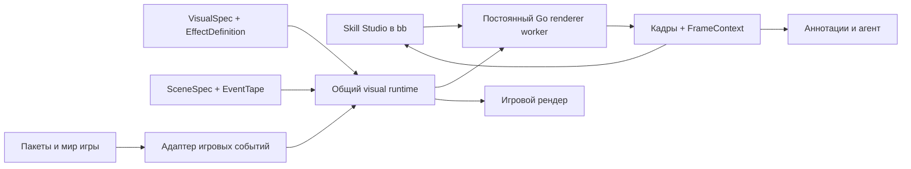

# Skill Studio: визуальная разработка навыков в GRF Workbench

Статус: реализация начата; первый вертикальный срез Soul Strike подготовлен в рабочей копии, остальные этапы ниже остаются планом. Дата: 2026-09-07.
Проверенная кодовая база: `f43a870`; BB 0.41 / Plugin SDK 0.4.34.

## Проблема и согласованные ограничения

По оценке пользователя, отладка визуальных эффектов Мага заняла около дня. Основные затраты — поиск оригинального референса, сопоставление ресурсов и реализаций, повторные проверки размеров, ориентации, траекторий и тайминга. Следующие 170+ навыков требуют сохранённого процесса исследования и воспроизводимого визуального стенда.

Ответы пользователя:

- Первый режим автономный, без подключения к игровому серверу. Онлайн-отладка — отдельный последующий кейс.
- Фокус на визуале. Механики нужны только в виде входных значений, меняющих отображение: число попаданий/снарядов, уровень, длительность и подобные параметры.
- Основной способ правки — замечания агенту. Инспектор текущих характеристик полезен для точной формулировки; объём ручного редактирования параметров ещё не определён.
- Для повседневной работы с эффектами пользователь входит через Skill Studio. Нужна самостоятельная библиотека эффектов и анимаций с понятными названиями: знание структуры GRF и корейских имён файлов не должно быть условием поиска и просмотра.

Рекомендация: добавить в Workbench **Skill Studio** — каталог навыков, самостоятельную библиотеку эффектов и анимаций, библиотеку референсов, тестовую сцену, таймлайн и инспектор. Это расширение существующего инструмента; аннотации кадра, crop, R/G, комментарии и review переиспользуются.

## Что уже есть и чего действительно не хватает

| Основа в проекте | Использование в Studio |
|---|---|
| `skills.Tree(job)`, имена навыков и `InfoOf(id)` | Каталог «профессия → навык → уровень»; не зависит от выученных навыков аккаунта |
| `skills.SkillEffects` | Начальные ассоциации BeginCast / OnCaster / OnTarget / OnGround |
| `effect.Frames(STR, elapsedMs)` | Вычисление STR-слоёв на заданный момент |
| `spriteeffect.go` | SPR/ACT-эффекты, привязка к сущности или земле, размеры и время жизни |
| `burst.go` | Процедурные эффекты, траектории, частицы и хвосты |
| `skillcast.go` | Последовательность эффектов, задержки попаданий, звук, реакции целей, жизненный цикл skill units |
| `scene.Scene` и `ui2d` | Сцена/акторы и финальное рисование эффектов |

В текущем `skilleffects.go` 175 skill ID с привязками и 165 разных EF-символов. Это карта ассоциаций, а не 175 завершённых визуальных реализаций. `info.go` содержит 1511 записей; каталог должен отличать активные навыки, пассивные и навыки без самостоятельного эффекта.

Полного авторского описания визуального действия пока нет, но его части уже существуют. Поэтому предлагаемая БД расширяет эту основу. Сгенерированные таблицы не редактируются руками, существующие эффекты сначала подключаются адаптерами.

Soul Strike в нашем клиенте — процедурная композиция `soulStrikeParts`, использующая `data/sprite/이팩트/particle1.spr`: снаряды, сегменты хвоста, траектории и вспышки. Искать для него единственный STR было бы неверным направлением исследования. В соседнем `nostalro-client` есть и реализация этого эффекта, и effect viewer с pause/frame step/hot-reload snapshot; это полезный референс структуры инструментов.

## Цели

- Открыть любой выбранный навык в воспроизводимой сцене без входа на сервер и поиска монстра на карте.
- Дать агенту референсы, найденные ресурсы, текущую реализацию и точный контекст замечания одним набором.
- Проверять изменение визуальных данных на том же исполнителе и пути рисования, что использует игра.
- Накапливать переиспользуемые компоненты эффектов и знания об их происхождении.
- Находить и проигрывать анимацию по смыслу и превью, в том числе без выбора навыка и для ресурсов, ещё не используемых клиентом.
- Измеримо сократить цикл «изменение → просмотр → замечание», а не обещать одинаковое время реализации любого навыка.

Начальные метрики — гипотезы для проверки на нашем компьютере: тёплый пересчёт выбранного кадра после изменения данных P95 ≤ 1 с; интерактивное воспроизведение ≥ 30 FPS на простой сцене; 100% сохранённых замечаний воспроизводимы по snapshot. На первых четырёх навыках отдельно измерить время поиска ресурсов и количество итераций до принятия, сравнив с текущим процессом. Компиляция Go и первая загрузка ресурсов измеряются отдельно.

## Сценарий пользователя и агента

1. Пользователь выбирает профессию и навык. Карточка показывает ID, уровень, тип цели, известные привязки, референсы, статус реализации и непроверенные аспекты.
2. Кнопка «Начать работу» создаёт или открывает связанный thread в проекте. В контекст попадают skill ID, выбранная сцена, спецификация, референсы и предыдущие замечания. Один навык имеет одну каноническую спецификацию, даже если доступен нескольким профессиям.
3. Пользователь добавляет ролик/скриншоты либо описывает намерение. Агент собирает пакет исследования: источники, ресурсы-кандидаты, существующий код, гипотезы и пробелы. Оригинальный вид и согласованное намерение — разные основания приёмки, отмеченные явно.
4. Агент готовит композицию через существующие компоненты или дописывает общий компонент в Go. Ресурсы проверяются до запуска. Пустой preview с ошибкой загрузки не считается готовым эффектом.
5. Пользователь нажимает Play, меняет скорость просмотра, останавливает сцену, выбирает момент или отдельный слой. Рядом доступны синхронизированный референс и инспектор.
6. Замечание относится к области кадра, компоненту или интервалу времени. Агент получает изображения и структурированный контекст, исправляет данные/код и предлагает новый snapshot.
7. Пользователь сравнивает A/B на одинаковой сцене и времени. После принятия определение и сценарии остаются в проекте, а связанный PR содержит воспроизводимую проверку.

## Интерфейс

Два самостоятельных входа: **«Навыки»** и **«Эффекты и анимации»**. Выбор профессии нужен только первому. Из карточки навыка можно открыть используемый эффект в библиотеке, из эффекта — все использующие его навыки. Референсы доступны рядом с обоими видами карточек.

| Область | Содержание |
|---|---|
| Слева | Профессия, поиск навыка, уровни, фильтры готовности; ссылки на связанный thread |
| Центр | Сцена: кастер, цель/цели, земля; камера, Play/Pause, скорость, сетка/масштаб; режим сравнения |
| Справа | Состав эффекта, ресурсы, текущие значения и единицы измерения; solo/hide компонента; замечания |
| Снизу | Таймлайн с дорожками каста, снарядов, попаданий, статуса, ground units, звуков и реакции цели |
| Референсы | Видео/кадры, диапазон клипа, версия клиента, заметки о соответствии и расхождениях |

На первом этапе инспектор эффектов **read-only**. Он позволяет сказать «увеличить ширину этого emitter с 12 до 16 world units», а агент меняет спецификацию. Сразу доступны параметры стенда: уровень, тестовые события, камера, положение акторов, фон и скорость просмотра. Это не изменение исходного эффекта.

Позднее можно добавить ограниченные preview-переопределения размера/смещения/длительности. Они должны отображаться как несохранённый эксперимент, передаваться агенту точным diff и применяться через тот же валидатор. Произвольное скрытое состояние ползунков недопустимо для воспроизведения.

Не начинать с визуального редактора графов на сотни узлов. Для первой версии эффективнее дорожки и инспектор небольшого набора типизированных компонентов.

## Библиотека эффектов и анимаций

Это отдельный пользовательский сценарий, а не только вкладка файлов выбранного навыка. Пользователь открывает библиотеку, ищет, например, «огонь», «вспышка попадания» или «аура», сравнивает превью и запускает выбранный эффект в сцене. Эти слова — примеры будущих редакторских названий и тегов, а не утверждение о существующих записях БД.

Различать уровни содержания:

| Уровень | Что пользователь просматривает |
|---|---|
| Навык | Полное действие с кастом, полётом, попаданиями и завершением |
| Эффект | Переиспользуемую композицию или компонент: снаряд, вспышку, ауру, след; может включать несколько файлов и процедурный код |
| Исходная анимация/ресурс | STR, SPR/ACT, текстуру или группу зависимых файлов, из которых собран эффект |

Карточка библиотеки содержит понятное название, короткое описание, превью, тип и теги, статус воспроизведения и ссылки «Используется в навыках/эффектах». Поиск работает по русским и английским названиям, псевдонимам, тегам, EF/логическому ID и исходному пути. Базовые фильтры: назначение (каст, снаряд, попадание, аура, область), визуальная тема, тип реализации и готовность. Семантический поиск на первом этапе означает поиск по сохранённым названиям и метаданным; отдельный векторный сервис для этого не требуется.

Действия карточки:

- **«Показать в сцене»** — Play/Pause/Seek отдельно либо на кастере, Rocker или земле, с подходящими привязками и входами. Используются общий исполнитель и те же аннотации, что при работе над навыком.
- **«Использовать в навыке»** — передать агенту выбранный стабильный ID и контекст для включения компонента в спецификацию; ручной редактор композиции не является условием первого выпуска.
- **«Открыть исходник GRF»** — перейти к точному ресурсу в браузере архива. Корейское имя, путь, архив и зависимости доступны в деталях.

Показывать и **каталогизированные записи**, и **неразобранные ресурсы-кандидаты**, включая ещё не связанные с навыками. Неизвестное назначение не скрывает ресурс. Вместе с тем наличие файла не означает, что эффект уже восстановлен: при недостающем адаптере, зависимостях или входных событиях карточка объясняет, чего не хватает для preview. Просмотр исходных кадров и просмотр полноценного эффекта имеют разные статусы.

Начальное наполнение — существующие привязки и реализации клиента плюс индекс подходящих ресурсов GRF. Агент постепенно добавляет названия, теги, сцены и подтверждающие источники. Предложенная агентом семантика помечается как гипотеза до проверки; машинный перевод имени файла сам по себе не подтверждает назначение. Подтверждение названия и принятие визуального поведения хранятся отдельно.

Один ресурс может использоваться несколькими эффектами, один эффект — несколькими навыками. Библиотека хранит эти связи без копирования или переименования исходных файлов. Ссылки на использования вычисляются из определений; замечания и история привязаны к стабильным ID и ревизиям. Браузер GRF остаётся доступен для исследования первоисточника, а библиотека становится основным входом для работы по смыслу.

## Граница механики и визуала

Сервер остаётся владельцем боевых правил. Studio не рассчитывает урон, сопротивления, шанс статуса, расход SP или доступность навыка. Он задаёт **готовые наблюдаемые события и контекст**, достаточные для проигрывания:

- skill ID / level, кастер, цель или набор целей, координаты;
- начало/окончание/отмена каста, длительность каста;
- результат применения, число попаданий и моменты/порядок событий;
- появление/удаление ground unit, включение/снятие визуального статуса;
- движение/исчезновение цели и, при проверке реакции, условные damage/miss/death события.

В игре эти значения приходят через адаптер серверных пакетов и состояния мира. В Studio их воспроизводит `SceneSpec`/`EventTape`. Генерируемые `InfoOf` и таблицы используются как начальные значения пресетов; пользователь может переопределить их для теста. Не создавать второй набор формул игрового сервера.

**`hitCount` и `projectileCount` — разные понятия.** Первый относится к входному результату, второй — к визуальной политике. Для конкретного навыка они могут совпадать, но это не универсальное правило. Композиция может показывать один снаряд и несколько попаданий или несколько сегментов хвоста на один снаряд.

Пример разделения: уровень выбирает пресет входных данных; presentation-компонент получает `hitCount` и создаёт нужную последовательность согласно визуальной политике навыка. В текущих локальных таблицах Soul Strike (13) на уровне 10 имеет 5 попаданий, Fire Bolt (19) — 10. Эти данные нужно показывать вместе с источником, а не зашивать пример «уровень 10 = пять картинок» в редактор.

Отдельно различать **получение результата от сервера** и **момент визуального попадания**. Текущий клиент уже задерживает число урона и реакцию цели до нужной фазы картинки. Нельзя запускать flash, звук и flinch немедленно по приходу пакета, если снаряд ещё летит.

## Сцена и цели

«На игрока», «на монстра» и «на область» не должны быть тремя отдельными проигрывателями. Нужна общая сцена с ролями `caster`, `primaryTarget`, `targets[]`, `groundArea`, `skillUnits[]` и привязкой каждого компонента.

Минимальная сцена: Mage + Rocker на нейтральной плоскости с сеткой. Rocker — полноценный тестовый актор с SPR/ACT, позой, направлением, размером и точками привязки. Одного файла ACT недостаточно. Нужны пресеты:

- Self: кастер одновременно является целью; аура следует за ним.
- Target: игрок, монстр, несколько целей; неподвижная или движущаяся цель.
- Ground: точка, линия, круг/сетка клеток; эффект остаётся в мире и завершается по событию/сроку.

Задавать anchors явно: ноги/земля, центр тела, точка каста, точка попадания. Указывать, фиксируется ли позиция при событии или продолжает следовать за актором. В текущем клиенте STR-инстансы и sprite effects уже имеют разные правила сопровождения владельца.

Для проверки размеров нужны маленькая, средняя и крупная цели, а также разные дистанции/направления и фон. Размер снаряда не должен автоматически масштабироваться с размером цели, если этого не требует конкретный визуальный компонент. Добавить тесты target == caster, цели на одной позиции, исчезновения цели и отмены каста.

Во второй группе сцен использовать настоящий участок карты: склон, стена, объект между камерой и целью. Это связывает Studio с будущей диагностикой перекрытия NPC/персонажей.

### Камера и просмотр с разных ракурсов

Skill Studio показывает живую игровую сцену с управляемой камерой. Это 2.5D-представление: пространственные позиции, геометрия и траектории сочетаются с плоскими спрайтами и эффектами, часть которых ориентируется к камере или рисуется после проекции. Вращение камеры не превращает исходный SPR в объёмную модель. Отдельный просмотр исходной картинки/анимации в библиотеке остаётся двумерным; действие «Показать в сцене» открывает пространственный контекст.

Включить в P0 горизонтальный поворот камеры вокруг выбранного центра на 360° на автономной тестовой площадке, zoom и pan. Центр выбирается между кастером, целью и серединой действия. Предусмотреть ракурсы с шагом 45° и кнопку «Вернуть игровой ракурс». Вращение работает при Play и Pause: на паузе меняется камера и пересчитывается отображение того же simulation tick, без продвижения анимации. Ориентация акторов в мире задаётся отдельно от камеры; выбор направлений ACT и ориентация эффектов следуют правилам игрового клиента.

Начальное управление в живой сцене: перетаскивание средней кнопкой — вращение, Shift + средняя кнопка либо Space + левая кнопка — pan, колесо — zoom. Добавить видимые кнопки режимов для мыши без средней кнопки. В просмотре исходного изображения сохраняется привычное перемещение средней кнопкой/Space + левой кнопкой. Клавиши R/G по-прежнему работают с рамкой замечания; режим камеры не меняет её геометрию.

По умолчанию использовать игровой профиль проекции и наклона. В текущей `ThirdPersonCamera` есть горизонтальное вращение, а pitch фиксирован для RO-ракурса; `OrbitCamera` также поддерживает вертикальное вращение. Свободный наклон добавить как диагностический режим P1 с ограничением допустимых углов и явной отметкой профиля. Такой ракурс помогает исследовать геометрию, но сам по себе не подтверждает соответствие обычному виду игры. На настоящей карте игровой профиль учитывает ограничения камеры карты; их обход возможен только в явно обозначенном диагностическом профиле.

Камера полностью входит в контекст кадра и ключ preview-кэша. Замечание с областью относится к сохранённому кадру и ракурсу: при вращении живой сцены не переносить старую экранную рамку на другой ракурс автоматически. Возврат к замечанию восстанавливает его время и камеру. Критерий P0: проверить Soul Strike на одном tick с нескольких азимутов, сохранить замечание и восстановить тот же кадр; поворот камеры не меняет события симуляции, число попаданий или позиции акторов в мире. При A/B обе версии используют одинаковую камеру.

## Собственная БД визуальных определений

Разделить четыре сущности:

1. **SkillVisualSpec** — какие компоненты запускаются на событиях навыка, с какими привязками и входами.
2. **EffectDefinition** — переиспользуемая STR/SPR-анимация, процедурный emitter, снаряд, trail, burst или звук, его параметры и render policy.
3. **SceneSpec + EventTape** — тестовые акторы, камера, входные значения, расписание событий, seed и render profile.
4. **ReferenceSet** — ролики/скриншоты, источник и версия, таймкоды, ожидаемые признаки и согласованные отклонения.

Над этими сущностями нужен редакторский каталог **EffectCatalogEntry**: стабильный ID, ссылка на `EffectDefinition` либо исходный ресурс/группу ресурсов, названия по языкам, aliases, описание, теги, тип записи, preview scene, источники и статус подтверждения семантики. Запись может существовать до появления готового определения эффекта. Каталог хранится в Git; параметры исполнения остаются в `EffectDefinition`, а связи «используется в» и готовность preview вычисляются по актуальным определениям и проверке ресурсов. Так семантическая библиотека не становится второй независимой БД визуального поведения. Идентичность исходного ресурса сохраняет точное имя/стабильный ключ браузера GRF; фактически разрешённый архив и хеш фиксируются при просмотре.

YAML удобен как Git-источник, JSON — как валидируемый транспорт. Схема версионируется; компоненты и параметры типизированы. Это не произвольный скриптовый язык. Для сложных процедурных эффектов остаются зарегистрированные Go-компоненты; данные управляют их публичными параметрами. Начинать с адаптеров существующих функций и постепенно выносить hardcoded параметры.

Предлагаемое размещение:

```text
internal/engine/skillvisual/
  runtime/                  общий исполнитель, время, события и диагностика
  procedural/               общие Go-генераторы и их регистрация
  definitions/skills/        SkillVisualSpec, один файл на skill ID
  definitions/effects/       переиспользуемые компоненты и параметры
qa/skill-scenes/             сцены и события для воспроизведения
tools/skill-studio/catalog/  семантические карточки эффектов и исходных анимаций
docs/features/skills/        референсы и решения по каждому навыку
cmd/skillstudio/             автономный renderer worker
plugins/bb-plugin-grf-workbench/skill-studio/
```

Для поставки игры определения можно встраивать через Go embed; в dev-режиме игра и Studio читают те же внешние определения с валидацией. Инструмент должен явно показывать, какая ревизия и какой источник данных сейчас загружены.

Ниже **концептуальный пример**, не существующий исполняемый формат. Он задаёт связи, а не нормативные тайминги оригинального Soul Strike:

```yaml
schema_version: 1
skill_id: 13
name: MG_SOULSTRIKE
inputs:
  skill_level: integer
  hit_count: integer
  cast_duration_ms: number
nodes:
  - id: cast_aura
    component: legacy.begin_spell
    start_on: cast.started
    stop_on: [cast.cancelled, cast.released]
    anchor: caster.feet
  - id: volley
    component: procedural.soul_strike
    start_on: cast.released
    anchors:
      from: caster.cast_anchor
      to: primaryTarget.center
    bind:
      hit_count: inputs.hit_count
    parameters_from: soul_strike.default
    emits: [visual.impact]
  - id: impact_audio
    component: audio.soul_strike
    start_on: volley.visual.impact
    anchor: primaryTarget.center
```

Начальные параметры `soul_strike.default` импортируются из текущей реализации и сохраняют её поведение. Подгонка под новый референс — отдельная видимая правка. Параметры времени выражать в ms; старые значения «в кадрах» конвертировать через FPS источника. Пространства координат (`world`, `actor-local`, `screen`) и единицы задавать явно. В текущем мире клетка равна 5 world units; это свойство общего runtime, а не коэффициент, скопированный в каждый YAML.

## Процедурные эффекты: хранение и просмотр Soul Strike

Процедурный эффект — полноценная запись библиотеки даже без собственного STR/ACT. Его воспроизводимое описание состоит из **Go-генератора + определения с параметрами и ресурсами + тестовой сцены**. Готовые кадры могут быть кэшем превью, но не заменяют это описание.

### Что и где хранится

| Часть | Содержание и владелец |
|---|---|
| Go-генератор | Алгоритм появления частиц, траекторий, хвостов и завершения. Зарегистрированный компонент общего клиентского runtime; один код для игры и Studio |
| EffectDefinition | Стабильный ID эффекта, `kind: procedural`, ID генератора и версия его контракта, типизированные параметры, ссылки на зависимости |
| SkillVisualSpec | Когда запускать генератор, откуда брать входы, к каким акторам привязывать, как связать попадания со звуком и реакцией цели |
| EffectCatalogEntry | Понятное имя «Soul Strike — снаряды и хвосты», теги, референсы, ссылка на определение и сцену для самостоятельного preview |
| SceneSpec + EventTape | Mage/Rocker, позиции, входное число попаданий, события, seed и камера; позволяют проиграть компонент без сервера и без выбора навыка |

Для Soul Strike исходной точкой служит текущая `soulStrikeParts` в `internal/game/states/burst.go`. Сначала выделить её за общий интерфейс, сохранив поведение, затем переносить настраиваемые константы в определение. Не копировать функцию в плагин и не поддерживать два алгоритма. Полный навык остаётся композицией: карточка генератора снарядов не обещает автоматически воспроизвести все фазы каста, звук и реакцию цели.

Пример связи с определением ниже **концептуальный**. Имена реестра и версия контракта предлагаются здесь, а численные параметры нужно перенести из кода при реализации:

```yaml
schema_version: 1
id: soul_strike.default
kind: procedural
generator:
  id: procedural.soul_strike
  contract_version: 1
resources:
  particle_sprite: "data/sprite/이팩트/particle1.spr"
# parameters: типизированные значения, извлечённые из текущего кода
```

Это определение соответствует `component: procedural.soul_strike` и `parameters_from: soul_strike.default` в примере навыка выше. Метаданные каталога ссылаются на `soul_strike.default`; имя файла и название карточки не используются как идентификатор алгоритма.

Реестр Go-компонентов публикует описание контракта: допустимые параметры с типами, единицами и диапазонами, обязательные входы и anchors, зависимости, выходные события и возможности диагностики. Определения валидируются по этому контракту; неизвестный генератор или несовместимая версия дают явную ошибку. Путь к Go-файлу/символу нужен для навигации агента, а исполнение выбирается через зарегистрированный ID. YAML не содержит исполняемый Go/JavaScript и не загружает произвольный код.

### Как он исполняется и отображается

1. При открытии карточки Studio разрешает определение, проверяет наличие генератора в worker и загружает ресурсы, в данном случае `particle1.spr`. Список зависимостей должен покрывать фактические обращения генератора к ресурсам, включая условные ветки.
2. Пресет передаёт позиции/anchors кастера и цели, готовые входные значения, seed и события. Генератор получает время от общего runtime и отдельный воспроизводимый поток случайных чисел экземпляра, без зависимости от wall clock или глобального RNG.
3. Генератор создаёт состояние и геометрию эффекта на фиксированных шагах; результат проходит те же игровые render passes, blending и сортировку. Play показывает его в реальном времени, Pause/Seek — точный момент. Для stateful-генератора переход назад выполняется через reset и повтор событий до нужного tick.
4. Карточка показывает отметку **«Процедурный»**, живое превью, используемые ресурсы, ссылку на код, текущие параметры и входы. Пользователь может открыть исходный SPR отдельно, но превью эффекта всегда запускает генератор. Если бинарник его не поддерживает, показывается причина отсутствия превью.
5. Read-only инспектор показывает доступные характеристики: количество снарядов и частиц, длительность, интервалы появления, масштаб, привязки и траектории. Показывать только реально опубликованные генератором значения. Выводимые значения и входной `hitCount` отличать от редактируемых авторских параметров; не выдавать количество частиц за число попаданий.

Общий контракт жизненного цикла предусматривает создание экземпляра, обработку событий, шаг симуляции, выдачу render-данных/диагностики, завершение и освобождение ресурсов. Для попаданий нужны идентификаторы экземпляра/снаряда и время события, чтобы композиция могла синхронизировать звук и реакцию. Диагностические идентификаторы должны быть стабильны при повторе того же сценария; при отсутствии детализации замечание привязывается к компоненту целиком.

### Изменения и контекст агента

Изменение опубликованного параметра или ссылки на ресурс валидируется и перезапускает эффект без компиляции. Изменение формулы траектории, алгоритма генерации или набора параметров требует изменения общего Go-кода и пересборки worker. После успешной сборки Studio восстанавливает сцену и вычисляет выбранный момент заново; при ошибке показывает ошибку сборки и явно отмечает предыдущий preview как устаревший.

Для замечания сохраняются ID/версия контракта генератора, digest определения и реально использованных ресурсов, идентификатор сборки и digest исходников, включая незакоммиченные изменения, resolved параметры/входы, seed, события, tick и сцена. Одного Git commit недостаточно при локальной правке алгоритма. Доступная диагностика добавляет состояния и идентификаторы выбранных снарядов/частиц. Это позволяет агенту отличить «не тот SPR», «неверный масштаб в данных» и «ошибка формулы в коде». Для воспроизведения старого кадра нужны сохранённые версии исходников/сборки и ресурсов; при их отсутствии snapshot остаётся свидетельством с явным статусом невозможности точного replay.

Превью-кэш учитывает сборку генератора, определение, ресурсы и сцену. После изменения любого из них старое превью и пользовательское принятие не считаются актуальной проверкой. Тот же механизм применяется к другим процедурным эффектам и к композициям, смешивающим STR, SPR и код.

## Архитектурное решение (Proposed)



Рендер и исполнение переиспользуются из midgard-ro. «Встроить рендер» означает показывать результат этого рендера в панели bb; прямое встраивание нативного OpenGL-окна не является обязательным условием.

Текущий одноразовый `grfworkbench` подходит для ресурсов, но полный скилл требует постоянного процесса: загрузить акторов/текстуры один раз, затем применять команды Play/Pause/Seek/SetScene. Бинарник пересобирается при изменении Go-кода; правка данных не должна требовать компиляции. При перезапуске восстанавливаются сцена, камера и позиция воспроизведения.

**Важная граница существующего рендера:** эффекты сейчас не все попадают в framebuffer `scene.Scene`. Значительная часть идёт через `InGameState.EffectQuads` и `UI2DBackend.drawWorldEffects` после проекции. Захват одного scene FBO потеряет эти эффекты. Стенд должен воспроизвести и композицию сцены/акторов, и финальные effect passes с теми же текстурами, фильтрацией и blending.

Сначала отделить необходимые части от `InGameState`: доступ к акторам, времени, ресурсам и событиям передаётся через узкие интерфейсы. Изменение общего компонента должно влиять на игру и Studio. Не поддерживать параллельную web-реализацию формул, масштаба и blending.

| Вариант | Решение |
|---|---|
| Автономный Go worker + кадры в bb | Основной путь: общий игровой код и воспроизводимость |
| Подключённый клиент, реальные касты | Позже для интеграционной проверки; сейчас усложняет итерации |
| Отдельный WebGL/Canvas проигрыватель | Не выбирать основой эталонного preview: придётся заново согласовывать рендер |
| Продолжить только экспорт SPR/ACT-атласов | Полезно внутри инспектора ресурсов, но не описывает полное действие |

Транспорт кадров — предмет короткого технического прототипа. Для локального режима начать с ограниченных запросов актуального сжатого кадра, не более одного в полёте, без накапливающейся очереди. Измерить 30 FPS и задержку ввода. Если этого недостаточно, ввести отдельный видеоканал; не пытаться передавать большие PNG 60 раз в секунду через JSON. При Pause/Seek/аннотации обязательно получать lossless PNG **показанного simulation tick**, а не случайный последний кадр воркера.

Постоянный worker владеет GL-контекстом, ресурсами и временем сцены; bb host entry управляет его запуском и завершением на машине проекта. Нужны отмена, ограничение сессий и освобождение ресурсов при закрытии панели. Отрисовка вне видимого окна всё равно требует подходящего GL-контекста; режим CI и его драйвер проверяются отдельно.

## Детерминированность, время и захват

- Фиксированный simulation tick и seed. Скорость просмотра меняет ход показа, но не авторские значения эффекта.
- STR с явным вычислением по времени можно seek напрямую. Stateful-компоненты сначала reset + replay фиксированными шагами; snapshots для ускорения длинных эффектов — последующая оптимизация.
- Один и тот же tick после линейного Play и после Seek должен давать одинаковые события/геометрию. Seek не воспроизводит заново все звуки; звуки слышны при обычном Play.
- Различать simulation tick/time, кадр STR/ACT и кадр видео-референса. «Кадр 15» без указания временной шкалы недостаточен.
- Камера, разрешение, DPI, projection, фон, позы и позиции акторов входят в snapshot. Для повторного сравнения они фиксируются.
- До захвата должны быть загружены все необходимые ресурсы. Пропущенная текстура, неподдержанный компонент и устаревшая сборка видны в диагностике и мешают пометить результат как проверенный.
- Между различными GPU/драйверами не обещать побитовое равенство PNG. Состояние/геометрия проверяются точно; визуальные тесты используют фиксированное окружение и оговорённые допуски.

## Контекст замечания для агента

Каждый `FrameContext` содержит:

- render session/run ID, skill ID/level при просмотре навыка либо catalog entry/effect ID при самостоятельном просмотре, digests используемых определений, scene digest, event tape digest, seed;
- simulation tick/time, режим рендера, viewport/DPI и камеру;
- состояние кастера, целей и ground units;
- активные nodes/instances, их resolved параметры, anchors и события;
- ресурсы и фактически выбранные архивы с хешами, версия renderer/runtime;
- PNG, region crop и координаты области в пикселях исходного кадра.

Типы замечаний: область кадра; интервал таймлайна; компонент. Для «слишком быстро» агент получает временной диапазон и несколько соседних кадров. Для «не тот угол» — компонент/привязку, камеру, траекторию и снимок. Сохранять ключ JSON/YAML-узла и путь к Go-адаптеру, когда они известны.

Hit-test по draw-геометрии может предложить список компонентов под областью; прозрачные и additive-слои часто перекрываются, поэтому это список кандидатов, а не автоматически доказанная причина. Solo/hide выбранного компонента помогает пользователю уточнить замечание.

После изменения данных/кода создаётся новый snapshot. Старый review остаётся историей, но не считается подтверждением новой версии. R/G меняют область аннотации на замороженном кадре; управление камерой отделено от режима аннотаций.

## Дополнения к брифу, которые дают наибольшую экономию

1. **Референсы как база знаний.** Хранить таймкоды, версию/регион клиента, уровень навыка, ракурс, URL/файл и отмеченные признаки. Непроверенная реконструкция из другой реализации помечается как гипотеза. Агент не повторяет уже выполненный поиск.
2. **Не искать только по названию навыка.** Граф поиска: skill ID → EF → STR/SPR/текстуры/звук либо процедурный адаптер. Общие ресурсы вроде particle1 используются многими навыками.
3. **Единицы и координатные пространства.** Линейка, клеточная сетка, axes, anchors, траектория, AABB, UV/flip, alpha/blend и depth-политика. Проверка в мире рядом с актором важнее отдельной красивой картинки.
4. **Полное действие.** Каст, выпуск, полёт, попадания, звук, реакция цели, остаточный эффект и исчезновение. Несовпадение удара и картинки уже было реальной проблемой Мага.
5. **Два типа эталона.** Текущий клиент — референс исполнения; оригинальная игра/согласованный intent — цель визуального соответствия. Нельзя улучшить только Studio и оставить игру с другим результатом.
6. **Общие исправления.** Перевёрнутый SPR или неверный alpha в общем пути исправляется в decoder/renderer, а не компенсируется сотней локальных flip/scale-поправок. Индивидуальные параметры допустимы для реально разных эффектов.
7. **Матрица сценариев и влияние изменений.** Показывать, какие навыки используют изменяемый компонент. Перепроверять затронутые сценарии, а не все 170 навыков после любого изменения.
8. **Статусы по фактам.** «Есть EF-привязка», «ресурсы разрешены», «проигрывается», «проверены сценарии» и «принято пользователем» — разные состояния. Отсутствие собственного VFX у пассивного навыка не является багом.

## Приоритеты и критерии готовности

**P0 / первый вертикальный прототип — Soul Strike.** Mage и Rocker на простой сцене; существующий procedural adapter; контроль готовых входов hit count/level/distance; Play/Pause/Seek; read-only параметры; PNG конкретного tick; аннотация, которую агент может воспроизвести. Критерий: `Play до t` и `Seek(t)` совпадают; изменение одного параметра общего определения видно и в стенде, и в клиентском пути. Никакого сервера для прохождения сценария.

**P0 / процедурный эффект в библиотеке.** Soul Strike находится без выбора навыка и запускает общий Go-генератор на тестовой сцене; исходный `particle1.spr` доступен отдельно. Проверить обновление параметра без сборки, обновление алгоритма после сборки, явную ошибку при отсутствующем генераторе и воспроизведение замечания с учётом ревизии кода. Ни экспорт кадров, ни просмотр SPR не заменяют этот критерий.

**P0 / полезный режим Skill Studio.** Каталог профессий и навыков, сохранённые reference sets/scenes, таймлайн, вкладка ресурсов, точный FrameContext, review/diff, перепроигрывание после изменения данных. Проверить четыре разных существующих кейса: Soul Strike (траектории/мультихит), Sight (эффект на кастере), Fire Wall (SPR и ground units), Safety Wall (STR и длительное существование). Они проверяют архитектуру лучше, чем ещё десять одинаковых снарядов.

**P0 / самостоятельная библиотека.** Отдельный экран «Эффекты и анимации» с поиском по названиям/тегам, превью, статусами, исходными ресурсами и обратными связями к навыкам. Сначала каталогизировать компоненты четырёх проверочных навыков; индекс остальных кандидатов доступен без требования заранее классифицировать весь GRF. Критерий: пользователь без знания корейского пути находит эффект по русскому названию/тегу, проигрывает его в подходящей сцене, оставляет воспроизводимое замечание и открывает использующий его навык либо исходник. Неразобранная анимация без связи с навыком также доступна для исследования с явным статусом полноты preview.

**P1.** Ограниченные ручные overrides параметров, дополнительные цели/движение/отмена/исчезновение, полноценные временные замечания, A/B с синхронизацией референса по событиям, layer picking и настоящая карта со стеной/склоном. Основные звук/impact/multi-hit события проектируются в P0, расширенные диагностики добавляются здесь.

**P2.** Запись событий из подключённого клиента, replay сетевых сессий, массовый каталог visual regression и budget-проверки, более сложный авторский граф при доказанной необходимости. Онлайн-режим использует тот же входной контракт; это не переписывание автономного стенда.

Не входят в первый выпуск: серверная боевая симуляция, миграция всех 175 привязок сразу, универсальная система произвольных скриптов и перенос renderer в другой движок.

## Открытые решения

- Объём ручных эффектных параметров: пока предлагается read-only инспектор и замечания агенту; пользователь ещё рассматривает варианты.
- Профиль оригинального вида: задавать per project/reference set, не угадывать renewal/pre-renewal и версию по названию навыка. Начать с предоставленных пользователем референсов.
- Качество и транспорт live viewport: измерить на первом вертикальном прототипе, прежде чем фиксировать видеостек.
- Какой участок карты использовать для проверки глубины/перекрытий: выбрать при переходе к сценам со стенами. Плоский стенд этого не доказывает.

## Источники

- [Каталог/эффекты](../../internal/game/skills/lookup.go), [метаданные навыков](../../internal/game/skills/info.go), [сгенерированные привязки EF](../../internal/game/skills/skilleffects.go).
- [Soul Strike и процедурные эффекты](../../internal/game/states/burst.go), [skill events и задержки](../../internal/game/states/skillcast.go), [SPR-эффекты](../../internal/game/states/spriteeffect.go).
- [STR evaluator](../../internal/engine/effect/str.go), [effect quads](../../internal/game/states/effects.go), [финальное рисование эффектов](../../internal/game/ui/hud_effects.go), [размер клетки](../../internal/game/entity/walk.go).
- [nostalro-client](https://github.com/nmeylan/nostalro-client): локально изучены `lib/effects/src/effects/soul_strike.rs`, `skill_effects.rs` и `tools/effect-viewer-hot/src/lib.rs`; сторонняя реализация служит источником объяснений и приёмов инструментов.
- [roBrowser EffectTable](https://github.com/vthibault/roBrowser/blob/master/src/DB/Effects/EffectTable.js): частичные связи EF, файлов и звуков; отсутствие готового файла не означает отсутствие эффекта.

## Ход реализации

**Этап 1 — автономный просмотр залпа Soul Strike (рабочая копия, 0.3.0).** `cmd/skillstudio` — постоянный JSON-lines worker со скрытым SDL/OpenGL-контекстом, сценой, рендером Mage/Rocker и финальным проходом эффекта. Адаптер `states.SoulStrikePreview` вызывает существующий генератор и аналитический evaluator; зависимости от `InGameState` не копируются в плагин. Новый общий YAML задаёт размер, подъём и разброс для клиента и Studio. Временные параметры и другие семейства эффектов пока остаются в Go. Перенос всего реестра в `internal/engine/skillvisual/runtime` ещё предстоит.

Вкладка Studio: уровень/готовый hit count, дистанция, Play/Pause/Seek, камера, read-only инспектор, сохранение точного кадра и возврат к сцене из review. `grf_studio_render` даёт агенту тот же путь и сохраняет capture. В snapshot есть код, данные и ресурсы с хешами. Восстановление сцены пока использует текущую сборку; старый PNG сохраняется как свидетельство, старые исходники автоматически не восстанавливаются.

Проверка на текущем macOS/GRF: 98 кадров; PNG совпадает побайтно после Seek и возврата камеры; тёплый native render + PNG — median 9.6 ms / P95 10.7 ms. Это измерение отдельного worker, не FPS панели bb. Автоматические проверки сравнивают адаптер с игровыми quads и проверяют валидацию определений, сохранение контекста и управление панелью.

Оставшиеся части P0: полная последовательность каста/звука/реакции цели и отмены, каталог профессий, следующие три семейства и самостоятельная семантическая библиотека. Этап 1 показывает только залп со вспышками на idle-акторах; не считать его полной приёмкой Soul Strike или проверкой перекрытий на карте.

**Уточнение 0.3.1 по обратной связи.** При вращении и зуме найдено отбрасывание готовых кадров после каждого нового события мыши, вызывавшее остановку показа. Исправлен планировщик: последовательный показ ответов, объединение ожидающих изменений до последнего состояния, один запрос в полёте, запуск по событиям вместо паузы 40 мс; бюджет до 60 Hz без обещания такой частоты на любом транспорте. Изображение отделено от обновлений органов управления через React memo. Регрессионный тест воспроизводит непрерывную смену ракурса и zoom во время незавершённых запросов. Добавлены пиктограммы камеры и понятные переходы «Снимок и замечание» / «Вернуться к живой сцене».

**Этап 2 — сценарий каста и события (рабочая копия 0.4.0, 2026-09-08).** Первый этап зафиксирован коммитом `c9c5ae1`. Добавлены опциональный `sequence` (каст из таблицы/override, отмена, реакция), полное расписание событий, дорожки и переход к событию. `CastAuraAt` и задержка реакции вынесены в общие функции клиента; рендер ауры использует его `GroundMarker.RenderTube`. Rocker проигрывает Hurt через `entity.Character` с фиксированным replay. Новые поля не меняют шкалу старых снимков без `sequence`.

Звуки EF_BEGINSPELL и EF_SOULSTRIKE загружаются из GRF с хешами и декодируются в панели через Web Audio. Звук включается пользователем; проигрывается при Play по пересечённым событиям показанных кадров, не при Seek/камере/повторе того же tick. Pause/выход останавливают источники. Точность привязки пока ограничена частотой показа, это не независимый sample-accurate аудиотранспорт. Общий боевой звук удара и числа урона не включены.

На реальных ресурсах проверены каст, Hurt, вся последовательность из 158 кадров, побайтное восстановление PNG после Seek, отмена и мгновенный каст. Выявлена текущая политика клиента: при касте 500 мс реакция Rocker на tick 46, первая вспышка на 56. Studio сохраняет и показывает эту разницу. Поза Mage при касте остаётся idle, как в клиенте; новую позу нельзя считать реализованной. Следующий этап — каталог навыков и ещё три семейства эффектов, затем семантическая библиотека.

## Отдельный разбор по снимку — реализовано в 0.5.0

Пользователь создаёт чистое обсуждение по накопленным замечаниям и видит чат рядом со снимком. Вход — **«Новый разбор»** в «Снимки и замечания». Страница выбора показывает пронумерованные рамки; подготовка фиксирует выбранные ревизии. Пустой набор областей допускается для разбора всего кадра.

1. Выбрать замечания (по умолчанию нерешённые), задать цель разбора и название.
2. Показать штатный BB `experimental_NewThreadComposer` с подготовленным черновиком, текущим проектом и подходящим окружением. Пользователь выбирает модель/режим и запускает новый тред. Плагин передаёт запрос в `bb.sdk.threads.spawn`; история текущего диалога не копируется через provider fork.
3. Создать независимую копию review: новый capture ID и новые annotation ID, полная копия FrameContext/сценария и ссылка на происхождение. PNG может оставаться общим неизменяемым blob по хешу; комментарии и статусы принадлежат новому разбору. Удаление исходного снимка не должно каскадно удалять копию.
4. Открыть обычный экран нового треда: чат слева и Workbench со скопированным снимком справа. Использовать штатную боковую панель, её разделитель и сохранённые `params`, а не собирать отдельный чат. `openThreadPanel` работает в текущей поверхности треда, поэтому открывать вкладку нужно после перехода/монтирования нового треда либо подготовить его tabs через SDK. Деталь перехода проверить живым сценарием при реализации.
5. В первый запрос входят цель, выбранные комментарии, доступные агенту ссылки на оригинал/кропы, точное время и камера, входы навыка, версии кода/определений/ресурсов. Агент сначала получает ограниченный пакет исследования и читает нужные изображения через инструменты review.

**Порядок запуска.** Проверка реального API показала, что BB не принимает `input: []` при создании треда. Поэтому плагин сначала сохраняет готовые копии (доступные по явным ID, но скрытые из списков до привязки), затем вызывает `threads.spawn` сразу с первым запросом, изображением и ограниченным индексом контекста. Полные комментарии/кропы доступны через review tools. После получения ID копия привязывается к новому треду, служебное скрытое имя заменяется названием пользователя, тред становится видимым. Выбранные в composer настройки и вложения сохраняются.

**Повтор после ошибки.** Operation ID и стадия сохранены до вызова SDK; одновременные повторные запросы объединяются. После потерянного ответа поиск по уникальному служебному имени восстанавливает уже созданный тред. При неопределённом исходе повторный spawn не выполняется: доступна повторная проверка. Это защита от дублирования в пределах возможностей BB 0.41, у которого нет idempotency key для spawn. После известного ID повтор завершается на том же треде.

**Разделение экрана.** После перехода `experimental_threadHeaderAction` открывает `threadPanelAction` в поверхности нового треда. Используются штатный чат, панель, разделитель и сохранённые params. Есть ручная кнопка «Снимок разбора», если автоматическое открытие пока недоступно. Отдельный чат внутри Workbench не создаётся.

Проверки: выбор непроверенных замечаний, передача формы bb без изменения её выбора, доступность копий до запуска, независимость от удалённого оригинала, сохранение порядка/статусов, повтор после потери ответа и перезагрузки плагина, открытие панели в целевом треде. В живом bb отдельно проверяется подготовка черновика; настоящий агент запускается пользователем кнопкой формы.

В 0.4.1 отдельно реализовано подтверждаемое удаление снимка и всех замечаний. Транзакция удаляет metadata целиком; повторная проверка перед записью асинхронного crop исключает создание осиротевшего замечания. Общие blob-файлы остаются в кэше, чтобы не повредить другие снимки.

## Каталог — первый шаг этапа 3, версия 0.6.0

Добавлен каталог из текущих таблиц клиента: 79 страниц профессий, 1627 уникальных skill ID. `skills.IDs` объединяет имена, метаданные, страницы и привязки; один навык сохраняет общую идентичность на разных страницах. Названия профессий вынесены в общий модуль `game/jobs`, используемый клиентом и каталогом. Чтение каталога не требует архивов, сервера или GL.

В Studio доступны выбор профессии, общий поиск по имени/ID/EF, фильтр статуса и карточка с параметрами, фазами эффектов и источниками. Страница профессии соответствует `skills.Tree`, без придуманного наследования классов. Максимальный уровень и пассивность не угадываются по неполным таблицам. Подключённый просмотр явно отделён от наличия EF-привязок; сейчас viewer имеет только Soul Strike. При выборе другого навыка старый renderer закрывается.

Для отсутствующего preview формируется запрос исследования в штатном новом composer bb. `grf_skill_catalog` даёт агенту те же данные с пагинацией. Следующий шаг этого этапа — адаптеры Sight, Fire Wall и Safety Wall и их сценарии; самостоятельная семантическая библиотека остаётся следующей частью плана.

## Четыре семейства в сцене — версия 0.7.0

Sight, Fire Wall и Safety Wall подключены к тому же viewport, времени, камере и review, что Soul Strike. Общий реестр `skillvisual.PreviewOf` используется каталогом и worker, поэтому статус preview следует наличию адаптера. Выбор другого навыка создаёт собственную сессию; возврат из снимка восстанавливает также skill ID. Отсутствующий skill ID сохраняет прежний смысл Soul Strike.

Sight использует реальную `sightTrailParts` и общий burst evaluator, без придуманного ACT. Fire Wall использует `spriteEffect.frameAt` и выделенную общую функцию размещения sprite quads; игровой клиент тоже вызывает эту функцию. Safety Wall использует общий STR evaluator и общую функцию размещения его quads. Все текстуры проверяются до готового preview. Параметры инспектора берутся из этих реализаций.

В автономном сценарии Sight включается/снимается событием статуса, стены создаются и удаляются событиями ground units. Длительность эффекта — явный вход 100–30000 мс, исходно 3000. Fire Wall имеет пресеты 1/3 клетки и двух осей линии; стены размещаются у Mage или Rocker. Это геометрия тестовой сцены, а не реализация сервера, урона или столкновений. После отменённого каста экземпляры не создаются. Timeline расширен до 2400 ticks; в FrameContext сохранены skill ID, экземпляры/опорные точки, quads, параметры и события.

Важное свойство клиента сохранено явно: Safety Wall STR имеет размер в экранных пикселях; спрайтовые и процедурные эффекты масштабируются из world units. Studio не компенсирует это собственным коэффициентом. Sight в этой сцене имеет единственного владельца флага, поэтому его clock начинается с активации; многопользовательская синхронизация статусов остаётся за рамками стенда.

На реальных GRF проверены все три эффекта, ненулевой результат рендера, завершение по событию, отмена каста, несколько ракурсов и побайтное восстановление PNG после Seek/возврата камеры. Следующая часть плана — самостоятельная семантическая библиотека эффектов и анимаций.


## Навыки Мага — версия 0.8.0

Добавлены Napalm Beat (11), Cold Bolt (14), Frost Diver (15), Stone Curse (16), Fire Ball (17), Fire Bolt (19), Lightning Bolt (20), Thunderstorm (21). Всего 12 доступных сценариев. Общая `targetVisualPlan` используется игровым клиентом и Studio для очереди болтов, отложенных вспышек и звуков; STR и процедурные части используют клиентские evaluators. Уровень выбирает клиентские cast/hit metadata, число попаданий допускает явный тестовый override. Один входной пакет вызывает одну реакцию Hurt, а не новую реакцию на каждую вспышку.

Frost Diver: можно выбрать заморозку, задержку её применения после выпуска (0–10000 мс) и длительность состояния (100–30000 мс). Ледяной блок строится общей функцией с игровым IceQuads. Stone Curse: доступны каст и target STR; состояние окаменения сохраняется в событиях/контексте, но отдельный рендер окаменевшего тела отсутствует в клиенте. Каталог помечает его как частичный просмотр. Вероятности и сопротивления не рассчитываются. Шкала ограничена 3600 ticks, чтобы вместить каст, задержку и полное состояние.

Thunderstorm показывает один наземный STR по OnGround, с выбором позиции у Mage/Rocker. Дополнительные серверные пакеты урона и повторные OnTarget не придумываются из уровня. Fire Ball в текущих локальных GRF не находит `data\texture\effect\fireball.str`; прочие составляющие рисуются, пропуск явно показан в панели и записан в снимок. Так же ведёт себя клиент при отсутствии STR. Исправление самих игровых эффектов — отдельная работа по замечаниям, а не скрытая коррекция адаптером.

Проверки: все восемь эффектов на реальных GRF/OpenGL, ненулевые quads, завершение и побайтное повторение PNG после Seek. Go-тесты проверяют общую очередь, задержки ударов, доступность остальных частей при отсутствии STR, состояния и отмену. SDK-тест проверяет выбор всех восьми, входы цели и маршрутизацию наземного эффекта.

Проверка звука обнаружила отсутствующие `ef_coldhit.wav` и `ef_windhit.wav` в локальных GRF; это отражается в audio warnings панели и soundWarnings контекста, доступные клипы проигрываются.

## Семантическая библиотека — версия 0.9.0

Добавлен самостоятельный вход «Эффекты и анимации»: редакторские карточки, EF-привязки клиента, все исходные STR/ACT/SPR и объединённый поиск. Метаданные 12 описанных эффектов лежат в `tools/skill-studio/catalog/effects.json`: стабильный ID общего адаптера, русское/английское название, описание, теги, исходные ресурсы. Это редакторские названия, а не подтверждение соответствия оригинальной игре. Поведение и параметры не копируются в каталог.

Прямые связи берутся из `skills.EffectsOf`; STR-путь рассчитывает общая с клиентом `skillvisual.EffectFileFor`, включая lightning.str. Наличие пути, наличие ресурса и возможность полного воспроизведения различаются. Привязка EF может потребовать процедурных компонентов. Составная карточка связана со своим навыком; переиспользование отдельной вспышки не делает весь составной эффект общим. Обратные связи ресурсов учитывают EF и описанные карточки. Разрешение ID сохраняет приоритет GRF, разделители, регистр ASCII и UTF-8/EUC-KR fallback.

Поиск — по словам в названиях, тегах, EF, ресурсах и связанных навыках, без векторного сервиса. Результат постраничный (50), с фильтрами раздела, типа и навыка. Неописанные анимации остаются исходными файлами с явным статусом исследования. Кнопка из навыка открывает связанные записи; обратный переход открывает навык, в том числе вне Mage. В узкой панели вместо бокового списка работает селектор с пагинацией.

Процедурные и составные карточки запускают имеющийся клиентский адаптер с момента выпуска, без обязательного выбора профессии. Отдельный SPR/ACT использует существующий просмотр ресурса с его известными ограничениями трансформаций. Новый самостоятельный STR viewer использует `effect.Frames` и игровой OpenGL blending, без акторов и связанных процедурных частей. Есть Play/Seek, источник кадра, масштаб/перемещение, снимок и замечание. STR разбирается и его текстуры загружаются один раз на сессию; поддерживается до 60 секунд. Неподдерживаемые/повреждённые или неполные ресурсы дают явную ошибку.

STR-снимок имеет skillId=0, ресурсный effectId, исходный кадр, хеши STR/текстур/кода и сцену. Библиотечная сцена сохраняет libraryEntryId/libraryRevision; возврат из снимка открывает библиотечный viewer, а не случайный навык. Метаданные обновляются из Git при повторном запросе; предыдущий PNG остаётся свидетельством прошлого рендера. Инструмент `grf_effect_library` даёт агенту те же фильтры, ссылки и страницы; `grf_studio_render` принимает strResourceId.

Пока не включены: редактирование тегов в UI, произвольный отдельный запуск каждого процедурного EF вне зарегистрированных адаптеров, автоматическое распознавание назначения всех ресурсов и сравнение двух анимаций рядом. Эти ограничения не скрыты за статусом готового эффекта.

## Проверенные исправления — 0.9.1

Fire Wall: видимая основа пламени привязана к земле через постоянный pivot 54/64, а не к нижней границе текстуры с пустыми строками. Вертикальный scale 4.5 даёт примерно 30 world units видимого пламени; размер не зависит от NPC. Общая функция применяется клиентом и Studio. Пользователь подтвердил исправление; проверены все 8 ACT-кадров при 4 ракурсах и 3 масштабах.

Подготовка исследования навыка больше не использует общий root-compose draft: initialPrompt заполняет только пустой черновик, из-за чего оставался Holy Cross после смены навыка. Штатный NewThreadComposer теперь встроен в карточку и имеет ключ по исходному треду и ID навыка. Собственные правки черновика сохраняются отдельно, параметры проекта/окружения/модели передаются из формы. Создание начинается только после Submit пользователя; подтверждённый повтор возвращает тот же тред, неподтверждённая попытка не вызывает повторный spawn автоматически.
