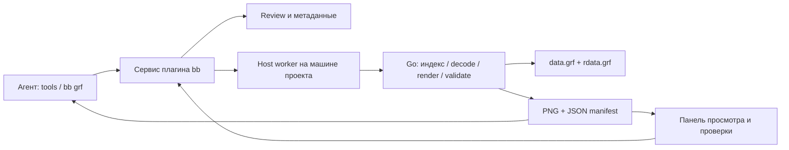

# GRF Workbench для bb: исследование и предложение

Дата: 2026-09-07. Статус: рабочий плагин и план дальнейшего развития; не утверждённый ADR.
Проверенная база: midgard-ro `39a9b84`, bb `0.41.0`, Plugin SDK `0.4.34`.

Реализация от 2026-09-07: [GRF Workbench 0.2.0](../../plugins/bb-plugin-grf-workbench/README.md) установлен в bb. Главный экран работает с GRF из конфигурации клиента: поиск по 174 959 ресурсам, выбор архива, просмотр изображений/SPR, воспроизведение ACT и фиксация конкретного кадра для замечания. Проверены настоящие ресурсы Poring и Rocker, паритет пикселей с игровым композитором, 12 SDK-тестов, Go-тесты и race-проверка reader. Снимки, системный выбор файла и аннотации сохранены как второй раздел. Следующие этапы — составные персонажи, специализированные эффекты и 3D/состояние сцены. Ниже сохранены исходные наблюдения исследования; `pkg/grf` уже доработан для ограниченного и конкурентного чтения. Интерфейс предыдущих версий подтверждён пользователем; новые UI-сценарии проверены через SDK harness, реальный backend — через работающий плагин.

## Рекомендация

Создать bb-плагин с общим Go-ядром анализа ресурсов, типизированными инструментами для агентов и React-панелью для человека. **Референсная реализация — текущий игровой клиент midgard-ro:** его загрузка ресурсов, композиция, прозрачность, тайминг и рендеринг определяют поведение Workbench. Переиспользовать эти пути исполнения через общий код или адаптер вызова клиента. `grfbrowser` давно не развивался вместе с игрой; использовать его как источник сценариев интерфейса и навигации. Его визуальное поведение не задаёт baseline и критерии приёмки.

Уточнение пользователя от 2026-09-07: при расхождении browser и клиента следовать клиенту. Внешний оригинальный RO-клиент может стать дополнительным референсом для отдельной задачи по совместимости, но не является условием создания Workbench. Возможные дефекты игрового клиента обсуждать и исправлять в его общей реализации; плагин не должен незаметно вводить собственные правила отображения.

Основная единица работы — ресурс с известным происхождением и воспроизводимое представление этого ресурса. Агент находит кандидатов, получает изображения и измерения, собирает набор для проверки. Пользователь открывает тот же набор рядом с обсуждением, сравнивает и оставляет замечания, связанные с конкретным кадром и версией.

## Что проверено в проекте

| Область | Реальное состояние | Значение для плагина |
|---|---|---|
| `pkg/grf` | GRF 0x200, список, поиск наличия, чтение; ASCII case folding с сохранением старших байтов | Основа чтения, но перед конкурентным сервисом нужна доработка |
| `pkg/formats` | SPR, ACT, TGA, RSM, RSW, GND, GAT, STR и тесты | Парсеры можно использовать без переноса в TypeScript |
| `cmd/grfbrowser` | Поиск, фильтры, дерево, SPR/ACT, картинки, текст/hex, WAV, GAT/GND, RSM и 3D-карта | Код существенно опережает список этапов в ADR-009 |
| `cmd/grftool` | `info`, `list`, `search`, `extract`, UTF-8 → EUC-KR fallback при извлечении | Полезная стартовая CLI, но нет JSON-контракта и визуальных артефактов |
| Автоматизация GUI | `command.json`, `state.json`, PNG-снимки в `/tmp/grfbrowser` | Подходит для короткого переходного моста |
| `internal/assets` | Последний добавленный архив имеет приоритет; сначала исходный путь, затем EUC-KR fallback | Нужен режим effective asset, повторяющий разрешение путей клиента |
| `internal/engine/sprite` и `charsprite` | CPU-композиция тела, головы, оружия, экипировки, anchors, направления, палитры | Полезнее для воспроизводимого рендера персонажей, чем копирование ImGui-preview |

Из реальных архивов прочитаны таблицы записей:

| Архив | Размер на диске, округлённо | Число файлов по текущему reader |
|---|---:|---:|
| `../data/data.grf` | 3.5 GiB | 171 707 |
| `../data/rdata.grf` | 276 MiB | 24 756 |

Пересечение нормализованных путей — **21 504**, объединение — **174 959**. Это количество совпадающих имён, а не доказательство различия содержимого. Сравнение хешей содержимого всех записей не проводилось. Конфигурация клиента добавляет `data.grf`, затем `rdata.grf`; второй имеет более высокий приоритет.

Проверено чтение и декодирование отдельных ресурсов, выбранных по рабочим сценариям:

- `data/texture/유저인터페이스/basic_interface/basewin_bg2.bmp`: 220 × 135, 30 648 байт.
- `data/texture/유저인터페이스/basic_interface/info1.bmp`: 54 × 18, 3 008 байт.
- `data/sprite/몬스터/poring.spr`: 49 indexed-изображений, 42 859 байт.
- Соответствующий `poring.act`: 72 action-записи, 146 172 байта.

Все четыре в этой проверке разрешились из `data.grf`. Путь с английским `monster` отсутствует: Unicode-поиск и правильная идентичность корейских путей нужны уже для простого сценария.

Выполнено: `go test ./pkg/grf ./pkg/formats ./internal/engine/sprite` — успешно. Это проверка имеющихся тестов, не полная проверка каждого файла двух архивов. GUI в этой исследовательской сессии не запускался.

## Ограничения, которые влияют на дизайн

1. **ImGui ACT-preview устарел относительно клиента.** `renderACTFrame` завершает цикл после первого валидного слоя; это причина переиспользовать игровой путь рендера. Доведение grfbrowser до паритета не входит в подготовку Workbench.
2. **Тайминг брать из клиента.** Browser использует `interval * 24ms` с нижним порогом 100ms, `charsprite` — `ActIntervalTickMs = 25`. Workbench использует правило текущего клиента; замедление для осмотра — явная настройка просмотра, сохраняемая в manifest.
3. **Проверять паритет с фактическим игровым путём.** В отдельно прочитанном `composite.go` нет полного применения ACT rotation/scale/tint и `SpriteType` при выборе изображения. Это наблюдение об одном модуле, а не заключение о всём клиенте. При реализации проследить путь конкретного типа ресурса до отображения в игре и переиспользовать его. Отдельное расширение поддержки формата не является обязательным условием интеграции; найденные ограничения клиента фиксировать явно.
4. **`pkg/grf` пока не рассчитан на общий конкурентный reader.** `Read` использует общий `Seek` + `ReadFull`; параллельные вызовы могут смешать позиции. Есть игнорируемые ошибки чтения и zlib, недостаточные проверки границ и размеров. До параллельных preview-задач нужны `ReadAt` либо сериализация доступа, проверки и лимиты.
5. **Поддержка формата должна быть явной.** Reader принимает только 0x200, не реализует полноценную поддержку encrypted entries. Отдельно проверить обработку обоих флагов шифрования. Ошибка декодирования не должна превращаться в «ресурс отсутствует».
6. **Сырые имена нельзя без потерь отправлять как обычные JSON-строки.** Reader сохраняет байты legacy encoding, но нормализует регистр и разделители. Для UI нужен display path; для повторного чтения — opaque ID и сохранённые байты ключа. Если понадобится точно исходное имя, reader придётся расширить. Предусмотреть коллизии декодирования.
7. **Метаданные CLI нуждаются в исправлении.** `grftool info` печатает `Size: 0.00 MB`, поскольку `totalSize` не суммируется. В исследовании размер взят с файловой системы.
8. **GUI-мост имеет общее изменяемое состояние.** Один `command.json` без request ID/ответа и общие `latest.png`/`state.json` не подходят для независимых задач нескольких агентов. Возможны перезапись команды и снимок чужого выбора.

## Подходящие поверхности bb

Наличие следующих API проверено по опубликованным декларациям `@get-bb/plugin-sdk@0.4.34`, соответствующим установленному bb. Первый срез использует thread panel, nav panel, message directive, mentions, native tools, CLI, RPC, database и host entry. Остальные поверхности перечислены как возможности для последующих этапов.

| Механизм | Применение |
|---|---|
| `bb.agents.registerTool` | Типизированные `search`, `inspect`, `render`, `validate`; результат поддерживает text и image content parts |
| `bb.cli.register` | Одна группа `bb grf …`, тот же сервис и схемы, JSON для скриптов и агентов |
| Skills + `bb.agents.configure` | Обучить работе с архивами и подключать инструменты в нужных проектах; изменение набора tools требует следующего старта/возобновления provider session |
| `app.slots.threadPanelAction` | GRF Explorer и Review рядом с конкретным обсуждением; `layout: "flush"`, JSON-параметры вкладки |
| `app.slots.messageDirective` | Компактная карточка найденного ресурса/набора внутри ответа агента, открывающая нужную панель |
| `app.slots.fileOpener` | Открытие `.grf`, экспортированных `.spr`/`.act` или собственного manifest-файла через привычные ссылки bb |
| `bb.ui.registerMentionProvider` | Упоминание ресурса с ID, разрешаемое в контекст при отправке сообщения |
| Composer `insertMention` | Кнопка «Добавить ресурс в обсуждение»; пользователь отправляет подготовленный контекст |
| `app.slots.navPanel` | Позднее — отдельная библиотека архивов/коллекций с deep links |
| `bb.rpc`, `bb.realtime`, `bb.storage` | Запросы UI, прогресс/инвалидация, индекс метаданных и сохранённые проверки |
| `bb.hosts.experimental_client` + `experimental_defineHostEntry` | Работа на явном hostId, запуск Go-процесса там, где находятся архивы |
| `bb.ui.requestInput` + `pendingInteraction` | Только для действия, которому действительно нужен синхронный ответ; обычный просмотр и review удобнее сохранять через RPC |

Практические границы SDK:

- CLI callback выполняется на сервере bb. `ctx.cwd` не означает, что нужный файл лежит на диске сервера. Вычислять host через thread → environment → host; host entry получает явные проверенные пути.
- Для SDK file I/O указывать hostId; Node filesystem использовать внутри нужного host worker либо для собственных серверных данных плагина.
- CLI stdout + stderr ограничены 1 MiB; host RPC — 8 MiB JSON на вход/выход. Выдавать страницы поиска, а изображения — ограниченного размера или через артефакты. Большой sprite atlas не передавать одним base64-ответом.
- Host worker ленивый, может выгружаться; хранить индекс/результаты устойчиво, учитывать отмену и dispose дочернего Go-процесса. Долгое индексирование оформить как job с прогрессом, удержанием worker на время работы и восстановлением после сбоя.
- `fileOpener` обслуживает живые файлы. Путь внутри GRF — не workspace-файл: его следует открывать по asset ID через панель/manifest. Просмотр бинарных версий из git не появляется автоматически.
- Глобальный `experimental_diffRenderer` получает текстовый patch и не является готовым GRF/image diff. Сравнение ресурсов реализовать в собственной панели.
- `experimental_timelineRenderer` ограничен строками собственного provider-плагина. GRF-плагину не следует рассчитывать на произвольную замену tool-строк Codex; использовать карточки `messageDirective` и обычное tool presentation.
- Ответ `requestInput` не сохраняется автоматически. Решение проверки и его привязку к версии обязан сохранить сам GRF-плагин.
- Зафиксировать SDK-версию и проверять `bb plugin types`, `bb plugin build` при разработке. Host API имеет experimental-статус; изолировать его адаптером.

## Предлагаемая архитектура



Начальная структура в этом репозитории:

```text
pkg/grf/                    доработанный reader
pkg/formats/                существующие парсеры
internal/assetworkbench/     resolver, metadata, render, validation
cmd/grftool/                человекочитаемые и JSON-подкоманды
plugins/grf-workbench/       server.ts, host.ts, app.tsx, skill
```

Сначала держать Go-часть в midgard-ro: она сможет переиспользовать `internal/engine/sprite` и `charsprite` без нарушения Go internal-границ. Перед выделением плагина в отдельный репозиторий вынести нужные интерфейсы/композитор в публичный пакет либо поставлять готовый sidecar-бинарник. Не копировать два независимых композитора.

Паритет проверять с текущим игровым клиентом на одинаковых ресурсах и параметрах. Для путей, которым нужен игровой GPU-контекст, предусмотреть захват через адаптер клиента; возможность headless-рендера проверять отдельно. Неполный preview помечать явно и не выдавать за игровой результат.

Предлагаемый протокол Go — версионированные запросы/ответы JSONL через stdio с request ID, ошибками и отменой. Для самого первого среза допустим отдельный запуск CLI на запрос; постоянный процесс вводить при индексации/кэшировании. Запускать через argv без shell interpolation. Доставку бинарника для конкретной OS/архитектуры реализует плагин: bb сам не устанавливает Go, SDL или сторонние executable.

Индекс и thumbnail-cache располагаются рядом с архивами на host, чтобы не переносить их на сервер и не пересоздавать для каждого worktree. Серверная plugin database хранит небольшие реестры, коллекции и review. Не индексировать все файлы при загрузке factory: сначала таблица имён, затем метаданные по запросу, затем фоновое обогащение.

## Что дать агенту

Имена ниже — предлагаемый контракт, не существующие команды:

| Операция | Результат |
|---|---|
| `bb grf search --query … --json` / `grf_search` | Страница кандидатов, asset IDs, тип, display path, источник, cursor |
| `bb grf inspect --asset … --json` / `grf_inspect` | Размеры, версия формата, actions/frames/layers, палитры, зависимости и ограничения поддержки |
| `bb grf render --asset … --action-index … --frame …` / `grf_render` | PNG выбранного кадра или листа кадров + render manifest; tool также возвращает image content |
| `bb grf validate --collection … --json` / `grf_validate` | Отсутствующие пары, ссылки вне диапазона, ошибки чтения, несовпадающие размеры и другие формальные нарушения |
| `bb grf compare --left … --right …` | Изменения записей/метаданных, A/B PNG и карта различий для выбранных представлений |
| `bb grf review create --collection …` | Сохранённый набор проверки и ID для карточки/панели |

Первый набор tools ограничить четырьмя: search, inspect, render, validate. Коллекции/review и сравнение можно сначала предоставить через CLI/RPC. Поиск по визуальному сходству и embeddings отложить: начальный эффект дадут правильные имена, фильтры, размеры и компактные листы изображений с ID.

Различать raw `actionIndex` и семантические `action + direction`: формула `action*8+direction` подходит не всем эффектам и UI ACT. Из `inspect` агент должен узнавать допустимые индексы, а не угадывать их.

## Что дать пользователю

Панель имеет список/галерею слева, крупное изображение в центре и сведения/замечания справа; на узкой панели — переключаемые вкладки. Основные действия:

- Поиск, тип и размеры; режимы «как видит клиент» / конкретный архив; все перекрывающие источники.
- Масштаб 1:1 и кратное увеличение без сглаживания, сетка пикселей, координаты/цвет под курсором, прямоугольное выделение и измерение.
- Фон шахматкой/светлый/тёмный; явный выбор raw image или правил клиента, включая magenta color key для HUD.
- SPR/ACT: action, direction там, где применимо, frame, playback, слои, origins и anchors; фиксированный canvas между кадрами, чтобы обрезка не создавала ложное дрожание.
- A/B, overlay/ползунок, карта различий. Сравнивать при одинаковых координатах, фоне, альфа-правилах и масштабе. Для 3D позднее потребуется фиксировать также камеру/освещение.
- «Подходит», «Нужна правка», «Отклонено», комментарий к координате/области/кадру и добавление выбранного ресурса в обсуждение.

Сценарий HUD: агент находит `basewin_bg2.bmp` и состояния кнопок, показывает лист кандидатов с размерами и прозрачностью, связывает выбранные ID с `docs/features/hud-basic-info/`. Пользователь проверяет 1:1 и отмечает область. После изменения клиента агент прикладывает снимок того же участка HUD и сравнение. Изолированный bitmap подтверждает исходный ресурс; корректную компоновку HUD подтверждает отдельный in-game capture.

Сценарий персонажа: агент создаёт фиксированную матрицу направлений/кадров тела, головы и экипировки через реализацию игрового клиента, пользователь отмечает смещённый anchor на конкретном кадре. Повторный рендер сравнивается с тем же baseline, сохраняя origin. Baseline строится на текущем клиенте; отмеченный пользователем дефект исправляется в общей игровой реализации и затем проверяется повторно.

**Выделение области с комментарием — обязательная возможность первого рабочего этапа.** Она работает на preview ресурса и на приложенном снимке игры. Пользователь выделяет прямоугольник, пишет замечание и добавляет его в обсуждение. Агент получает единый пакет:

- Полное исходное изображение для контекста и отдельный crop выделенной области; рамка хранится как overlay, исходные пиксели сохраняются.
- Координаты `x, y, width, height` в пикселях исходного изображения с началом в левом верхнем углу, размеры изображения и комментарий. Zoom, pan и HiDPI интерфейса не меняют сохранённую область.
- Annotation ID, manifest digest, asset ID и параметры кадра, если они известны. Для снимка игры — capture ID и версия сборки/сцена, если доступны; связь с конкретным asset или слоем не угадывать.
- Ссылку на эту аннотацию в панели. Для A/B фиксировать сторону сравнения; для анимации при выделении зафиксировать кадр.

Упоминание аннотации разрешается в текстовый контекст с координатами и ID артефактов. Полное изображение и crop передаются через image content инструмента или вложения, доступные выбранному provider; одной ссылки на панель недостаточно. Сквозной тест должен подтвердить, что агент действительно получает изображения.

При повторной проверке сохраняются исходная аннотация и новый результат. Агент может отметить «исправление предложено» и приложить сравнение; пользователь подтверждает устранение проблемы. На изменённое изображение прямоугольник автоматически не переносится как актуальное замечание без проверки соответствия.

## Воспроизводимость и сохранение решений

Manifest представления должен включать `schemaVersion`, project/host/asset-set identity, порядок архивов, asset ID, источник и хеш содержимого, хеши зависимостей, версии decoder/renderer, параметры action/frame/palette/background/color-key/camera, checksum PNG и сведения об ошибках/неподдержанных свойствах.

Быстрый fingerprint архива для invalidation допустим на основе размера/mtime/таблицы, но это не криптографическое доказательство неизменности. Для проверенного артефакта хешировать фактически прочитанные ресурсы и зависимости; полный хеш многогигабайтного GRF считать отдельно, когда нужен.

Решение пользователя относится к manifest digest. Если изменились ресурс, зависимость, приоритет архивов или renderer, старое решение остаётся историей и становится устаревшим для нового результата. Сохранять автора/время/комментарий и версию записи; применять optimistic concurrency при одновременной работе вкладок.

Базовые API агента создают представления и читают результаты review. Запись человеческого решения идёт из UI, а не из аргумента tool `approved=true`. Структурная валидация может завершиться автоматически; визуальное подтверждение пользователем — отдельное состояние.

Review JSON и выбранные небольшие baseline PNG можно экспортировать в `docs/features/<feature>/` для связи с кодом. Полные распаковки и автоматически воспроизводимый кэш не хранить в git. Извлечение ограничить выбранной output root, проверять path traversal и коллизии имён; в первом релизе архивы используются только для чтения.

## Порядок реализации и критерии готовности

**Первый практический тест после подготовки инструментария — проблема перекрытия стенами.** По решению пользователя её диагностика и исправление отложены до готовности инструмента; карта, координаты и снимок не являются входными требованиями для разработки. После готовности пользователь указывает проблему через выделение области и комментарий. Проверяем, достаточно ли полученных агентом изображения, фрагмента, координат и контекста для адресной диагностики, а затем — удобно ли пользователю проверить результат исправления. Подготовку инструмента вести на доступных ресурсах и снимках клиента.

**Срез 0: проверить самый короткий путь.** Доработать reader для безопасных ограниченных чтений, добавить JSON inspect/render для BMP и SPR на базе игровых правил, собрать минимальный plugin tool и thread panel. Из новой сессии агент вызывает инструмент, получает настоящее image content; пользователь открывает тот же PNG по manifest, выделяет область и передаёт комментарий. Агент получает полное изображение, crop и точные координаты. Проверить на двух HUD-файлах и poring, включая корейские пути. Это снимет неопределённость доставки изображения и аннотации через provider и host API.

**Срез 1: полезный ежедневный инструмент.** Индекс двух архивов, effective lookup и override chain, фильтры и листы изображений, BMP/TGA/PNG/JPEG/SPR, измерение пикселей, коллекции и сохранённый review с аннотациями областей ресурсов и снимков игры. Проверить координаты выделения после zoom/pan/HiDPI, восстановление комментария после reload и передачу агенту crop вместе с контекстом. Проверить, что поиск не загружает всё содержимое архивов, отмена освобождает работу, два запроса/треда не смешивают результаты, reload сохраняет проверки, изменение файла инвалидирует кэш. Измерить холодное индексирование, тёплый поиск, render latency и пик памяти на реальных архивах; SLO установить по этим измерениям.

**Срез 2: ACT и персонажи с паритетом клиенту.** Подключить фактические игровые пути композиции и тайминга, проверить layers, indexed/RGBA, mirror, scale, rotation, tint, anchors и палитры в пределах поддержки клиента. Набор golden fixtures должен проверять применимые свойства, а не только poring. Baseline фиксировать по текущему игровому клиенту и сверять с его захватом на одинаковых параметрах. Добавить воспроизводимое сравнение и распространить аннотации на конкретные кадры. Исправления обнаруженных дефектов клиента вести через общий код как отдельные явно обозначенные изменения.

**Срез 3: карты, модели и эффекты.** RSW→GND/GAT/RSM→textures dependency graph, отсутствие текстур, размеры/проходимость карты, 2D contact sheets. Рендеринг и baseline брать из игрового клиента. Интерактивный 3D/WebGL — отдельная задача: OpenGL-шейдеры и ImGui-контролы не становятся web-компонентами автоматически. До её завершения существующий grfbrowser доступен как вспомогательный 3D-просмотрщик; подтверждение игрового отображения выполняется по захвату клиента. RSM2, IMF, PAL и другие форматы имеют отдельную матрицу поддержки; наличие расширения в архиве не означает готовый preview.

## Альтернативы

| Вариант | Когда полезен | Ограничение |
|---|---|---|
| Обёртка над текущим ImGui и JSON-командами | Быстро показать уже существующее 3D и сделать снимок | Требует GUI/OpenGL, нет изолированных job и точного ACT; нужен протокол с ACK/ID и отдельными каталогами |
| Go-ядро + bb plugin UI/tools | Рекомендуемый основной путь | Нужны UI, контракты и доставка sidecar; сохраняет существующую Go-базу |
| Полный перенос в JS/WASM/WebGL | Когда обязательна работа только в браузере | Существенный перенос чтения/кодировок/рендера; для текущего локального bb не требуется |
| Отдельный MCP server | Если нужен тот же анализ вне bb | Даёт tool transport, но сам не обеспечивает панели, review и интеграцию с bb; можно добавить адаптер позже |

## Источники

Локальный код — основной источник сведений о текущей реализации:

- [GRF reader](../../pkg/grf/grf.go), [CLI](../../cmd/grftool/main.go), [asset manager](../../internal/assets/assets.go).
- [Маршрутизация preview](../../cmd/grfbrowser/main.go), [ACT-preview](../../cmd/grfbrowser/preview_sprite.go), [GUI automation](../../cmd/grfbrowser/commands.go).
- [CPU composition](../../internal/engine/sprite/composite.go), [character sheets и timing](../../internal/engine/charsprite/charsprite.go), [HUD texture rules](../../internal/game/ui/texture_cache.go).
- [ADR-009 — исторический план](../adr/ADR-009-grf-browser-tool.md), [реальный сценарий HUD](../features/hud-basic-info/README.md).

Платформа:

- [Официальный репозиторий bb](https://github.com/get-bb/bb) — исходники платформы и примеры плагинов; текущий main может отличаться от установленной версии.
- [Метаданные SDK 0.4.34](https://registry.npmjs.org/@get-bb/plugin-sdk/0.4.34) и [точный пакет деклараций](https://registry.npmjs.org/@get-bb/plugin-sdk/-/plugin-sdk-0.4.34.tgz). Проверены `bundled-types/bb-plugin-sdk.d.ts`, `bb-plugin-sdk-app.d.ts`, `bb-plugin-sdk-host.d.ts`.
- Встроенные навыки `bb-cli`, `bb-plugin-authoring`: references backend-foundation, backend-cli-agents, backend-ui-lifecycle, frontend-core-slots, frontend-renderer-slots, distribution. Наличие API сверено с точными декларациями; рекомендации не предполагают изменение ядра bb.

Исследовательский scaffold и SDK распакованы в `/private/tmp`. Реализация первого среза находится в `plugins/bb-plugin-grf-workbench` и установлена из локального пути как `grf-workbench@0.2.0`. Графические алгоритмы клиента переиспользованы; общий GRF-reader доработан для корректного конкурентного чтения и обработки ошибок.
